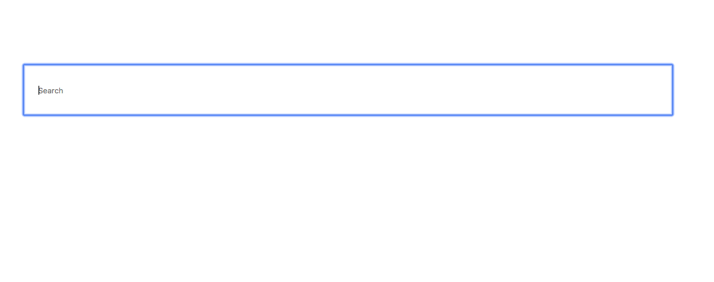

Sometimes we need to access the particular dom nodes in our react components in such cases react provides us a `ref` attribute to access that dom node. In this tutorial, we will learn about how to use ref attributes in React apps.


We can create the ref by using React.createRef() method.


Have you seen if you open `Google.com` the search box is focused automatically?. The same thing we created below using `ref` attribute.




```js{3,5,12}
class Search extends React.Component {

  inputText = React.createRef();

  componentDidMount() {
    this.inputText.current.focus()
  }

  render() {
    return (
      <div>
        <input type="text" ref={this.inputText} placeholder="search" />
      </div>

    )
  }

}
```

In the above code first we invoked the `React.createRef()` method and passed it to the `input` element ref atribute.

In componentDidMount() life cycle method we accessed that `input` element by using `current` property.


React assings the dom element to the `current` property whenever the component mounts and assigns back to null when component unmounts.

We can also use ref's inside the functional components.

```js{3,6,11-12}

function SmallComponent(){

  const inputText = React.createRef();

  function handleFocus(){
     inputText.current.focus();
  }

        return(
          <div>
            <input ref={inputText} type="text" />
            <button onClick={handleFocus}>Focus</button>
            </div>
        )
      }

```

### Callback refs

There is another way to use refs by using __callback functions__. React passes the dom element as an argument to the callback function.

Let's repalce the above `Search` Component using Callback refs.

```js
class Search extends React.Component {


  componentDidMount() {
    this.inputText.focus()
  }

  render() {
    return (
      <div>
        <input type="text" ref={node =>this.inputText = node} placeholder="search" />
      </div>

    )
  }

}
```
React invokes the callback function by passing a dom element when the component mounts and
passes null when component unmounts.


_Other example Login form_

```js
class Login extends React.Component{

 state = {
     username:null,
     password:null
 }

 handleSubmit=(e)=>{
   e.preventDefault();

    this.setState({
        username:this.refusername.value,
        password:this.refpassword.value
    })
 }
      render(){
          return (
           <form>
           <input type="text"   ref ={name=>this.refusername=name } />
           <input type="password" ref= {pass=>this.refpassword=pass }  />
           <button onClick={this.handleSubmit}>Login</button>
           </form>
          )
      }

}


```

>Note: ref updates happen before `componentDidMount()` and `componentDidUpdate()` life cycle methods.
