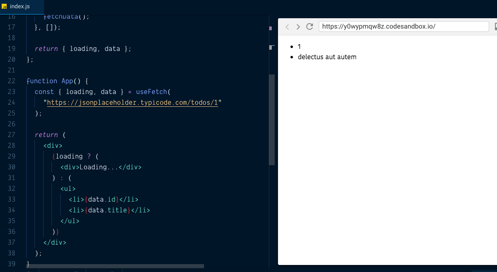

In this tutorial, we will learn about how to make the ajax requests in functional components by creating
our own custom react hook.

React hooks are JavaScript functions which help us to use react features in functional components.

>If you don't know about react hooks then check out [previous tutorial](/react-hooks/)


### useFetch custom react hook

Let's create our own custom hook called __useFetch__ which helps us to fetch the data from the API.


We are using `useState` and `useEffect` hooks to add the state and lifecycle methods in functional components.

__useState__: It is used to add the state in functional components.

__useEffect__: It helps us to use the  lifecycle features in functional components like componentDidMount,componentDidUpdate,componentUnmount.

```js{4,9,12}
import React,{useState,useEffect} from 'react'

const useFetch = url => {
  const [data, setData] = useState(null);

  async function fetchData() {
    const response = await fetch(url);
    const json = await response.json();
    setData(json);
  }

  useEffect(() => {fetchData()},[url]);
  return data;
};
```

In the above code first, we imported `useState` and `useEffect` hooks from the 'react' library.

useState hook takes one argument which is initial state and returns back an array with two values
`currentState` and a `function` which is used to update the state.

By default `useEffect` hooks runs on every time when a component is updated but we only need to fetch the data when a component initially Mounts to the dom, to stop this behavior in `useEffect` we passed the second argument an empty array `[]`.


Let's use our __useFetch__ hook to make an API request.


```js{20}
import React, { useState, useEffect } from "react";
import ReactDOM from "react-dom";

const useFetch = url => {
  const [data, setData] = useState(null);

  async function fetchData() {
    const response = await fetch(url);
    const json = await response.json();
    setData(json);
  }

  useEffect(() => {fetchData()},[url]);

  return data;
};

function App() {

  const data = useFetch("https://jsonplaceholder.typicode.com/todos/1");

  if (!data) {
    return <div>Loading...</div>;
  } else {
    return (
      <ul>
        <li>{data.id}</li>
        <li>{data.title}</li>
      </ul>
    )
  }
}

export default App;
```

In `<App>` component we invoked __useFetch__ hook by passing an URL and it returns back the `data`.It takes some time to get the data from the API so that we display the `loading` state if the data
is not available.

Once the data is available we display the actual data.

Let's add the loading state to the useEffect hook instead of we manually checking if data is available or not.


```js{12,24}
import React, { useState, useEffect } from "react";
import ReactDOM from "react-dom";

const useFetch = url => {
  const [data, setData] = useState(null);
  const [loading, setLoading] = useState(true);

  async function fetchData() {
    const response = await fetch(url);
    const json = await response.json();
    setData(json);
    setLoading(false)
  }

  useEffect(() => {
    fetchData()
  }, []);

  return {loading,data};
};

function App() {

  const {loading,data} = useFetch("https://jsonplaceholder.typicode.com/todos/1");

  return (
    <div>
      {loading ? <div>Loading...</div> :
      <ul>
       <li>{data.id}</li>
       <li>{data.title}</li>
      </ul>
      }
    </div>
  )
}

export default App;
```




>You can also check [FetchData component](/react-render-props-tutorial/#fetchdata-component)
