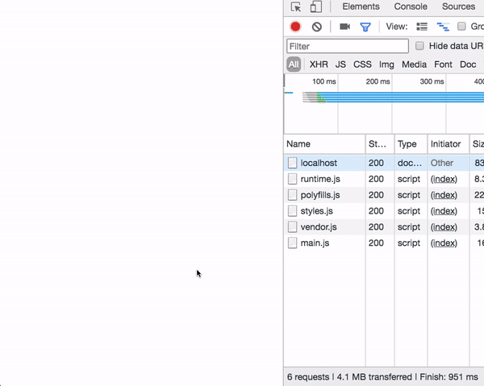

The Angular CLI is a command line interface tool that can create a project, add files, and perform a variety of ongoing development tasks such as testing, bundling, and deployment.

If you need to update  Angular CLI then  you can update it  easily by using the following commands.

```bash
npm install -g @angular/cli
```

```bash
ng new PROJECT-NAME
cd PROJECT-NAME
ng serve --open
```

ng new is used to generate angular boilerplate.


### What is Lazy loading?

Lazy loading helps us to download the web pages in chunks instead of downloading everything in a big bundle.

To implement the Lazy Loading in Angular we need to create a `routing module` and a `module.ts` file for the component we need to lazy load.


In the above image, we have created two files which are `posts-routing.module.ts` and `posts.module.ts`.

Now let's see what we need to code in these two files.

#### posts-routing.module.ts

<iframe src="data:text/html;charset=utf-8,%3Cbody%3E%3Cscript%20src%3D%22https%3A%2F%2Fgist.github.com%2Fe46ba0a09383aeb875cbe33687e86fbb.js%22%3E%3C%2Fscript%3E%3C%2Fbody%3E" frameborder='no' allowtransparency='true' allowfullscreen='true' style='width: 100%;margin-bottom:-1.5rem'></iframe>


In the above code first we created a routes array with an object containing path and component.

In the line `14` we are passing the `routes` array  as an argument to the `RouterModule.forChild` method.

#### posts.module.ts

<iframe src="data:text/html;charset=utf-8,%3Cbody%3E%3Cscript%20src%3D%22https%3A%2F%2Fgist.github.com%2Fd3168c157c0c89b5c2c6f6a38de0883f.js%22%3E%3C%2Fscript%3E%3C%2Fbody%3E" frameborder='no' allowtransparency='true' allowfullscreen='true' style='width: 100%;margin-bottom: -7.55rem;'></iframe>

Here we added a `PostsComponent` to the declarations array, that's it we are done with the child level components.


Now we need to create a new file called `app-routing.module.ts` on root level of your app it means inside the app folder.

**app-routing.module.ts**

<iframe src="data:text/html;charset=utf-8,%3Cbody%3E%3Cscript%20src%3D%22https%3A%2F%2Fgist.github.com%2F7df0ac77c6509d0a3e00e1074aedce42.js%22%3E%3C%2Fscript%3E%3C%2Fbody%3E" frameborder='no' allowtransparency='true' allowfullscreen='true' style='width:100%;'></iframe>


**app.module.ts**

<iframe src="data:text/html;charset=utf-8,%3Cbody%3E%3Cscript%20src%3D%22https%3A%2F%2Fgist.github.com%2Fd05db72f41ef8a370131ce63650f98e4.js%22%3E%3C%2Fscript%3E%3C%2Fbody%3E" frameborder='no' allowtransparency='true' allowfullscreen='true' style='width: 100%;'></iframe>

In the **app.module.ts** file we need to remove the declarations for the components which
we would like to lazy load.


This is our final output



Have you seen in the above image we successfully implemented the lazy loading?


__[Code repository](https://github.com/saigowthamr/Angular-Lazy-loading)__

Happy coding...🤗
