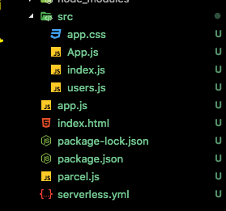
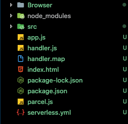
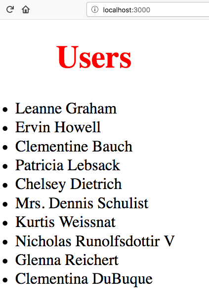
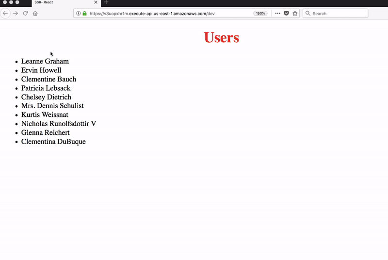

In this tutorial, we are going to learn about Server-Side Rendering in React Apps Using Serverless framework and
Aws Lambda.

>Note: If you stuck anywhere in this tutorial then please checkout code respository on [github](https://github.com/saigowthamr/SSR-React-Using-Serverless).

## What is Server Side Rendering?

Server-Side Rendering or Isomorphic or Universal Javascript it means running the JavaScript from both client and server.In Single Page Apps it takes a lot of time to the initial load because we need to download the script and executes inside the browser. In server-side rendering, the client gets the fully build HTML file so that client no need to wait until the script downloads and creates the markup.

## Uses of Server-Side Rendering

   - Seo
   - Improve the web Performance.
   - Fast Interaction.


### Normal React App markup

```html
<!DOCTYPE html>
<html lang="en">
  <head>
    <meta charset="utf-8">
    <meta name="viewport" content="width=device-width, initial-scale=1, shrink-to-fit=no">
    <title>React App</title>
  </head>
  <body>
    <noscript>
      You need to enable JavaScript to run this app.
    </noscript>
    <div id="root"></div>
  </body>
</html>
```

### How to Implement Server-Side Rendering Using Serverless Aws Lambda


### Requirements

1. [Aws Account](https://aws.amazon.com/free/)
2. Nodejs
3. Serverless framework cli.


### Step 1

 First we need to install the Serverless Framework cli.

Open your terminal and run below command.

```bash
npm install -g serverless

sls login // SLS is a shortcut of serverless

```

### Step 2

After sls login, You need to configure Your Aws Credentials with a serverless framework.

**[Get Aws Credentials](https://www.youtube.com/watch?v=tgb_MRVylWw)**


### Step 3
###Create a New Directory in your Pc.

```bash
mkdir ssr
cd ssr
```


### Step 4

 Serverless Offers us a different type of templates but we are using Nodejs as our Backend so that we are creating nodejs template.

```bash
serverless create --template aws-nodejs
```

The above command generates the boilerplate.


Open Project Directory In your Favorite code editor

### For Bundling modules, I'm using Parceljs which is super fast


**parcel.js config**

```javascript
const Bundler = require("parcel-bundler");
const Path = require("path");

// Entrypoint file location
const server = Path.join(__dirname, "app.js");

// Bundler options
const serverOpt = {
  outDir: "./", // The out directory to put the build files in, defaults to dist
  outFile: "handler.js", // The name of the outputFile
  publicUrl: "./", // The url to server on, defaults to dist
  watch: true,
  cacheDir: ".cache", // The directory cache gets put in, defaults to .cache
  minify: true, // Minify files, enabled if process.env.NODE_ENV === 'production'
  target: "node", // browser/node/electron, defaults to browser
  logLevel: 3, // 3 = log everything, 2 = log warnings & errors, 1 = log errors
  sourceMaps: true, // Enable or disable sourcemaps, defaults to enabled (not supported in minified builds yet)
  detailedReport: true // Prints a detailed report of the bundles, assets, filesizes and times, defaults to false, reports are only printed if watch is disabled
};

// Entrypoint file location
const browser = Path.join(__dirname, "./src/index.js");

// Bundler options
const browserOpt = {
  outDir: "./Browser",
  outFile: "bundle.js",
  publicUrl: "./",
  watch: true,
  cacheDir: ".cache",
  minify: true,
  target: "browser",
  https: false,
  logLevel: 3,
  hmrPort: 0,
  sourceMaps: true,
  hmrHostname: "",
  detailedReport: false
};

const serverbundler = new Bundler(server, serverOpt);
const bundle = serverbundler.bundle();

// Initialises a bundler using the entrypoint location and options provided
const browserbundler = new Bundler(browser, browserOpt);
const bundle1 =browserbundler.bundle();
```


Now initialize the Package.json file

```json
{
  "name": "ssr-react",
  "version": "1.0.0",
  "description": "ssr rendering react using serverless",
  "main": "index.js",
  "scripts": {
    "bundle": "rimraf Browser && node parcel.js",
    "start": "sls offline start",
    "deploy":"sls deploy"
  },
  "author": "",
  "license": "ISC",
  "babel": {
    "presets": [
      [
        "env",
        {
          "targets": {
            "browsers": [
              ">1%",
              "last 3 versions"
            ]
          }
        }
      ],
      "stage-2",
      "latest",
      "react"
    ],
    "plugins": [
      "syntax-dynamic-import",
      "transform-class-properties"
    ]
  },
  "devDependencies": {
    "babel": "^6.23.0",
    "babel-cli": "^6.26.0",
    "babel-core": "^6.26.3",
    "babel-loader": "^7.1.4",
    "babel-plugin-syntax-dynamic-import": "^6.18.0",
    "babel-plugin-transform-class-properties": "^6.24.1",
    "babel-preset-env": "^1.7.0",
    "babel-preset-latest": "^6.24.1",
    "babel-preset-react": "^6.24.1",
    "babel-preset-stage-2": "^6.24.1",
    "parcel-bundler": "^1.8.1",
    "rimraf": "^2.6.2",
    "serverless-offline": "^3.25.4"
  },
  "dependencies": {
    "body-parser": "^1.18.3",
    "cors": "^2.8.4",
    "express": "^4.16.3",
    "isomorphic-fetch": "^2.2.1",
    "react": "^16.4.0",
    "react-dom": "^16.4.0",
    "react-router-dom": "^4.2.2",
    "serverless-http": "^1.5.5"
  }
}
```

### Folder structure




```javascript:title=/src/App.js
import React,{Fragment} from "react";

const App = (props) => {
  return (
    <Fragment>
    <h1>Users</h1>
    <ul>
      {props.data.map((user, i) => {
        return <li key={i}>{user.name}</li>
      })}
    </ul>
 </Fragment>
  )
}

export default App;
```


```javascript:title=/src/users.js
import fetch from 'isomorphic-fetch';
function Data() {
    return fetch('https://jsonplaceholder.typicode.com/users')
        .then(data => data.json())
}
export default Data;
```

Isomorphic fetch helps us to fetch the data from  both  server and client side.


```javascript:title=/src/index.js
import React from "react";
import "./app.css";
import { hydrate } from "react-dom";

import App from "./Myfirst";
import Data from "./users";

Data().then(users => {
  hydrate(<App data={users} />, document.getElementById("root"));
});

```

Hydrate: if a markup is already generated by the server it doesn't regenerate it again in the browser and attach the required event handlers.


### index.html

```html
<!DOCTYPE html>
<html lang="en">
<head>
    <meta charset="UTF-8">
    <meta name="viewport" content="width=device-width, initial-scale=1.0">
    <meta http-equiv="X-UA-Compatible" content="ie=edge">
    <title>SSR- React</title>
<link rel="stylesheet" href="/bundle.css">
</head>
<body>
<div id="root"><!--App--></div>

<script src="/bundle.js"></script>
</body>
</html>
```


Now here comes the main part so far we  created a simple react app and HTML template.


# Server Side Setup

create a new file called `app.js` in your directory

 first, we need to import the required packages

```javascript:title=app.js
import serverless from "serverless-http";
import express from "express";
import cors from "cors";
import bodyParser from "body-parser";
import React from "react";
import { renderToString } from "react-dom/server";
import App from "./src/App";
import Data from "./src/users";
import fs from "fs";
import path from "path";
```

Now we need to add some middlewares

```js
const app = express();

app.use(cors());
app.use(bodyParser.json());
app.use(bodyParser.urlencoded({ extended: false }));
app.use(express.static(path.resolve(__dirname, "./Browser")));

```

```javascript
const markup = fs.readFileSync(__dirname + "/index.html",
  "utf8"
);

app.get("**", (req, res) => {
  Data().then(users => {
    const html = renderToString(<App data={users} />);
    res.send(markup.replace("<!--App-->", html));
  });
});

module.exports.ssr = serverless(app);
```

In the above code first, we stored the HTML file in the  markup variable

**renderToString:** Helps to Take the Jsx and gives us back an HTML string.


Now we need to Bundle our code and Transform the syntax for these
open your terminal and run below command.

```javascript
npm run bundle
```

it creates the bundled code  with Browser folder and handler.js file

**client-side code goes inside the Browser folder**
**app.js code is transformed to the es5 code and stored inside the handler.js file**




Final step `Serverless.yml` setup

```yml
service: ssr

provider:
  name: aws
  runtime: nodejs8.10

functions:
  app:
    handler: handler.ssr
    events:
        - http: ANY /
        - http: 'ANY {proxy+}'

plugins:
  - serverless-offline
```

**Serverless-offline plugin helps us to run the code in  local environment.**

**handler:** it means we need to tell on which file it needs to look.


Now open your Terminal and Run

```bash
npm start
```
it will  create a local server




How to Deploy the code?

```bash
sls deploy
```

Once you run the command after some time your endpoints are visible in your terminal.

## Server-side rendered React app.




 [Code Repository](https://github.com/saigowthamr/SSR-React-Using-Serverless)


