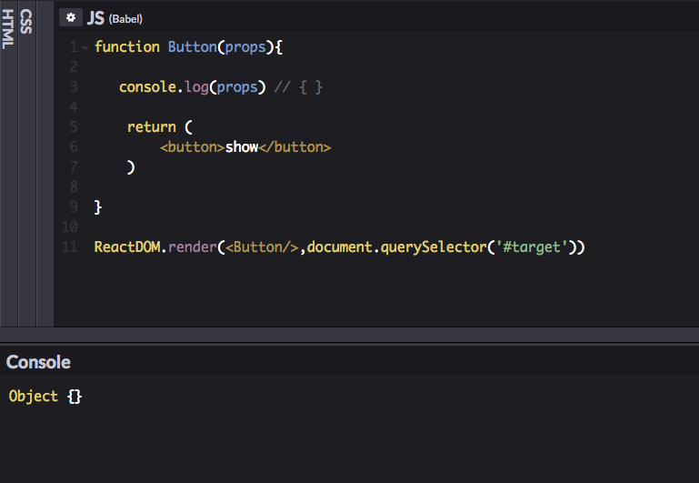
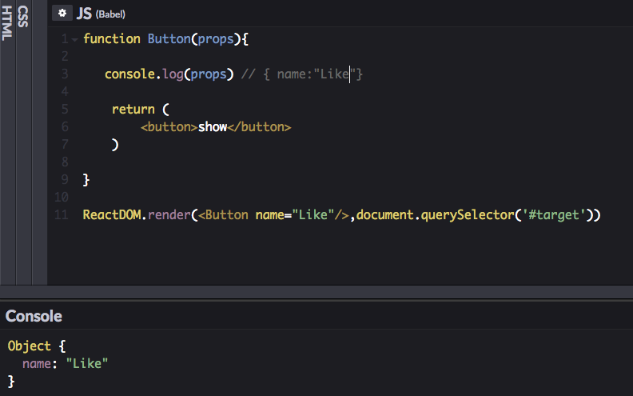

In this tutorial, we will learn about how to pass the data to the components
by using props.


## Props

- Props are used to pass the data from parent to  child components.
- Props are readonly.


Let's see in practice.


### Functional components

**Functional components** in the react accepts the `props` object as a parameter. Let's log the `props` parameter inside the below component.

```js{3}

function Button(props){

   console.log(props) // { }

    return (
        <button>show</button>
    )

}

ReactDOM.render(<Button/>,document.querySelector('#target'))

```




Have you seen in the above image an empty  Object is logged inside the console?

If we pass data as an `attribute` to the components, that data is available inside the components as a `props` object.

```js{3,11}

function Button(props){

   console.log(props) // {name:"Like" }

    return (
        <button>show</button>
    )

}

ReactDOM.render(<Button name="Like" />,document.querySelector('#target'))

```

In the above code, we passed `name` attribute to the Button component so that we can access that data inside the Component by using `props` object.




Now let's remove the name of the button and replace with the `props.name` so that we can have more control over the `Button` component.


```jsx{4,14-18}

function Button(props){

    return (
        <button>{props.name}</button>
    )

}


function App() {

  return (
    <div>
      <Button name="Like" />

      <Button name="Share" />

      <Button name="Comment" />
    </div>
  )
}

```
---

### Props in class-based components

In **class** based components, we need to use `this.props` to access the props data.


```js{20}

class User extends React. Component{


   render(){
       <div>
        <h1>{this.props.name}</h1>
        <ul>
          <li>{this.props.id}</li>
          <li>{this.props.age}</li>
        </ul>
       </div>
   }

}

class App extends React. Component{


    render(){
        <User name="nick" age=34 id = 11112 />
    }

}

```

Let's replace the above User component data using curly braces.

```js{4}
class App extends React.Component{

    render(){
        <User name={"nick"} age={3} id = {11112} />
    }

}

```

`props` are not only limited to the `strings` or `numbers` we can also pass functions, objects or components.

### Passing objects using props

```js{5,24}
class Date extends React.Component{

  render(){

  const {day,month,year } =  this.props.data

      return (
         <ul>
         <li>{day}</li>
         <li>{month}</li>
         <li>{year}</li>
         </ul>

      )
  }

}


class App extends React. Component{

  render(){
      return(
          <Date data = {{day:11,month:"December",year:2018  }} />
      )
  }
}
```

In the above code we passed an object as a `prop` to the `Date` Component so that inside the `Date` component we can access that data using `this.props.data`.


### Passing components as a prop.


```js{26-27}
function Button(props) {
  return (<button>{props.name}</button>)
}


function Post(props) {
  return (
    <div>
      <h1>{props.title}</h1>
      <p>{props.body}</p>
      <div>
        {props.share}
        {props.like}
      </div>
    </div>
  )

}

class App extends React. Component {

  render() {
    return (
      <div>
        <Post title={"My first post"} body={"some body text"}
          share={ <Button name="Share"/> }
          like={ <Button name="Like"/> }
        />
      </div>
    )
  }
}
```


### Passing functions as a props


```js{5,15-19}
function Button(props) {
  return (
    <div>
    <button>{props.name}</button>
    {props.icon("https://cdn3.iconfinder.com/data/icons/glypho-free/64/share-512.png")}
  </div>
  )
}

class App extends React.Component {

  render() {
    return (
      <div>
        <Button name="share"
          icon={function (icon) {
            return 
          }}
        />
      </div>

    )

  }
}
```


In the above code we passed a function as a prop to the `Button` Component so that we invoked this function by passing an `icon` as its argument inside the `Button` component.

*Passing functions as a props  is  called `render props` technique.*