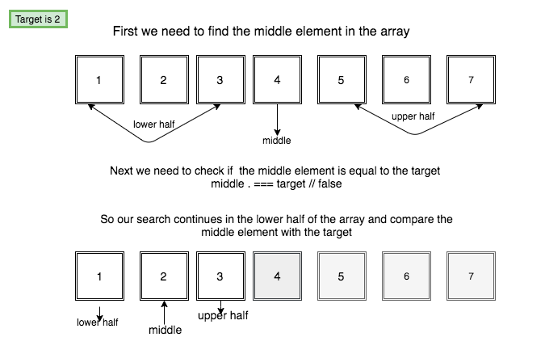
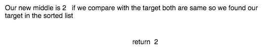

In computer science, the binary search algorithm is used to find the position of the target value in a sorted array.

### How binary search algorithm works?

Binary search algorithm compares the target value to the middle element in the array. if the target is found then return the index or search continues in the other half of the array repeating until a target is found.

Let's learn by using a sample sorted array.






### Binary search algorithm implementation.

__Pseudocode__

1. store the midpoint of the array.
2. compare the midpoint to the target value.
   - return item
3.  if midpoint is less than the target value then search continues in the upper half of the array.
4. if midpoint is greater than the target value then search continues in the lower
half of the array.

we are using the recursive approach.

```js
function binarySearch(arr, target) {

  const midpoint = Math.floor(arr.length / 2);

  if (arr[midpoint] === target) return arr[midpoint];

  if (arr[midpoint] < target && arr.length > 1) {
   return binarySearch(arr.slice(midpoint), target);
  }
  if (arr[midpoint] > target && arr.length > 1) {
   return binarySearch(arr.slice(0, midpoint), target);
  }

  return false;
}

console.log(binarySearch([1, 2, 3, 4, 5, 6, 7, 8, 9, 10, 11], 10)); //10
```


Time complexity :  O(logN).


### Tests

<iframe height='265' scrolling='no' title='Binary search algorithm' src='//codepen.io/saigowthamr/embed/LXLXNz/?height=265&theme-id=dark&default-tab=result' frameborder='no' allowtransparency='true' allowfullscreen='true' style='width: 100%;'>See the Pen <a href='https://codepen.io/saigowthamr/pen/LXLXNz/'>Binary search algorithm</a> by saigowtham (<a href='https://codepen.io/saigowthamr'>@saigowthamr</a>) on <a href='https://codepen.io'>CodePen</a>.
</iframe>

Hope you enjoyed...


