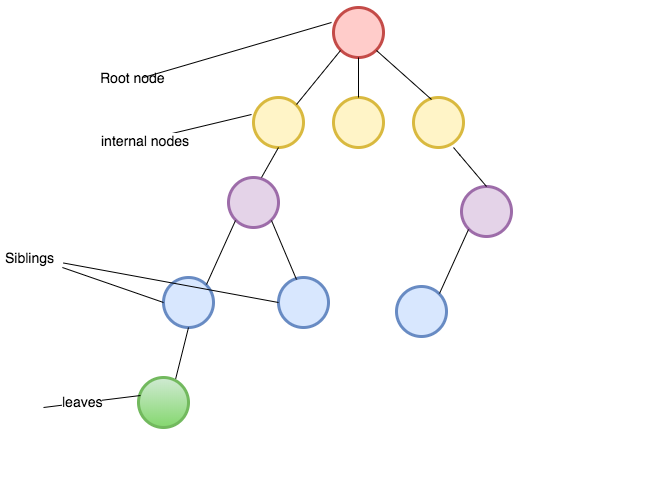
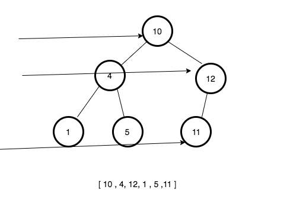
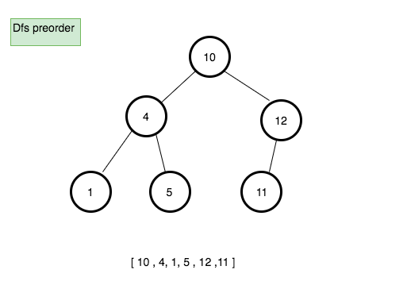
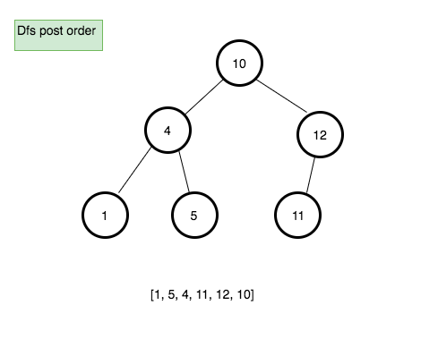
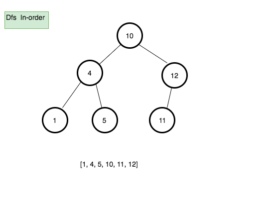

In this tutorial, we are going to learn about Binary search trees and its implementation in javascript.


## What is a tree?

- A tree is nonlinear data structure compared to stacks and queues, linked lists and arrays which are the linear data structure.

### Terminologies  used in trees

**Root**: The top node in a tree.

**Child**: A node directly connected to another node when moving away from the root.

**Parent**: The converse notion of a child.

**Siblings**: A group of nodes with the same parent.

**Descendant**: A node reachable by repeated proceeding from parent to child. Also known as subchild.

**Ancestor**: A node reachable by repeated proceeding from child to parent.

**Internal nodes**: nodes that have children.

**External nodes or leaves**: nodes that don’t have children.




### Types of trees

**Binary tree**: Every node has at most two children where each node is labeled as being either a left child or a right child

**Binary search tree**: Every node has at most two children but there is a condition which states that the key in each node must be greater than or equal to any key stored in the left sub-tree, and less than or equal to any key stored in the right sub-tree.


Binary search tree Implementation in Javascript.

```js
class Node{
  constructor(data){
    this.right = null;
    this.left = null;
    this.data = data
  }
}
```

In the above code we declared a class Node with three properties `right`, `left` and `data`.


### Insert method.

- It helps us to insert the new node in the correct place.

**Pseudocode**

1. create a new method called insert which accepts the data as its first argument.
2. declare and initialize the new variable with that data.
3. if the root is empty then set root property to a new node and return it.
4. Declare a new variable called current and initialize with root property.
5. while the current variable is true
   - if the data we passed is equal to current.data  then return(no duplicates allowed).
   - if data is less than current.data  and  nothing in left it means we need
     to set current.left to a new node and break the while loop
   - if there is left node then update the current variable to current.left.
   - if data is greater than current.data  and  nothing in right it means we need
     to set current.right to a new node and break the while loop
   - if there is right node then update the current variable to current.right.

```js
class Bst {
  constructor() {
    this.root = null;
  }

  insert(data) {
    var node = new Node(data);

    if (!this.root) {
      this.root = node;
      return this;
    }
    let current = this.root;
    while (current) {
      // duplicates check
      if (data === current.data) {
        return;
      }

      // left node insertion
      if (data < current.data) {
        if (!current.left) {
          current.left = node;
          break;
        }
        current = current.left;
      }

      //right node insertion
      if (data > current.data) {
        if (!current.right) {
          current.right = node;
          break;
        }
        current = current.right;
      }
    }
  }
}

```


### Find method

 - It helps us to find the value present in the binary search tree.

**Pseudocode**
1. Declare a new method called `find` which accepts data as its first argument.
2. if the root is empty then return null.
3.  declare a new variable and initialize with `this.root` property.
4. while current property is true.
   - if data is equal to the current. data then return that data.
   - if there is `current.right` and the data is greater than `current.data` then update the current     variable with `current.right`.
  - if there is `current.left` and the data is less than `current.data` then update the current variable with `current.left`.
5. return false ( not found anywhere)


```js
  find(data){
    if(!this.root) return null
    let current = this.root;

    while(current){
      if(data == current.data) return current.data;

      if(current.right && data > current.data){
        current = current.right
      }else{
        current = current.left
      }
    }

    return false
  }
```

### Contains method

The `Contains` method helps us to check whether the data is present inside the binary search tree or not.


```js

  contains(data){

      const found = this.find(data)

      if(found){
        return true
      }

      return false

 }
```

## Tree traversal algorithms

### Breadth-First Search(Bfs)

Bfs is an algorithm used for traversing in trees or graphs. It starts with a root node of the tree and moves to next level depth.




Let's implement the breadth-first search algorithm in JavaScript.

**Pseudocode**

1. Create a new method called bfs.
2. Declare three variables and initialize with a root node, an array with the node, empty array.
3. While the queue is not empty.
  - update the `node` variable with the node from the queue.
  - if `node.left` property is true then push node.left to the queue.
  - if `node.right` property is true then push node.right to the queue.
  - push the data to the finalData array.
4. return finalData

```js
 bfs(){

    let node = this.root;
    const queue = [node];
    const finalData = [ ]

    while(queue.length){

      node= queue.shift()
      if(node.left) queue.push(node.left)
      if(node.right) queue.push(node.right)
      finalData.push(node.data)

    }

    return finalData
 }
```

### Depth-first search(Dfs)

**Preorder traversal**
 it starts from a root node and moves all the way down to the left before backtracking then all the way right.


**Pseudocode**

1. Create a new method called preOrder.
2. Declare a new variable called finalData and initialize with the empty array.
3. create a new function called traverse which accepts node as its first argument.
   - push the data present in the node to the finalData array.
   - if node.left is true then invoke traverse function with node.left
   - if node.right is true then invoke traverse function with node.right
4. invoke traverse function with the root node.
5. return finalData.

```js

  preOrder(){
     // final preorder list
    const finalData = [];

    function traverse(node){
        // push the data
      finalData.push(node.data)
      if(node.left) traverse(node.left)
      if(node.right) traverse(node.right)
    }

    traverse(this.root);
    return finalData;
  }
```

we are using recursion in the above code.


### Postorder traversal

Process all nodes of a tree by recursively processing all subtrees, then finally processing the root.




**Pseudocode**

1. Create a new method called postOrder.
2. Declare a new variable called finalData and initialize with the empty array.
3. create a new function called traverse which accepts node as its first argument.
   - if node.left is true then invoke traverse function with node.left.
   - if node.right is true then invoke traverse function with node.right.
   - push the data present in the node to the finalData array.
4. invoke traverse function with the root node.
5. return finalData.

```js
  postOrder(){
     const finalData = [];

    function traverse(node){
      if(node.left) traverse(node.left)
      if(node.right) traverse(node.right)
            // push the data
        finalData.push(node.data)
    }

    traverse(this.root)
    return finalData

  }
```

### In-order traversal

 Process all nodes of a tree by recursively processing the left subtree, then
 processing the root, and finally the right subtree.



**Pseudocode**

1. Create a new method called inOrder.
2. Declare a new variable called finalData and initialize with the empty array.
3. create a new function called traverse which accepts node as its first argument.
   - if node.left is true then invoke traverse function with node.left.
   - push the data present in the node to the finalData array.
   - if node.right is true then invoke traverse function with node.right.

4. invoke traverse function with the root node.
5. return finalData.

```js
inOrder(){
     const finalData = [];

    function traverse(node){
      if(node.left) traverse(node.left)
        finalData.push(node.data)
      if(node.right) traverse(node.right)

    }
    traverse(this.root)
    return finalData

  }
```

### Max node method

It helps us to find the maximum node in the tree.

**Pseudocode**


1. create a new method called maxNode.
2. if root property is empty then return null.
3. declare a new variable called current and initialize with this.root.
4. while current.right is true.
   - update the current to current.right
5. return current.data


```js
  maxNode(){
    if(!this.root) return null;
    let current = this.root;
    while(current.right){
       current = current.right
    }
    return current.data
  }
```

### Min node method

It helps us to find the minimum node in the tree.

**Pseudocode**

1. create a new method called maxNode.
2. if root property is empty then return null.
3. declare a new variable called current and initialize with this.root.
4. while current.left is true.
   - update the current to current.left.
5. return current.data


```js
  minNode(){
    if(!this.root) return null;
    let current = this.root;
    while(current.left){
       current = current.left
    }
    return current.data
  }
```


### Codepen demo

<iframe height='265' scrolling='no' title='Trees in  javascript' src='//codepen.io/saigowthamr/embed/MzryXV/?height=265&theme-id=dark&default-tab=result' frameborder='no' allowtransparency='true' allowfullscreen='true' style='width: 100%;'>See the Pen <a href='https://codepen.io/saigowthamr/pen/MzryXV/'>Trees in  javascript</a> by saigowtham (<a href='https://codepen.io/saigowthamr'>@saigowthamr</a>) on <a href='https://codepen.io'>CodePen</a>.
</iframe>
