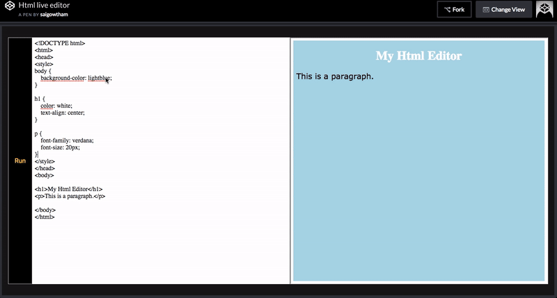

In this tutorial, we are building a Live Html editor using Html, CSS, and javascript no libraries or frameworks used.



Have you seen w3schools code editor we are building similar to that but in the simple version.

#### What properties, attributes, and elements we need to use to achieve this?

- **contenteditable**: if you add `contenteditable` attribute to an element it becomes editable in the browser.

- **textContent**: it is used to get the textContent present inside the dom node.

- **innerHtml**: The `innerHtml` property is used to get the HTML content instead of text.


**Let's Begin with writing some markup**

create an `index.html` and add the below code.

```html
<!DOCTYPE html>
<html lang="en">
<head>
    <meta charset="UTF-8">
    <meta name="viewport" content="width=device-width, initial-scale=1.0">
    <meta http-equiv="X-UA-Compatible" content="ie=edge">
    <link rel="stylesheet"  href="code.css">
    <title>Html editor</title>
</head>
<body>
    <div class="main-editor">
        <button class="btn">Run</button>
        <div class="first" contenteditable>
            writecode
        </div>
        <iframe class="second">
        </iframe>
    </div>

    <script src="editor.js"></script>
</body>
</html>

```

In the above, we have added `contentEditable` attribute to the `div` element so that it becomes editable
in the browser.


### JavaScript

create a new file called `editor.js` and add the below code.

```js

const first = document.querySelector(".first");
const iframe = document.querySelector("iframe");
const btn = document.querySelector("button");

btn.addEventListener("click", () => {
  var html = first.textContent;
  iframe.src = "data:text/html;charset=utf-8," + encodeURI(html);
});


first.addEventListener('keyup',()=>{
  var html = first.textContent;
  iframe.src = "data:text/html;charset=utf-8," + encodeURI(html);
})

first.addEventListener("paste", function(e) {
        e.preventDefault();
        var text = e.clipboardData.getData("text/plain");
        document.execCommand("insertText", false, text);
    });
```


### Css code

```css
* {
  box-sizing: border-box;
  padding: 0;
  margin: 0;
}


.btn {
  poistion:fixed;
  right:0;
   padding: 0.4rem;
  width: 4rem;
  background: rgb(0, 0, 0);
  color: gold;
  font-size: 1rem;
  outline:none;
  cursor:pointer;
   height:90vh;
}
.btn:hover{
   color:white;
   background: blue;
}


.main-editor {
  background: rgba(0, 0, 0, 0.91);
  display: flex;
  width: 100%;
  padding: 1rem;
  box-shadow:0 2px 3px black;
  position:fixed;
  height:100vh;
   justify-content: center;
    align-items: center;
  border: 7px solid #36383f;
}

.first {
  background-color: #ffffff;
  width: 50%;
  overflow-x: hidden;
  overflow-y: auto;
  white-space: pre;
  box-shadow: 0 1px 1px rgb(22, 22, 22);
  outline: none;
  padding: 0.4rem;
  height: 90vh;
}

.second {
  background-color: rgb(255, 255, 255);
  width: 50%;
  overflow-y: auto;
  white-space: pre;
  right: 0;
  box-shadow: 0 1px 1px rgb(22, 22, 22);
  padding: 0.4rem;
  height: 90vh;
}
```

### Codepen demo

This an HTML live editor demo.

<iframe height='265' scrolling='no' title='Html live editor' src='//codepen.io/saigowthamr/embed/YjMwmV/?height=265&theme-id=dark&default-tab=result' frameborder='no' allowtransparency='true' allowfullscreen='true' style='width: 100%;'>See the Pen <a href='https://codepen.io/saigowthamr/pen/YjMwmV/'>Html live editor</a> by saigowtham (<a href='https://codepen.io/saigowthamr'>@saigowthamr</a>) on <a href='https://codepen.io'>CodePen</a>.
</iframe>


