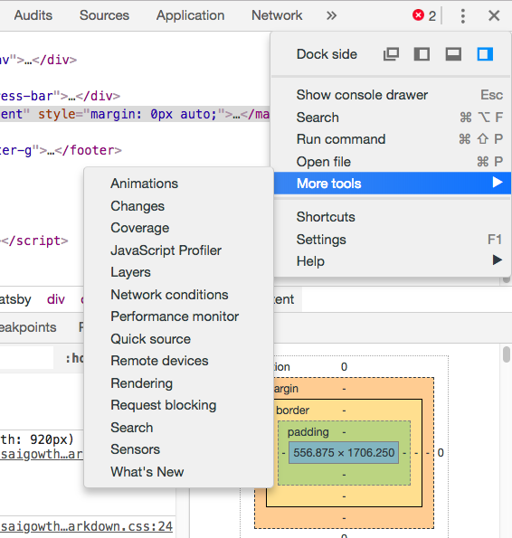
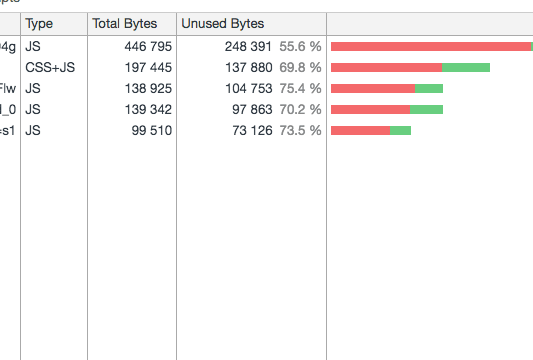
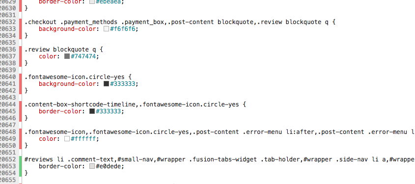

Does your code is fully covered is there any unused JavaScript or CSS code on your web pages.

Let's see how to check the unused code on your page by using chrome dev tools.

First, we need to open the chrome dev tools by hitting `cmd+opt+i` in mac or just right click and choose to inspect.

 Next, click on the 3 dots and select coverage option.
 

Now click on  `reload` icon inside the coverage tab.

when we click on a __red__ bar it will open a new tab and shows exactly what type of code in your file is currently not used.

In above image red color is showing **unused** code and the green color is indicating **used** code.

So that we can remove the unused code from our files before it shipping to the user's browser.it helps to increase the web performance.

check out now,  it helps you so much to see how much amount of your code is using.if you didn't see the coverage option then update your chrome browser.

