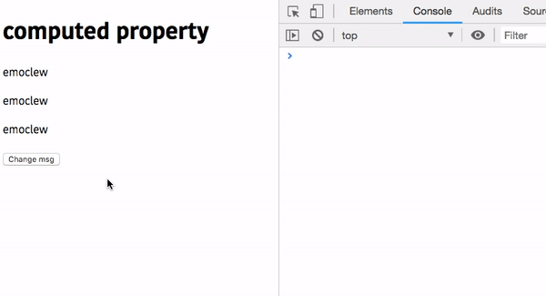
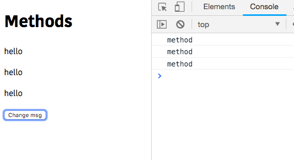

In this tutorial, we are going to learn about difference between Computed properties vs methods in vue.js

## Computed properties

- In vuejs Computed properties helps us to run the complex logic.
- Computed properties are cached by the vue so that it only revaluates the logic if its underlying data property changes.

example:

```html{7}:title=Example.vue
<template>
  <div id="app">
    <h1>computed property</h1>
    <p>{{ reverseMsg }}</p>
    <p>{{ reverseMsg }}</p>
    <p>{{ reverseMsg }}</p>
    <button @click="msg = 'hello';">Change msg</button>
  </div>
</template>

<script>
export default {
  data: function() {
    return {
      msg: "Learn vuejs"
    };
  },
  computed: {
    reverseMsg: function() {
      console.log("computed");
      return this.msg
        .split(" ")
        .reverse()
        .join(" ");
    }
  }
};
</script>
```
In this example, we have created a **computed property** called `reverseMsg` where we used it three times in the `<template>` tag.

**Change msg `button`** : It is used to Change the msg.

Let's test it now.



Have you seen when we click on a `change msg` button our `reverseMsg` computed property function is only run once and other two times it accessed the result from the cache without running the function again.

## Methods

- In vuejs methods helps us to create functions where it can accept arguments.
- Methods are used to create event handler functions.

Example:

```html{6,7}
<template>
  <div id="app">
    <h1>Methods</h1>
    <p>{{ reverseMsg(msg) }}</p>
    <p>{{ reverseMsg(msg) }}</p>
    <p>{{ reverseMsg(msg) }}</p>
    <button @click="msg = 'hello';">Change msg</button>
  </div>
</template>

<script>
export default {
  data: function() {
    return {
      msg: "Welcome"
    };
  },
  methods: {
    reverseMsg: function(str) {
      console.log("method");
      return str
        .split(" ")
        .reverse()
        .join(" ");
    }
  }
};
</script>
```
In this example,we used the `reverseMsg` function  multiple times in our template so that it revaluates the value every time we run a function but in computed properties the result is cached and it doesn't need to revaluate every time.


