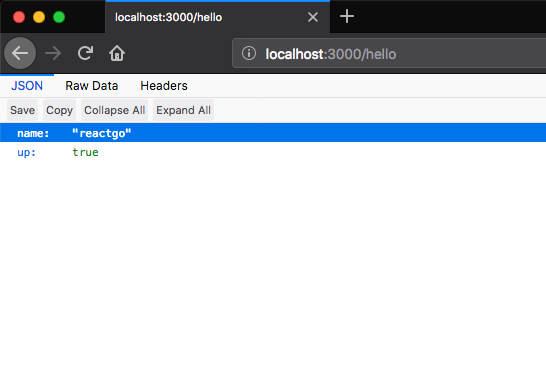
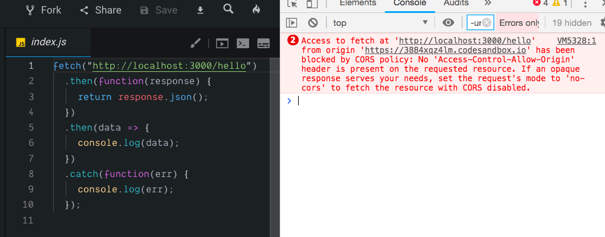
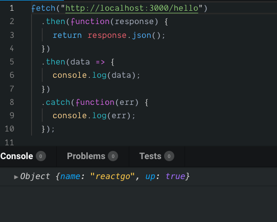

In this tutorial, we are going to learn about what is cross origin resource sharing(cors) and how to resolve the cors errors.


If we try to fetch the data from the other APIs you will get a cors errors mostly because the origin URL is `example.com` and you are making the http request to `api.example.com`.

The origin URL `example.com !== api.example.com` so that the cross resource sharing policy doesn't allow you to make requests to that API endpoint.

Let's learn it by using an example.

We are creating a sample server using node and express.

```js
const express = require('express')
const app = express();

app.get('/hello', (req, res) => {
    res.json({ name: "reactgo", up: true })
})

app.listen(3000, () => {
    console.log('server is up')
})
```

Now if we open `localhost:3000/hello` in our browser it will respond with the json object.




### Cors error

Now we are fetching the data from our frontend by making an http request to our endpoint `localhost:3000/hello`.

```js
fetch("http://localhost:3000/hello")
  .then(function(response) {
     return response.json()
  }).then(data=>{
    console.log(data)
  })
  .catch(function(err) {
    console.log(err);
  });
```

Output



The error is clearly mentioning you are making an http request from the different origin


In the above code the error has occurred because the user agent made an http request from `https://codesandbox.io/s/3884xqz4lm` origin to `http://localhost:3000/hello` so that the response comes the `localhost:3000/hello` doesn't contain 'Access-control-allow-origin' header.

If the response doesn't contain 'Access-control-allow-origin' header then our user-agent invoke the `err` callback function.

If the response contains 'Access-control-allow-origin' header then our user-agent invoke the `response`
callback function.

### How to resolve the cors error?

To resolve the cors error we need to add the `Access-Control-Allow-Origin` header to our response.

Let's add the `Acess-control-Allow-Origin` header to our server.

```js
const express = require('express')
const app = express();

app.use(function (req, res, next) {
    res.header("Access-Control-Allow-Origin", "*");
    next();
});


app.get('/hello', (req, res) => {
    res.json({ name: "reactgo", up: true })
})

app.listen(3000, () => {
    console.log('server is up')
})
```

We added a middleware to our express server so that for every response we are sending an `Access-Control-Allow-Origin` header.

```js
"Access-Control-Allow-Origin", "*"
```

`*` is a wildcard character it means we can fetch the data from the any origin.


Let's test our API endpoint.





If you open your network tab in chrome dev tools you will see a `Request headers` and `Response headers`.

```js

Response headers

Access-Control-Allow-Origin: *
Connection: keep-alive
Date: Sat, 05 Jan 2019 01:14:49 GMT
ETag: W/"1c-tkTgCcXUYKqMoGefdC0jm6oVXk8"
X-Powered-By: Express

Request headers

Accept: */*
Accept-Encoding: gzip, deflate, br
Accept-Language: en-GB,en-US;q=0.9,en;q=0.8
Connection: keep-alive
Host: localhost:3000
If-None-Match: W/"1c-tkTgCcXUYKqMoGefdC0jm6oVXk8"
Origin: https://3884xqz4lm.codesandbox.io
```

### How to allow requests only from particular origins?

sometimes we need to allow requests only from particular origins in that cases we need to specify the origins instead of adding wild `*` card character.

The express framework provides us a `cors` middleware which helps us to easily enable the cors.

```js
const express = require('express')
const cors = require('cors')
const app = express();


var corsOptions = {
    origin: 'https://3884xqz4lm.codesandbox.io',
    optionsSuccessStatus: 200 // some legacy browsers (IE11, various SmartTVs) choke on 204
}

app.use(cors(corsOptions))

app.get('/hello', (req, res) => {
    res.json({ name: "reactgo", up: true })
})

app.listen(3000, () => {
    console.log('server is up')
})
```


if we want to allow more than one origin we can do that by passing our origins in an array.

```js
const express = require('express')
const cors = require('cors')
const app = express();

const  whitelist = ['https://3884xqz4lm.codesandbox.io',
                     'http://example2.com']

const  corsOptions = {
  origin: function (origin, callback) {
    if (whitelist.indexOf(origin) !== -1) {
      callback(null, true)
    } else {
      callback(new Error('Not allowed by CORS'))
    }
  }
}

app.use(cors(corsOptions));

app.get('/hello', (req, res) => {
    res.json({ name: "reactgo", up: true })
})

app.listen(3000, () => {
    console.log('server is up')
})
```


### What is a preflight request?

Preflight request is an http request issued by the browsers automatically to check whether the requested API endpoint is participating in the cors protocol by including an origin header.

> A CORS-preflight request is a CORS request that checks to see if the CORS protocol is understood. It uses `OPTIONS` as the method and includes these headers:

The options method contain

`Access-Control-Request-Method` Indicates which method a future CORS request to the same resource might use.

`Access-Control-Request-Headers` Indicates which headers a future CORS request to the same resource might use.

For example, we are  asking a server to `POST` some data  before sending a `POST` request,
the browser sends a  preflight request without user interaction:

```js
OPTIONS /user/123
Access-Control-Request-Method: DELETE
Access-Control-Request-Headers: origin, x-requested-with
Origin: https://example.org

```

Response from the server

```js
HTTP/1.1 200 OK
Connection: keep-alive
Access-Control-Allow-Origin: https://example.org
Access-Control-Allow-Methods: POST, GET, OPTIONS, DELETE
Access-Control-Max-Age: 63400
```

The `Acess-control-Allow-origin-Methods` tell us we can also make `GET` and `DELETE` requests.

**Access-Control-Max-Age**: It tells us how long the information provided by the `Access-Control-Allow-Methods` and `Access-Control-Allow-Headers` headers can be cached.