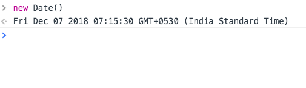
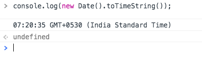
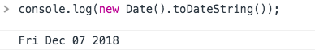

In this tutorial, we will learn about how to access the current date and time in JavaScript by using  Date Object.


 `Date` Object  helps us to get the current date and time.


```js
console.log(new Date());

```




### Time

We can also  access only time by using  the `new Date().toTimeString()` method


```js

console.log(new Date().toTimeString());

```




### Date


```js
console.log(new Date().toDateString());
```




### Year


```js

console.log(new Date().getFullYear());

// 2018

```
