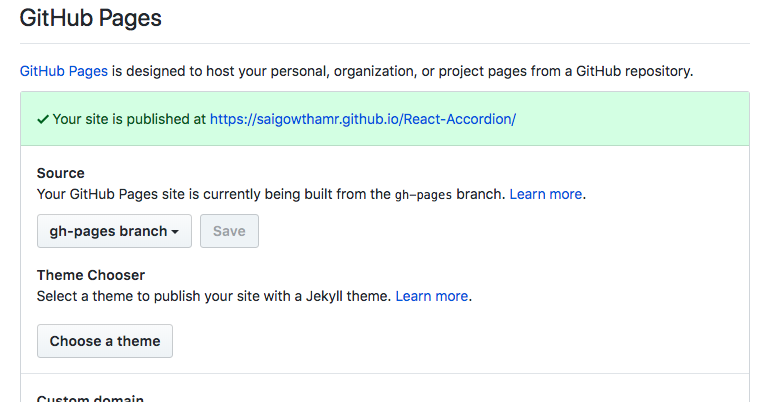

In this tutorial, we will learn about deploying a react app in GitHub pages.


GitHub provides us a free hosting to host our static web apps or documentation sites the github pages turns your code repository into a website and serves on a unique URL that ties to your username or organization name.

*Make sure your react app code is already pushed to the github account.*


Let's start to deploy a create react app in 5 steps.

### 1. Add homepage

Open your package.json file present inside your react app and add `homepage`  property.

```sh
"homepage":"https://yourusername.github.io/repository-name"
```

replace the above url with your github username and repository name.

---

### 2. Install gh-pages

Next, we need to install a package called gh-pages.

```bash
npm install --save gh-pages
```
---

### 3. Deploy script

It's time to add a deploy script commands in our package.json file.

```javascript

"scripts":{
 "predeploy": "npm run build",
 "deploy": "gh-pages -d build",
}

```

Now in your terminal run `npm run deploy `


### 4. Setup source to gh-pages branch.

Once you successfully deployed open your GitHub code repository and click on settings tab if you scroll down you can see a GitHub Pages then choose a branch to gh-pages.

