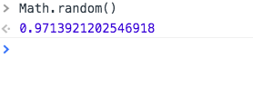
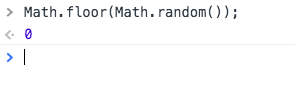
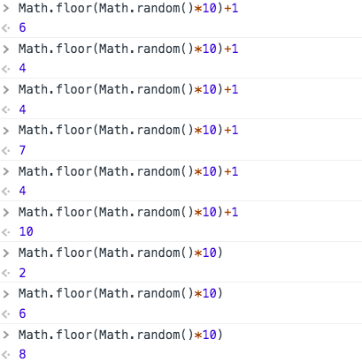

In this tutorial, we are going to learn how to generate random numbers in javascript by using `Math.random()` method.


By default `Math.random()` method generates a floating point number between 0 to 1 (inclusive of 0, but not 1).


```js
Math.random();
```



We don't need floating point numbers so that by using `Math.floor( )` method we floor it down to a decimal number.

```js
Math.floor(Math.random());
```



### Let's generate random numbers ranging between 1- 10.

```js
Math.floor(Math.random()*10) //random numbers 0-9
```
The above code only generates random numbers between  0 –9. But we need random numbers between 1–10.

```js
Math.floor(Math.random()*10)+1; //random numbers 1-10
```



### 1–100 random numbers

```js
Math.floor(Math.random()*100)+1; //random numbers from 1-100

```

Happy coding...
