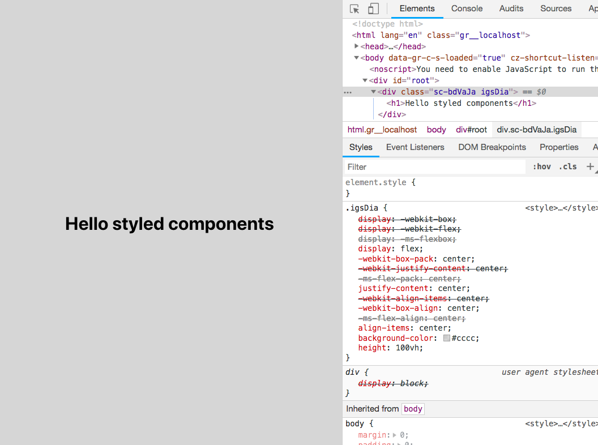
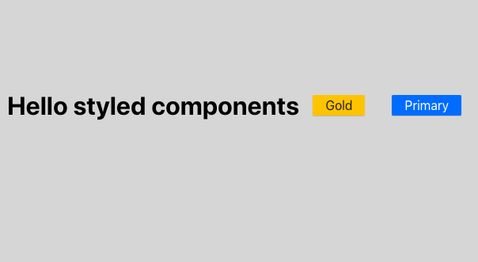
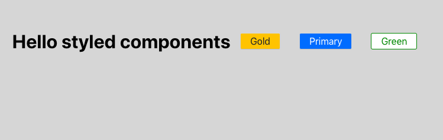

In this tutorial, we are going to learn about what is styled components and how to use it in react apps.

## What is Styled components?

Styled components allow us to write the CSS in JavaScript instead of writing the CSS in separate files.

The CSS is automatically vendor prefixed and easier to maintain our code base.

Styled components generate unique classnames so that we don't need to worry about class name collisions.


Let's see in action.

### Styled components Installation

Open your terminal and run below command to install `styled-components`.

```bash
npm install  styled-components
```

```js:title=App.js
import React, { Component } from 'react';
import styled from 'styled-components'

const Mydiv = styled.div`
 display:flex;
 justify-content:center;
 align-items:center;
 background-color: #cccc;
 height: 100vh;
`

class App extends Component {
  render() {
    return (
      <Mydiv>
        <h1>Hello styled components</h1>
      </Mydiv>
    );
  }
}

export default App;
```
In the above first we imported `styled` from the `styled-components` package,styled-components uses the tagged template literals to style your react components.

We need a `div` element to be styled so that we used `styled.div` template literal and added our styles at finally we got a react component with styles added to it.

output



Have you seen in above image our `div` element is rendered on the dom with unique class name and vendor prefixes are also added for the different browsers?


### Passing function to styled components

We can also pass functions to styled components and define styles based on its props.

```js{28-29}:title=App.js
import React, { Component } from 'react';
import styled from 'styled-components'


const Mydiv = styled.div`
 display:flex;
 justify-content:center;
 align-items:center;
 background-color: #cccc;
 height: 100vh;
`

const Button = styled.button`
  background: ${props => props.primary ? "#007bff" : "#ffc107"};
  color: ${props => props.primary ? "#fff" : "#212529"};
  font-size: 1em;
  margin: 1em;
  padding: 0.25em 1em;
  border-radius: 3px;
  cursor:pointer;
`;

class App extends Component {
  render() {
    return (
      <Mydiv>
        <h1>Hello styled components</h1>
        <Button>Gold</Button>
        <Button primary>Primary</Button>
      </Mydiv>
    );
  }
}

export default App;
```



In `Button` styled component we defined a function which returns the different colors based on the props passed to it.


### Extending styles

We can also inherit the styles to the new component based on the previous styled component and extend it with some new styles.


Here we used a `Button` component created in the above and passed it to the `styled()` constructor
to create a new button with extending styles.
```js{15,28}:title=App.js
import React, { Component } from 'react';
import styled from 'styled-components';

const Button = styled.button`
  background: ${props => props.primary ? "#007bff" : "#ffc107"};
  color: ${props => props.primary ? "#fff" : "#212529"};
  font-size: 1em;
  margin: 1em;
  padding: 0.25em 1em;
  border-radius: 3px;
  cursor:pointer;
`;


const GreenButton = styled(Button) `
  background-color:white
  color: green;
  border-color: green;
`;

class App extends Component {
  render() {
    return (
      <Mydiv>
        <h1>Hello styled components</h1>
        <Button>Gold</Button>
        <Button primary>Primary</Button>
        <GreenButton>Green</GreenButton>
      </Mydiv>
    );
  }
}

export default App;
```
