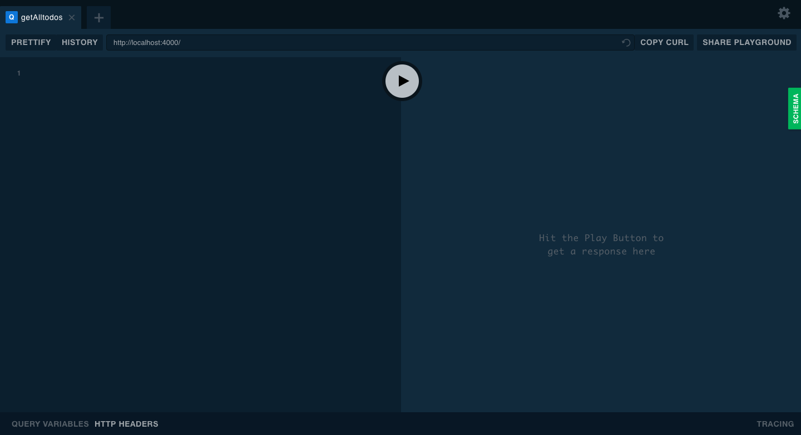
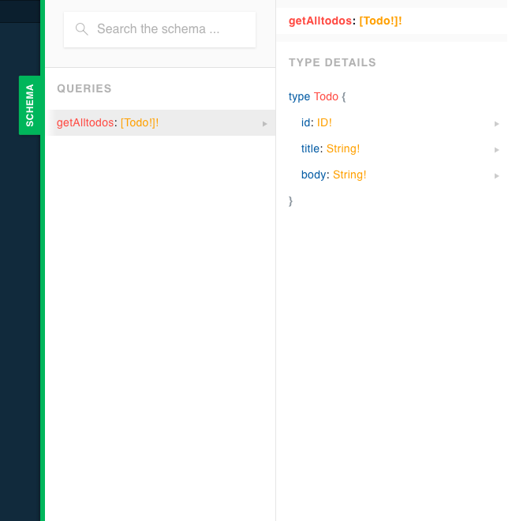
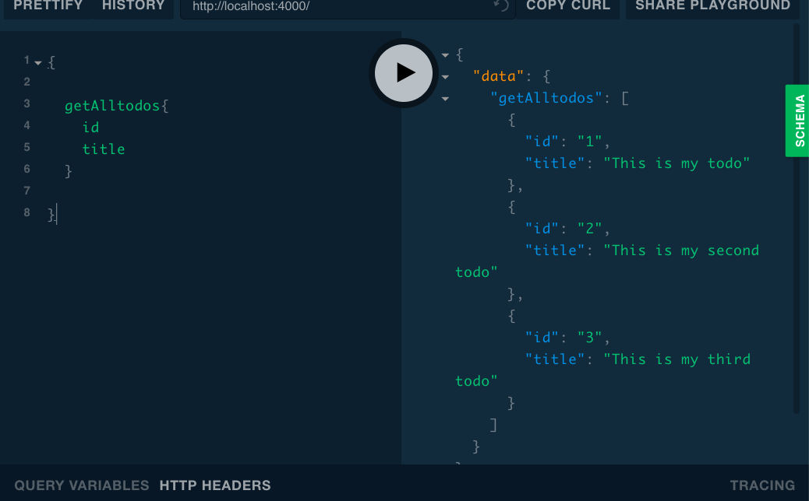
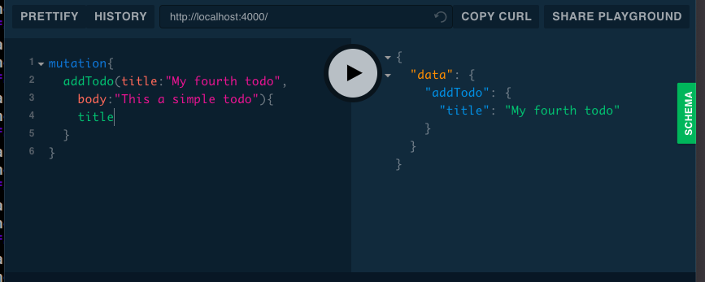
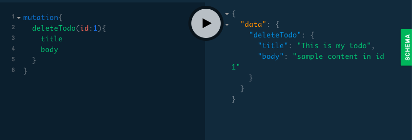
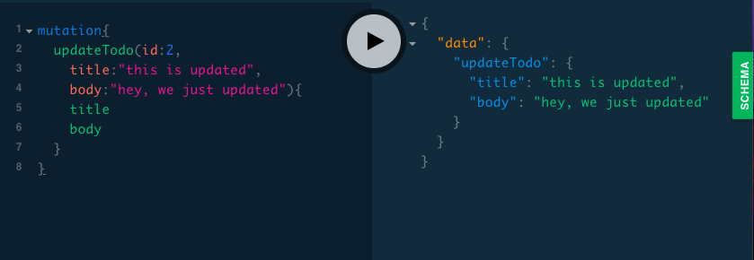

In this tutorial, we are going to build a simple todos API by using the GraphQL and graphql-yoga server.

[View code](https://github.com/saigowthamr/graphql-test-api)


>Note: if you don't know about what is Graphql then refer to my previous tutorial [Graphql intro](/graphql-intro-beginners/)


**Requirements**

- Nodejs


First, we need to install a `graphql-yoga` package by using npm or yarn.

```bash

mkdir graphql-api

cd graphql-api

npm i -y

npm i graphql-yoga

```

graphql yoga package helps us to create the graphql server with the minimal setup.


Now, create a new file called app.js and add the below code.

```js:title=app.js


const { GraphQLServer } = require('graphql-yoga');

//sample data

let todos = [
    {
        id: 1,
        title: "This is my todo",
        body: "sample content in id 1"
    },
    {
        id: 2,
        title: "This is my second todo",
        body: "sample content in id 2"
    },
    {
        id: 3,
        title: "This is my third todo",
        body: "sample content in id 3"
    }
]


```


In the above code first, we require the `graphql-yoga` package and our `todos` are added inside the `array` because we are not using any database.


Next, we need to create the type definitions using graphql `Schema definition language`(SDL).


```js:title=app.js

const typeDefs = `

   type Todo {
       id: ID!
       title: String!
       body: String!
   }

   type Query{
       getAlltodos : [Todo!]!
   }

`
```

Here we created a `Todo` type which contains three fields `id,title, body` it means our todo data must be in this shape.


On Query type, we created `getAlltodos` query which returns back an array of todos.


Now we need to create the resolvers. Which helps us to resolve the particular queries


```js:title=app.js

const resolvers = {

   Query:{
       getAlltodos(){
           return todos
       }
   }

}

```

<!-- In graphql Queries helps us to get the data to a client. Like `get` method in Rest APIs. -->


>Note: we need to use the same name for both resolvers and typedefs like how we used above `getAlltodos`.


Finally, step to turn on the server.

```js:title=app.js
const server = new GraphQLServer({
    typeDefs, resolvers, context: {
        //if we pass anything here can be available in all resolvers
    }
})


server.start(() => console.log('Server is running on localhost:4000☄'))
```

Now in your terminal run `node app.js` and navigate to `localhost:4000` in your browser.





This a graphql playground which helps us to test our data.


If you click on the left side Schema button you will see a Query which is the same query we created above in  `Type defs`.




As i said `getAlltodos` Query help us to get the array of `todos` let's test it now by
running a query on the graphql playground.


Copy the below query and paste on the left side and hit the play button.

```
{

  getAlltodos{
    id
    title
  }

}
```

Response from the graphql server is present on the right-hand side.




Have you seen the flexibility of the graphql we only get the data what we ask not more or not less?

```js
{

  getAlltodos{
    id
    title
    body
  }

}
```


output


```js
{
  "data": {
    "getAlltodos": [
      {
        "id": "1",
        "title": "This is my todo",
        "body": "sample content in id 1"
      },
      {
        "id": "2",
        "title": "This is my second todo",
        "body": "sample content in id 2"
      },
      {
        "id": "3",
        "title": "This is my third todo",
        "body": "sample content in id 3"
      }
    ]
  }
}
```

### Mutations

Mutations in the graphql allow us to create or update or delete the data.


Let's add the Mutation types inside the `type definitions`


```js:title=app.js

const typeDefs = `

type Todo{
    id: ID!
    title: String!
    body: String!
}


type Query{
   getAlltodos : [Todo!]!
}


type Mutation{

    addTodo(title:String!,body:String!):Todo!,
    updateTodo(id:ID!,title:String!,body:String!):Todo!
    deleteTodo(id:ID!):Todo!
}

`
```
we have added three Mutation types which are `addTodo,updateTodo,deleteTodo`

- `addTodo` accepts two arguments which are `title, body` and returns back newly created todo.

- `updateTodo` helps us to update the todo and returns back updated todo.

- `deleteTodo` only accept a single argument and returns back deleted todo.


Now, we need to add resolvers to resolve the above mutation types.


```js:title=app.js

const resolvers = {
    Query: {
        getAlltodos() {

            return todos
        }

    },
    Mutation: {
        addTodo(parent, args, ctx, info) {

            if (args) {
                todos.push({
                    id: Math.random(),
                    title: args.title,
                    body: args.body
                })
            } else {
                throw new Error('not args found')
            }

            return todos[todos.length - 1];

        },
        updateTodo(parent, args, ctx, info) {
            const index = todos.findIndex(e => e.id === +args.id)

            let todo = todos[index];

            todo.title = args.title
            todo.body = args.body

            return todos[index]
        },
        deleteTodo(parent, args, ctx, info) {
            const index = todos.findIndex(e => e.id === +args.id)

            let todo = todos[index];
            const filter = todos.filter(e => e.id !== +args.id)

            todos = filter

            return todo
        }
    }

}
```


Every resolver method can have four arguments which are `parent, args, context, info`

`parent`: Which helps us to the get parent data if we use Nested queries.

`args`: Arguments are the objects passed at the time of running the query.

`context`: This is an object shared by all resolvers Like authentication or change theme

`info`: It contains the information about the query.


Let's test our mutations using GraphQL Playground

`addTodo`

```js
mutation{
  addTodo(title:"My fourth todo",body:"This a simple todo"){
    title
  }
}

```



`deleteTodo`

```js
mutation{
  deleteTodo(id:1){
    title
    body
  }
}
```



`updateTodo`

```js
mutation{
  updateTodo(id:2,title:"this is updated",body:"hey, we just updated"){
    title
    body
  }

}
```




**[Code repository](https://github.com/saigowthamr/graphql-test-api)**


Happy coding...