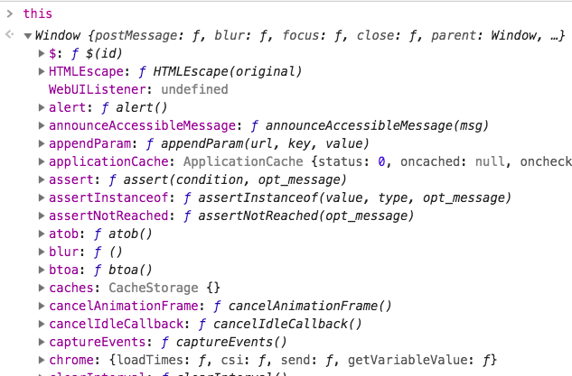
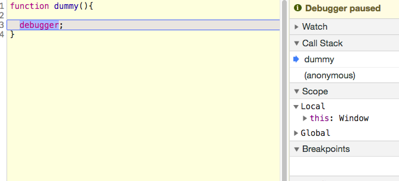
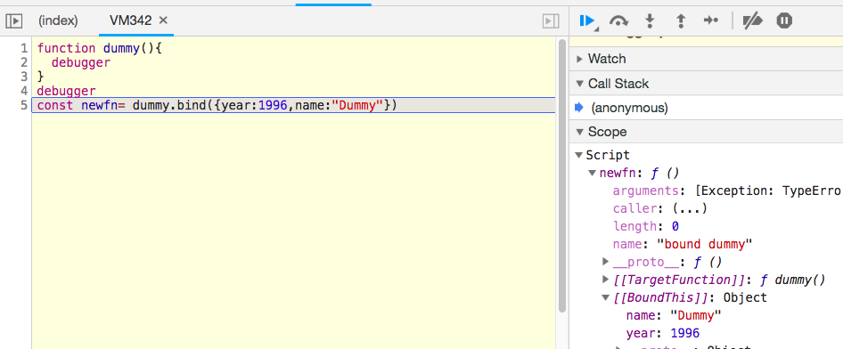
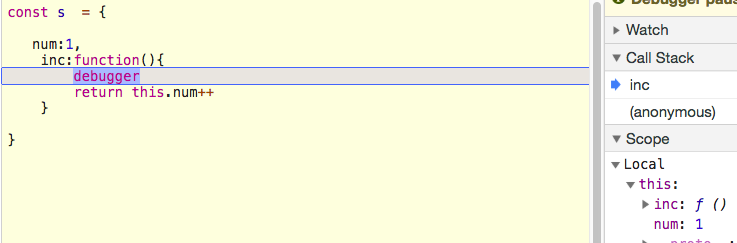
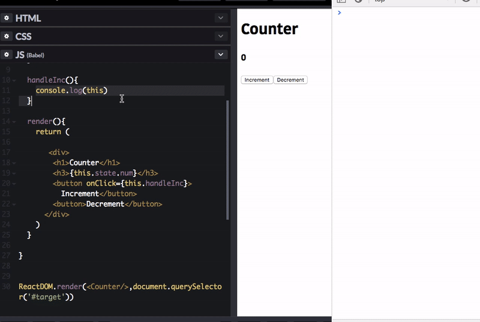
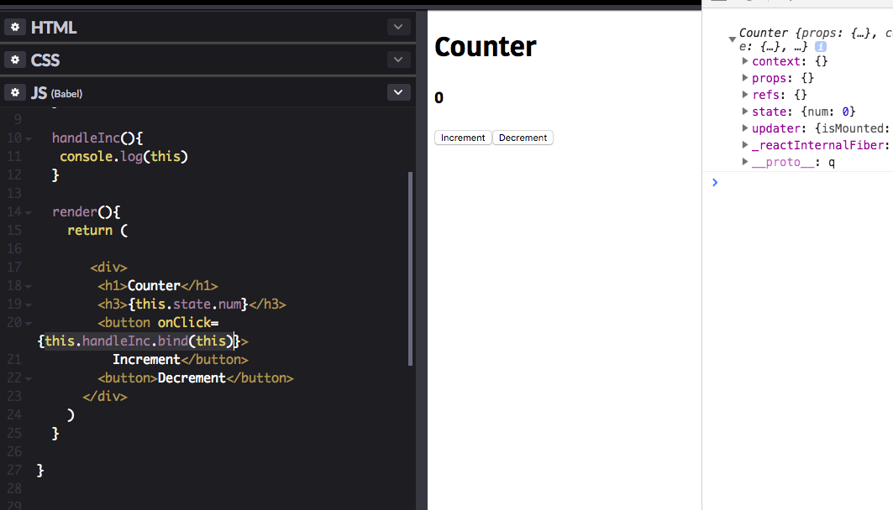

 In this tutorial, we are going to learn how `this keyword`  works in javascript at the end of this tutorial you will have confidence about how it works.

Let's get started.


### What is an Execution context?

The execution context is specific to the device where it keeps track the runtime evaluation of the code you are running at any point of time there is most one execution context that actually executing the code.


### Lexical environment


A Lexical Environment is a specification type used to define the association of Identifiers to specific variables and functions based upon the lexical nesting structure of ECMAScript code.

A global environment is a Lexical Environment which does not have an outer environment. The global environment's outer environment reference is null

if we declare a function javascript engine creates it's own execution context and it has reference to the outer lexical environment means it always has reference to where it is born.

---
In the global execution context, `this` keyword is assigned to the window object.

```js
console.log(this)
```




### How  does __this__ keyword works in the functions ?

If we invoke a function, javascript engine creates its own execution context where  `this` keyword refers to the `window` object.

```js{2}
function dummy(){
 debugger;
}

dummy()
```





In above image have you seen right side there is a `this` keyword which refers to the window object?


### How can we change the __this__ keyword reference in functions?

- JavaScript offers us three different methods to change the  __this__ keyword reference.


#### Call method

```js{5}
function dummy(){
  debugger
}

dummy.call({year:1996,name:"Dummy"})
```

call method takes two arguments first one is to which object `this` keyword needs to refer the second one is for function arguments.

Have you seen below image we changed `this` keyword reference.


### Apply method

The apply method also works the same as call method but in the apply method, we need to pass function arguments as an array.


### Bind method

Bind method is something different it will invoke the function and returns the new function with `this` keyword bound to the passed object.




In the above image have you seen dummy function returns the new function with `this` keyword is bound to the object we passed it as an argument.


### How __this__ keyword works in Objects ?

```js
const s  = {

   num:1,
    inc:function(){
        debugger
        return this.num++
    }

}

s.inc()
```


if we invoke an `inc` function javascript creates execution context where
__this__ keyword is bound to the entire object like below image.





### Why we are binding `this` keyword in react?

In react, if we use class-based components we need to bind `this` keyword to the class. Because the method we are passing to the event Handler is invoked in the global environment where `this` keyword refers to the window object.

see below image were i attached the **handleInc** method to the onClick handler.


If we try to access the setState method it doesn't found on the execution context so that we need to bind the `this` keyword to the class.

Have you seen difference in below image after we bind this keyword to the event handler method




Instead of using the normal functions if we use arrow functions it will solve the `this` keyword problem in react.

Because in arrow functions we don't have `this` keyword so that `this` keyword will bound to its outer lexical environment(outer wrapper function).
