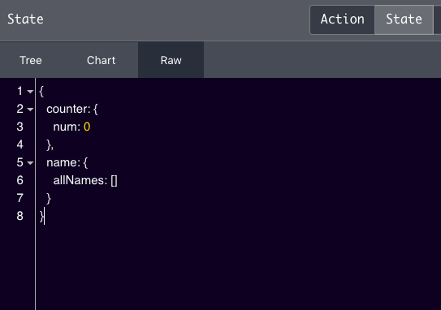

In this tutorial, we are going to learn about how to combine the multiple reducer functions in redux with the help of an example.

If you don't know about redux then check out my previous tutorials

1. [React Redux beginners tutorial](/react-redux-beginners-tutorial/)
2. [State management in React by using Redux and React-Redux](/redux-state-management-in-react/)


As our app grows our reducer function is getting more complex so that we can split the single function into a multiple independent reducer functions which manage their own state.

consider we have two reducers in our react app.

```js:title=counterReducer.js

const counterReducer = (state={num:0},action)=>{

    switch (action.type){

        case "INCREMENT":
         return { num : state.num+1 }

        case "DECREMENT":
          return {num: state.num-1}

         default:
           return state
    }


}

export default counterReducer
```
In the above code, we have created our first `counterReducer` function.


Now, we are going to define the  __second__ reducer function.


```js:title=namesReducer.js

const namesReducer = (state = { allNames: [] }, action) => {
    switch (action.type) {

        case "ALLNAMES":
            return { allNames: state.allNames.concat(action.name) }

        default:
            return state
    }

}

export default namesReducer
```

Next, we need to import these two reducer functions inside the `index.js` file.

**combineReducers example**

```js:title=index.js
import React from 'react';
import ReactDOM from 'react-dom';
import { createStore, combineReducers } from 'redux'
import {Provider} from 'react-redux'
import counterReducer from './counterReducer';
import namesReducer from './namesReducer';

// combining two reducers into a single reducer
const reducer = combineReducers({
    counter: counterReducer,
    name: namesReducer
})


const store = createStore(reducer)

ReactDOM.render(<Provider store={store}><App /></Provider>,
 document.getElementById('root'))
```


In the above, we have imported two reducer functions which are `counterReducer` and `namesReducer`
then we imported a combineReducer function from the 'redux' library.

`combineReducer` function takes multiple reducer functions as an argument and turns down into a single reducer function.

We are namespacing the reducer functions as `counter` for the `counterReducer` and `name` for the `namesReducer`.


Let's see how can we access the state from the `Components`.


```js:title=App.js
import React from 'react'
import {connect} from 'react-redux'

class App extends React.Component{


   render(){
       return (
           <div>
            <h1>{this.props.num}</h1>
           </div>
       )
   }

}

const mapStatetoProps = (state)=>{
    return {
        num : state.counter.num
    }
}

export default connect(mapStatetoProps)(App)
```

In the above component, we used `state.counter.num` because we namespaced it in the combineReducer function.


If you open your redux dev tools you can see the whole app state in a single object with namespacing.



