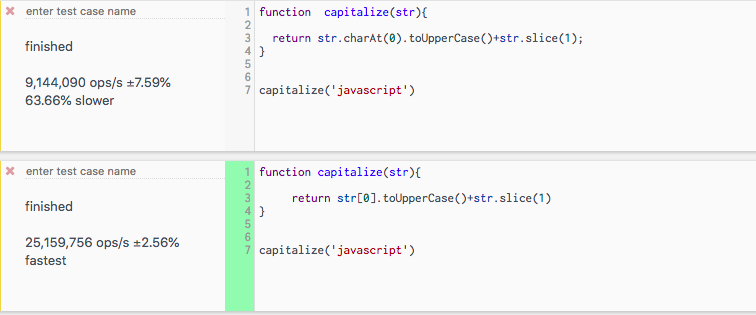

JavaScript doesn't have any inbuilt methods to uppercase the first letter of string
but we can do it by using the slice and charAt methods.


First, we need to access the first character of a string by using the `charAt`
method then convert it to uppercase, and concat with the string by slicing
the first character.

```js
const str = 'javascript';


 str.charAt(0).toUpperCase()+str.slice(1);


//output -> 'Javascript'

```

You can also create your function.

```js
function capitalize(str){

  return str.charAt(0).toUpperCase()+str.slice(1);
}


capitalize('gowtham') // Gowtham

capitalize('jshype') // Jshype
```


### Second way

We can also access the first character of a string by using its index.

```js

function capitalize(str){

     return str[0].toUpperCase()+str.slice(1)
}


capitalize('javascript') //  Javascript

```

The second solution is the fastest compared to the first one.

