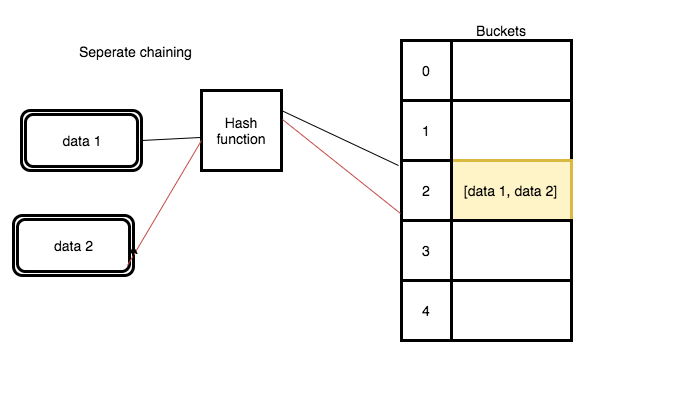

## What is Hashtable?

A hash table is a data structure which helps us to quickly find the data by using the keys. Hashtable uses the `hash` function to generate the indexes sometimes hash function generates the same `index` for the different `data` this is called `collision`.

**Definition**: A dictionary in which keys are mapped to array positions by hash functions. Having the keys of more than one item map to the same position is called a collision. There are many collision resolution schemes, but they may be divided into open addressing, chaining, and keeping one special overflow area. Perfect hashing avoids collisions but may be time-consuming to create.


  


If the collision occurs there are different ways to resolve the collisions.

1. Linear Probing
2. Separate Chaining
3. coalesced chaining
4. double hashing
5. quadratic probing

In this tutorial, we are using `separate chaining` to resolve the collisions.




### Let's implement the algorithm.

Create a new class called HashTable with two properties `buckets` and `size`.

```js
class HashTable{
  // default bucket size 42
  constructor(size=42){
    this.buckets =  new Array(size)
    this.size = size
  }

}
```

### Hash function

```js
    hash(key){
       return key.toString().length % this.size;
   }
```


### Set method

 - It helps us to add the new data to the Hashtable.

**Pseudocode**

1. Create a new method called set which accepts two arguments `key` and `value`.
2. Hash the key by using a hash function.
3. push the key-value pairs into that bucket


```js
 set(key,value){

    let index = this.hash(key);

    if(!this.buckets[index]){
      this.buckets[index] = [ ];
    }

    this.buckets[index].push([key,value])

    return index

  }
```


## Get method

 - It helps us to get the data by using the key.


1. Create a new method called get which accepts one argument `key`.
2. Hash the key and get the index of that bucket.
3. if there is no bucket in that index return null
4. for of loop and return value

```js
  get(key){

     // index of the bucket
    let index = this.hash(key);

     // if there is no bucket
     if(!this.buckets[index])return null

        for(let bucket of this.buckets[index]){
          // if key  matches
          if(bucket [0] === key){
            // value
            return bucket [1]
           }
        }
  }
```

### Time complexity

 - Insertion - O(1)
 - Searching - O(1)
 - Deletion - O(1)


**Code pen demo**


<iframe height='265' scrolling='no' title='Hash tables in  javascript' src='//codepen.io/saigowthamr/embed/PxdWwB/?height=265&theme-id=0&default-tab=result' frameborder='no' allowtransparency='true' allowfullscreen='true' style='width: 100%;'>See the Pen <a href='https://codepen.io/saigowthamr/pen/PxdWwB/'>Hash tables in  javascript</a> by saigowtham (<a href='https://codepen.io/saigowthamr'>@saigowthamr</a>) on <a href='https://codepen.io'>CodePen</a>.
</iframe>


#### Uses

Several dynamic languages, such as Perl, Python, JavaScript, Lua, and Ruby, use hash tables to implement objects.