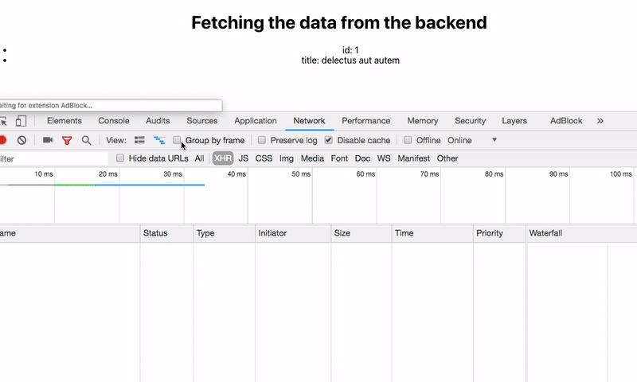

In this tutorial, we will learn about how to fetch the data from the backend APIs in redux by using 'redux-thunk' middleware.

- [Synchronous action creators](#synchronous-action-creators)
- [Asynchronous action creators](#asynchronous-action-creators)
- [http request example](#http-requests-example)

If you want to learn about redux basics then please check out below tutorials.

1. [React Redux beginners tutorial](/react-redux-beginners-tutorial/).


## Getting started

We are using the `create-react-app` command line tool to generate the new react app boilerplate.

```bash
npx create-react-app http-redux
```
This above command will download the react app related files inside the "http-redux" folder.

Change your working directory to "http-redux" by using below commands.

```bash
cd http-redux
npm start
```
`npm start` command is used to turn on the react app development server.


### Connecting react with redux

Now we need to make a connection between the react and redux libraries for that we need to download
two packages from the npm.

Run the following commands to install the `redux` and `react-redux` packages.

```bash
npm i redux react-redux
```
Redux is a state management library for JavaScript apps.

React-redux is used to make a connection between react and redux.

Open your "http-redux" folder using your favorite code editor and create a new folder called `reducers`inside your `src` directory.

In `reducers` folder create a new file called `myreducer.js` and add the below code.

```js{7-11}:title=myreducer.js

const intialState = {
    num: 0
}

const reducer = (state = intialState, action) => {

    switch (action.type) {
        case "INCREMENT":
            return { num: state.num + 1 }
        default:
            return state
    }

}


export default reducer
```
Here we just created a small reducer function with one action type "INCREMENT".

Open your `index.js` file and the below code.


```js:title=index.js
import React from 'react';
import ReactDOM from 'react-dom';
import './index.css';
import App from './App';
import { createStore } from 'redux'
import { Provider } from 'react-redux'

import reducer from './reducers/myreducer'

const store = createStore(reducer);


ReactDOM.render(<Provider store={store}>
    <App /></Provider>, document.getElementById('root'));
```

Now We successfully connected react with redux.


### Synchronous action creators

Synchronous action creators are just functions which return an object with the type of
action and payload.

Let's create a synchronous action creator.

create a new file called  `actions.js` in your src folder.

```js:title=actions.js

export const increment = () => {
    return {
        type: "INCREMENT"
    }
}
```

Let's use this action creator to dispatch the `INCREMENT` action.

```js:title=App.js
import React, { Component } from 'react';
import './App.css';
import { connect } from 'react-redux'
import { increment } from './actions'


class App extends Component {
  render() {
    return (
      <div className="App">
        <h1>{this.props.num}</h1>
        <button onClick={this.props.onIncrement}>Increment</button>
      </div>
    );
  }
}


const mapStatetoProps = (state) => {
  return { num: state.num }
}

const mapDispatchtoProps = (dispatch) => {
  return {
    onIncrement: () => dispatch(increment())
  }
}

export default connect(mapStatetoProps, mapDispatchtoProps)(App);
```

This asynchronous action creator example.

### Asynchronous action creators

Asynchronous action creators don't return the `object` immediately with action type and payload instead of it returns the function with parameters `dispatch` and `getState`.

Because in asynchronous code like  if we fetching something from the backend API it takes some time to get the data from the backend so that we are not dispatching the action immediately instead of we are
dispatching the action only when the data comes back from the backend API.

For Asynchronous actions we need to install a new package called `redux-thunk`.

```bash
npm i redux-thunk
```
`redux-thunk` is a middleware which helps us to delay the actions to dispatch.

>If you want to learn about __thunks__ then check out my [previous tutorial](/thunks-javascript/).

once you successfully installed the 'redux-thunk' now we need to configure our code to use this
middleware.

Open your `index.js` and update with `redux-thunk` configuration.

```js{13}:title=index.js
import React from 'react';
import ReactDOM from 'react-dom';
import './index.css';
import App from './App';
import { createStore, applyMiddleware } from 'redux'
import thunk from 'redux-thunk'
import { Provider } from 'react-redux'

import reducer from './reducers/myreducer'


const store = createStore(reducer, applyMiddleware(thunk));


ReactDOM.render(<Provider store={store}>
    <App /></Provider>, document.getElementById('root'));
```

First, we imported `applyMiddleware` function from the 'redux' library then we imported 'thunk' from the 'redux-thunk.

Next, we invoked the `applyMiddleware` function by passing the `thunk` as its argument.


Update your `reducers.js` file with below code.

```js

const intialState = {
    num: 0,
    data: null,
    error: ""
}

const reducer = (state = intialState, action) => {

    switch (action.type) {
        case "INCREMENT":
            return { ...state, num: state.num + 1 }
        case "FetchData":
            return { ...state, data: action.data }
        case "ERROR":
            return { ...state, error: action.msg }
        default:
            return state
    }

}


export default reducer
```
We are updated our `reducer.js` file by adding a two new action types "FetchData" and "ERROR".


Let's create an __asynchrous__ action creator which helps us to fetch the data.

update your `actions.js` file with the below code.

#### http requests example
```js:title=actions.js

// synchronous action creator
export const increment = () => {
    return {
        type: "INCREMENT"
    }
}

// asynchronous action creator
export const fetchData = () => {

    return (dispatch) => {
        console.log('ss')
        return fetch('https://jsonplaceholder.typicode.com/todos/1')
            .then(response => response.json())
            .then(json => dispatch(
                { type: "FetchData", data: json }))
            .catch(err => dispatch(
                { type: "ERROR",msg: "Unable to fetch data" }))
    }

}
```

In the above code, we only dispatch the `FetchData` action whenever the data arrives from the API and we dispatch the `ERROR` action in case an error occurs while fetching the data.


Let's dispatch the asynchronous action creator in our `App` component.

```js{19-22,30,34}:title=App.js
import React, { Component } from 'react';
import './App.css';
import { connect } from 'react-redux'
import { fetchData } from './actions'


class App extends Component {

  componentDidMount() {
    this.props.onFetchData()
  }

  render() {
    return (
      <div className="App">
        <h1>Fetching the data from the backend</h1>
        {this.props.error && <p>{this.props.error}</p>}

        {this.props.data && <ul>
          <li>id: {this.props.data.id}</li>
          <li>title: {this.props.data.title}</li>
        </ul>}
      </div>
    );
  }
}


const mapStatetoProps = (state) => {
  return { num: state.num, data: state.data, error: state.error }
}

const mapDispatchprops = (dispatch) => {
  return { onFetchData: () => dispatch(fetchData()) }
}


export default connect(mapStatetoProps, mapDispatchprops)(App);

```
In the `App` component we called the `this.props.onFetchData()` function inside the
 `componentDidMount()` life cycle method.


Output:




[Code repository](https://github.com/saigowthamr/redux-http-requests)