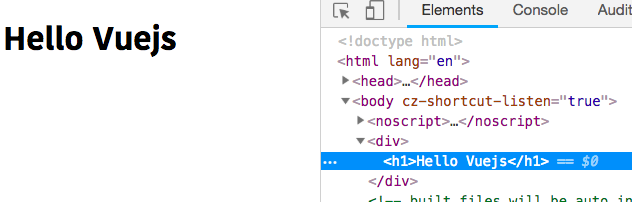
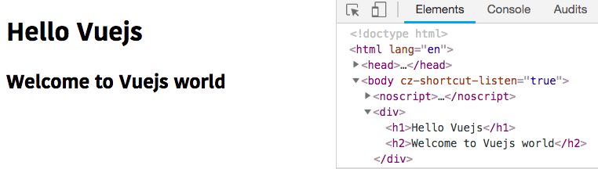

In this tutorial, we are going to learn about how to use `data` and `methods` properties in Vue JS.


>For this tutorial we are using Vue cli to generate our Project.

## Creating our project

Let's quickly create our vue project by running the following command.

```bash
vue create vue-app
```
This above will download required files in `vue-app` folder.

>Note: if you don't about how to create vue project using cli then check out my [Vue Cli 3 tutorial](/vue-cli3-tutorial-creating-project/)

Change your working directory by using `cd vue-app` then open your project folder by using your favorite code editor.

Inside your `src` folder navigate to `App.vue` file and remove everything then replace with below code.

```js:title=App.vue
<template>
  <div>
    <h1>Hello Vuejs</h1>
  </div>
</template>

<script>
export default {};
</script>
```
### Data property

In the above code, we are exporting `default` empty object inside the `<script>` tag let's add the `data` property to that empty object.

```js{5}
<script>
export default {
   data:function(){
       return {
           title: "Vuejs"
       }
   }
};
</script>
```

**data**: The `data` property value is an anonymous function which is returning object.Every property
inside that object is added to the Vue reactivity system so that if we change that property value then vuejs re-renders the dom with the updated data.

let's add the `title` property to our template `tag` by using `{{}}` double curly braces.

```js{3}:title=App.vue
<template>
  <div>
    <h1>Hello {{title}}</h1>
  </div>
</template>

<script>
export default {
  data: function() {
    return {
      title: "Vuejs"
    };
  }
};
</script>
```

In Vuejs we need to use double curly braces `{{js expression }}` to pass the JavaScript expressions.

Let's start the development server by using the following command.

```bash
npm run serve
```


Have you seen our `{{title}}` is replaced with `Vuejs`.

### Methods property

The name denotes you can create `methods` by using me, let's create our first method by using `methods` property.

The `methods` property value is also an `object`.

```js{9-11}
<script>
export default {
  data: function() {
    return {
      title: "Vuejs"
    };
  },
  methods:{
      welcomeMsg:function(){
          return `Welcome to ${this.title} world`
      }
  }
};
</script>
```

In the above code, we have added a `welcomeMsg` method which is returning a
string.

Inside the methods, we can access the `data` object by using `this.propertyname`.

Let's invoke the `welcomeMsg` method inside our template tag.

```html{4}
<template>
  <div>
    <h1>Hello {{title}}</h1>
    <h2>{{welcomeMsg()}}</h2>
  </div>
</template>
```
