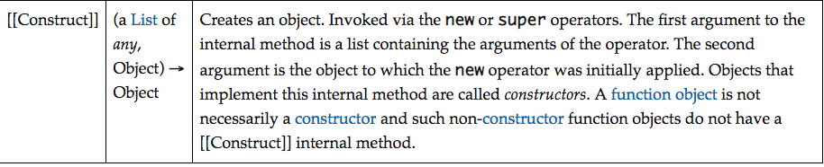
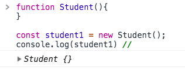
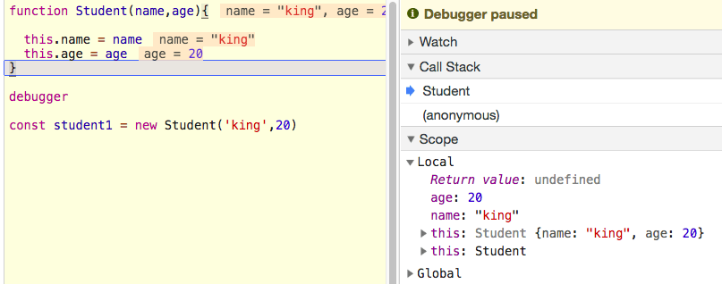
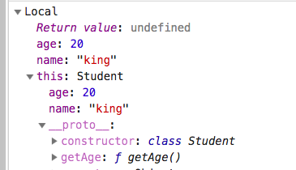
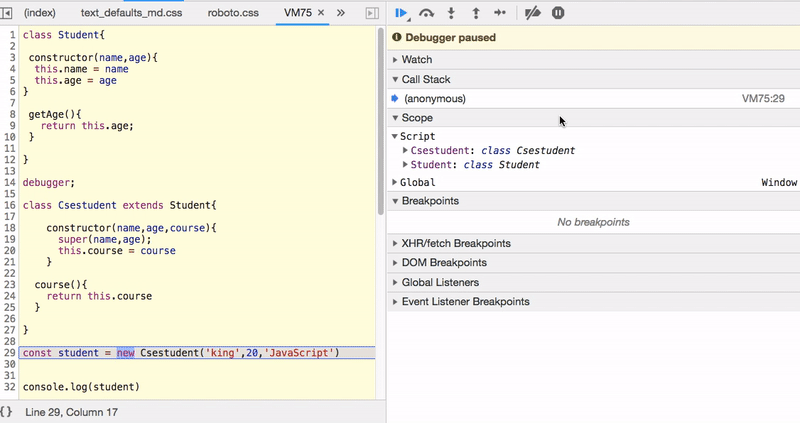

Classes are the syntactic sugar in the javascript unlike the other programming languages javascript doesn't contain proper classes.

Classes use the prototype-based inheritance by using constructors.

## What is a constructor?

A constructor is a function object which is used to create and initializes the objects.



Let's discuss now by using examples.


```js
function Student(){

}
const student = Student();

console.log(student) // undefined

```

If we invoke a function with the new keyword it will return the empty object instead of undefined.

```js
function Student(){

}

const student1 = new Student();

console.log(student1) //  { }

```



**How to add properties  into that returned empty object?**

```js
function Student(name,age){

  this.name = name
  this.age = age
}

const student1 = new Student('king',20);

// { name : 'king',age:20 }

```

The new object is created by the constructor and assigned to the  `this ` keyword so that we can add new properties to that object by using this.propertyname.

At last, the constructor returns `this` object like below image.



### Classes

Classes are also a special type of functions using prototype-based inheritance.

to declare the class we need to use class keyword.

```js
class Student{

constructor(name,age){
  this.name = name
  this.age = age
}

}

const student1 = new Student('king',20)

// { name : 'king',age:20 }
```


### Methods in classes

```js
class Student{

 constructor(name,age){
  this.name = name
  this.age = age
}

 getAge(){
   return this.age;
 }

}

const student1 = new Student('king',20);

student1.getAge();

```

The methods we declare inside the Student class are added to its prototype and it assigns
the methods to the `this.__proto__` property. so that at the time of accessing the `getAge` method
javascript engine first look on its object, if it fails to find then it will look up at the `__proto__` property.

check out the below image you will get the clarity.




### Extends in classes

Extends keyword helps us to access the properties and methods present in the other class or parent class.

### super

If we extend the class from the parent class we need to invoke the parent class before using the child class there is a super method provided by the javascript, it does the invocation for us.


```js
class Csestudent extends  Student{

    constructor(name,age,course){
      super(name,age);
     this.course = course
    }

   getCourse(){
      return this.course
   }
}

const student = new Csestudent('king',20,'JavaScript')
```

In below image, i have shown how javascript engine process the code.



Let me explain what happens when we invoke a Csestudent class javascript engine first adds the  Csestudent to the call stack once it sees the super method it invokes the parent class which is a Student and it returns the object with two properties at final we are adding **course** property to that object.

  The final student object might look like these.


But the methods we declared in the Student class are present in the `this.__proto__.__proto__`


#### References
 - [ Ecmascript-262 Objects](https://www.ecma-international.org/publications/files/ECMA-ST-ARCH/ECMA-262,%203rd%20edition,%20December%201999.pdf#sec-11.2.2)

- [Ecma-262 Class definitions](https://www.ecma-international.org/ecma-262/9.0/index.html#sec-class-definitions)
