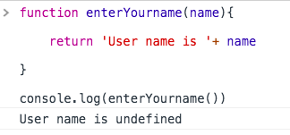
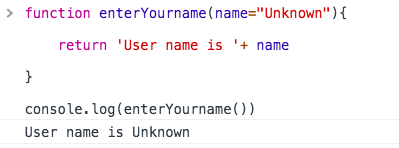

Default function parameters help us to initialize the parameters with the default values.


By default function parameters are initialized with the value `undefined`  if we don't pass any value to the function.


Let's see in practice.


### Without default parameters

```js


function enterYourname(name){

    return 'User name is '+ name

}

console.log(enterYourname())

```

In the above example we don't pass any argument to the function so that it will return `username is undefined`.




### With default parameters


```js


function enterYourname(name="unknown"){

    return 'User name is '+ name

}

console.log(enterYourname())

```
Here we added a default value to `unknown`.




More examples

```js

function add(a,b=5){

    return a+b;
}

console.log(add(1))

// output -> 6

```

```js

function combineArrays(a,b=[5,6,7]){

    return [...a,...b];

}

console.log(combineArrays([1,2,3,4]))

// output [1,2,3,4,5,6,7]

```
