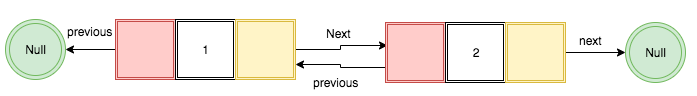

In this tutorial, we are going to learn about implementation of doubly linked list in JavaScript


## What is Doubly Linked List?

In doubly linked list, each node has a reference to the previous node and the next node. The beginning and ending nodes of the previous and next should point to the null.



> Note: If you don't know about  linked list then please refer to my previous tutorial  [What is  Linked List](/linked-list-implementation-javascript/).


### Doubly Linked List Implementation

Let's implement a doubly linked list.

We are using es6 classes  if you don't about classes then please check out [How classes work in javascript](/javascript-class/)

In below code, we created a helper class `Node` with three properties `data`, `prev`, `next`.

```js
class Node {

  constructor(data){
    this.data = data; // data
    this.prev = null; // reference to the prev node
    this.next = null; // . reference to next node
  }

}
```

**data**: The data we need to add in the node.

**prev**: reference to the previous node.

**next**: reference to the next node.


The  **main algorithm starts**

```js
class DoublyLinkedList{

   constructor(){
        this.head = null;
        this.tail = null;
        this.length = null;
  }

}
```
In the above code, we created a `DoublyLinkedList` class with three properties
`head`,`tail`,`length`.

**head**: It is the first node in the List.

**tail**: Last node in the list.

**length**: How many nodes present in the list?


Let's add the functionalities to our DoublyLinked List

### Push Method

- Push method helps us to add the new node at the end of the Linked list.


```js
  push(data){

    const node = new Node(data);

    if(!this.head){
      this.head = node;
      this.tail = node;
    }else{
      node.prev = this.tail;
      this.tail.next = node;
      this.tail = node;

    }

    this.length++;
  }
```
1. In above code first, we declared a new variable and invoke the Node constructor.
2. if there is no this.head then this.head and this.tail to be a new node that we created in step 1.
3. If there is already a node
     - new node.prev property should be the this.tail
     - this.tail.next should be a new node
     - updating the tail.
4. Increment the length by 1.


### Pop method

 - It helps us to remove the last node from the list.

In the doubly linked list, it is easy to remove the last node from the list because in the tail property we have the reference to the previous node.

```js
  pop(){

    if(!this.head) return null

    // tail is the last node so that we take the
    // prev property from the tail
    const prevNode = this.tail.prev

    if(prevNode){
       prevNode.next = null;
       this.tail = prevNode; // updating the tail
    }else{
      // if  prev property is null
      // it means there is only single node
      this.head = null;
      this.tail = null;
    }
     this.length--; //decrement the length
  }
```

1. In above code first, we declared a new variable and store the previous property of the tail.

2. if the previous Node found.
     - remove the last node
     - updating the tail.
3. if the previous node is null it means we have the only single node
    - this.head and this.tail should be null.
4. decrement the length by 1.


### insertBeginning.

- insertBeginning method helps us to insert the new node at the beginning of the list.


```js
  insertBeginning(data){

    // new node is created
    const node = new Node(data);

    // if there is no nodes
    if(!this.head) {
      this.head = node;
      this.tail = node;
    }else{
      // update the head.prev to the new node
      // take the new node.next property and link it to the
      // head property
      this.head.prev = node
      node.next = this.head;
      this.head = node;
    }
    // increment the length
    this.length++;

  }
```

### Remove First method

 - The removeFirst method helps us to remove the first node from the linked list.


```js
  removeFirst(){

    if(!this.head) return null

    // storing the second node
    const node = this.head.next;

    if(node){
     // removing the previous node
      node.prev = null
     // updating the head
      this.head = node
    }else{
      // only single node so we update head and tail to null
      this.head = null
      this.tail = null
    }
    //decrement the length
     this.length--;

  }
```


#### Tests

<iframe height="265" style="width: 100%;" scrolling="no" title="Doubly linked list javascript" src="//codepen.io/saigowthamr/embed/bQWBdj/?height=265&theme-id=dark&default-tab=result" frameborder="no" allowtransparency="true" allowfullscreen="true">
  See the Pen <a href='https://codepen.io/saigowthamr/pen/bQWBdj/'>Doubly linked list javascript</a> by saigowtham
  (<a href='https://codepen.io/saigowthamr'>@saigowthamr</a>) on <a href='https://codepen.io'>CodePen</a>.
</iframe>