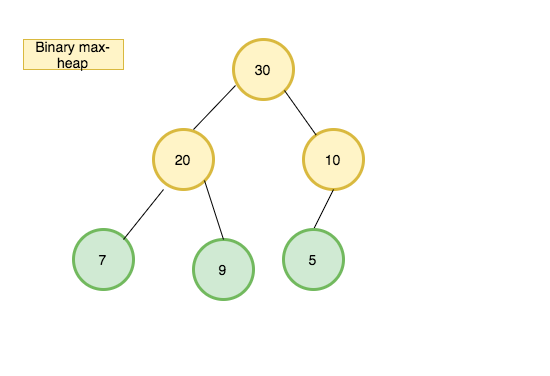
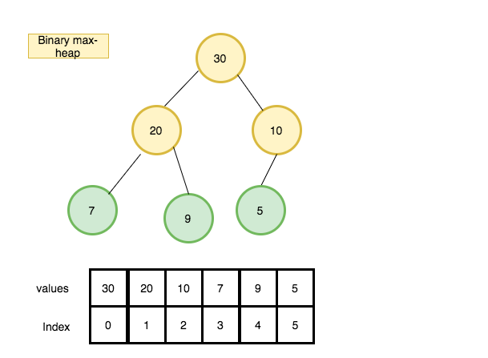
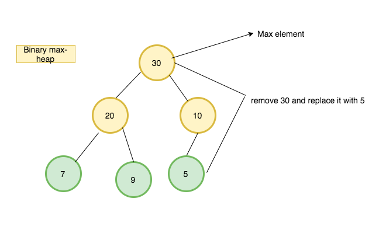
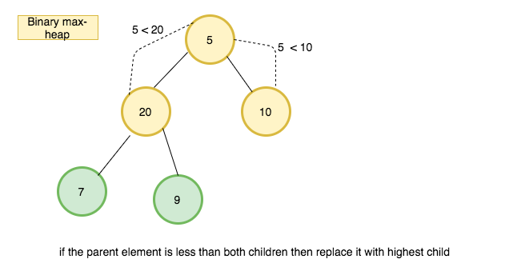
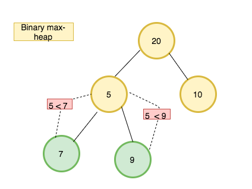
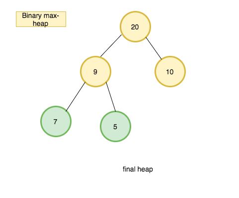

In this tutorial, we are going to learn about heap data structure and it's implementation in javascript.

>Note: If you don't know about Trees checkout my [last tutorial](/binary-search-tree-javascript/)

## What is a heap?

A heap is a tree-based data structure which satisfies the heap property,
if the parent node is greater than the child node is called max-heap or if the parent node is less than the child node is called min-heap.

The common implementation of the heap is the binary heap, which is a binary tree. see the below tree which is a binary max-heap where the parent node is greater than the child node.



### Heap implementation

The most common approach is to store the heap in an array because the heap is always a complete binary tree.No space is required for pointers; instead, the parent and children of each node can be found by simple calculations.




Let 'i' be the index of the  array the element of arr[i]  children can be found in `arr[2i+1]` and `arr[2i+2]` and its parent index `arr[Math.floor((i-1)/2)]`

**example**: let's find the children of element 30 in the above image.
1. element 30 index is 0
2. left child = 2x0+1 -> 1
3. right child = 2x0+2 -> 2
4. The children of element 30 are arr[1] and arr[2] which is 20 and 10.


### Algorithm implementation

First, we need a declare a class called Binary heap with the heap property.

```js
class  BinaryHeap{


  constructor(){
    this.heap = [30, 20, 10, 7, 9, 5]
  }

}
```

**Insert method**

Insert method helps to insert a new value to the heap.

1. Create a new method called insert which accepts value as its first argument.
2. Push the value to the last of the heap.
3. then we need to invoke bubbleUp method (also known as also known as percolate-up, sift-up, trickle-up, swim-up, heapify-up, or cascade-up).
4. Bubbleup method
   - declare a variable called index and initialize with the last index in the heap.
  - while the index is greater than 0
  - declare three variables element,parentIndex,parent.
  - if the parent is greater than or equal to the element then break the loop.
  -  swap the parent and element.


```js
  insert(value){

    this.heap.push(value)
     this.bubbleUp()
  }

     bubbleUp(){
       let index =  this.heap.length-1;

    while( index > 0){
       let element = this.heap[index],
           parentIndex = Math.floor((index-1)/2),
           parent = this.heap[parentIndex],

       if(parent >= element) break
          this.heap[index] = parent;
         this.heap[parentIndex] = element;
          index = parentIndex

    }
  }
```

Let me explain to you what happens when you run a bubble method.


- first, we store an index of the inserted element.
 - if the index is greater than 0  means our index is present in the heap.
-  while loop starts
  - if the parent is greater than or equal to the element then we break out of the loop.
-  if the parent is less than the child then swap the parent and child.


### ExtractMax method

It helps us to remove the highest element from the heap

The procedure for deleting the root from the heap and restoring the properties is called sink-down (also known as bubble-down, percolate-down, sift-down, down-heap, trickle down, heapify-down, cascade-down, and extract-min/max).

The highest element in the heap present in index 0. so we need to remove the first element and replace it with the last element and run sink down method.

How ExtractMax method works by using diagrams ?

1.

2.

3.

4.


Let's implement an ExtractMax algorithm

__Pseudocode__

1. create a method called extract max.
2. declare a variable called max and initialize with the first element in the heap.
3. update the first element in the heap with the last element.
4. run sink down method.
5. return max

```js
extractMax(){
    let  max = this.heap[0];
    this.heap[0]= this.heap.pop()
    this.sinkDown(0)
   return max
  }

```

### sinkDown method implementation

- Check out the above diagrams you will get a clarity about how sinkDown method
  works.

```js
 sinkDown(index){
     let   left = 2*index+1,
           right = 2*index+2,
           largest = index;
     const length = this.heap.length


        // if left child is greater than parent
      if(left <= length &&  this.heap[left]>this.heap[largest] ){
         largest = left
       }
      // if right child is greater than parent
      if(right <= length && this.heap[right]>this.heap[largest]) {
        largest = right
      }
     // swap
     if(largest !== index){
        [this.heap[largest],this.heap[index]] =
        [this.heap[index],this.heap[largest]]
       this.sinkDown(largest)
     }

  }
```


#### Code and Tests

<iframe height='265' scrolling='no' title='Heaps  in  javascript' src='//codepen.io/saigowthamr/embed/wQmXWZ/?height=265&theme-id=dark&default-tab=result' frameborder='no' allowtransparency='true' allowfullscreen='true' style='width: 100%;'>See the Pen <a href='https://codepen.io/saigowthamr/pen/wQmXWZ/'>Heaps  in  javascript</a> by saigowtham (<a href='https://codepen.io/saigowthamr'>@saigowthamr</a>) on <a href='https://codepen.io'>CodePen</a>.
</iframe>

