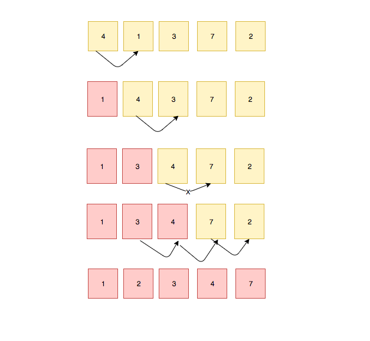

In this tutorial, we will learn about the insertion sort algorithm and its implementation in JavaScript.


Insertion sort maintains a sorted list and unsorted list in the same array.
it finds the correct position to insert the item in the sorted list that's why it's called insertion sort.


In the below diagram, red color items are sorted and yellow ones are unsorted.

.


Let's write an algorithm.


```js
function insertionSort(array,length=array.length){
  return array
}
```

Next, we need to create a for loop which starts from 1.
Inside the `for loop` we declared and initialized the temp variable with `arr[i]`.


```js
function insertionSort(array,length=array.length){
  for(var i = 1 ;  i < length ; i++){
    var temp = arr[ i ];
  }
  return array;
}
```


In nested for loop we are moving backward.Inside the nested `for loop` we need to swap the
`arr[j+1] = arr[j]`.

```js
function insertionSort(array,length=array.length){
  for(var i = 1 ;  i < length ;i++){
    var temp = array[ i ];
    for(var j = i-1 ; j>-1 && array[ j ]>temp; j--){
       array[ j+1 ] = array[ j ];
    }
  }
  return array;
}

```

final step update the `array[i+1]`  with  `temp` value;

__Completed algorithm__
```js
function insertionSort(array,length=array.length){
  for(var i = 1 ;  i < length ;i++){
    var temp = array[ i ];
    for(var j = i-1 ; j>-1 && array[ j ]>temp; j--){
       array[ j+1 ] = array[ j ];
    }
    array[ j+1] = temp;
  }
  return array;
}

console.log(insertionSort([4,1,3,7,2])) // [1, 2, 3, 4, 7]
```


### Visualization


### Time complexity

- Best case    - O(n)
- Average case - O(n<sup>2</sup>)
- Worst case   - O( n <sup>2</sup>)

 Space complexity -  O(n)

