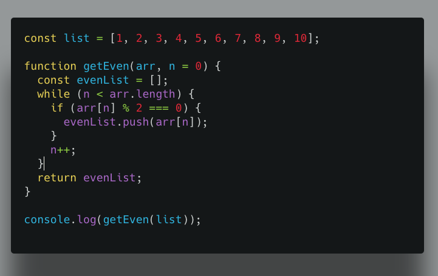

### Modulo operator helps us to find the remainder of the two numbers.


suppose we have two numbers 5 and 2 where `number 1 is dividend` and `number2 is a divisor`
( `number 1  % number 2 = Remainder`).


```js
 // 5 mod 2 = 1

5 % 2 = 1 // 1 is remainder


 // 10 mod 2 = 0

10 % 2 = 0 //0 is remainder

 //9 mod 3  = 0

9 % 3 = 0 // 0 is remainder

```

By using the modulus we can easily find the even numbers and odd numbers in the list.

### How to find even numbers using the modulo operator?




Happy coding…
