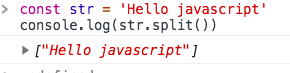
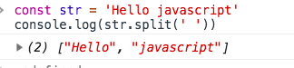
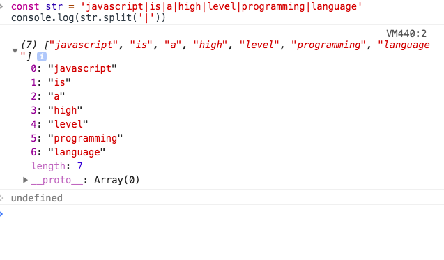
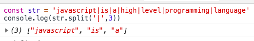

In this tutorial, we will learn about how to split the strings in javascript.

The split method helps us to split the string into an array of strings by using a separator where the exact place to split. it takes two arguments first one is a separator and the second one is limit.

**Separator**: We need to tell the split method at which point each split needs to occur in the string.

**Limit**: How many splits we need in the string.

```js
const str = 'Hello javascript'
console.log(str.split())
```
If we don’t specify a separator argument it will simply return a whole string in the array.




### Using separator argument

```js
const str = 'Hello javascript'
console.log(str.split(''))
```



```js
const str = 'javascript|is|a|high|level|programming|language'
console.log(str.split('|'))
```


### Using limit argument

```js
const str = 'javascript|is|a|high|level|programming|language'
console.log(str.split('|'),3)
```



Have you seen in the above image by using a limit argument it only split first 3 matches in the string?

Happy coding….