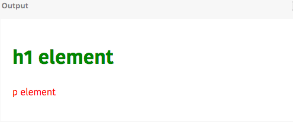
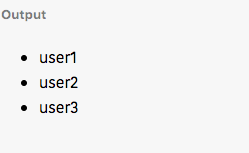

Beginners to the react probably get confused about why we write HTML inside the JavaScript.At the end of this tutorial, you will get a better understanding of jsx.


### React without JSX

Let’s write some react code without using jsx so that we can know better , why we use jsx in react.

```js{1,3,5}

let h1 = React.createElement('h1',{style:{color:"green"}}," h1 element");

let p = React.createElement('p',{style:{color:"red"}},"p element");

let div = React.createElement('div',{className:"container"},h1,p)


ReactDOM.render(div,document.querySelector('#app'))

```



`React.createElement(type,props,children)` method takes the three arguments.

__type:__ It means the type of HTML element we need.
(example: h1,h2,p,div..etc.)

__props:__ Any properties required for this element/not.

__children:__ The data we need to add inside the html element.(example: plain text or child elements)


### React with JSX

Now we are replacing the above code by using jsx.

```js{4,6,8}

let  green  = {color:"green"},
     red =    {color:"red"}

let h1 = <h1 style ={green}>h1 element</h1>;

let p =  <p style={red}>p element</p>;

let div = <div className="container">{h1}{p}</div>

ReactDOM.render(div,document.querySelector('#app'))

```

The jsx we write inside the react is often converted into [JavaScript](#react-without-jsx) by using the babel transpiler.


### What is JSX?

Jsx allows us to write HTML like syntax inside the JavaScript these is not a react specific thing. By using jsx we can make our code more readable so that react team recommends us to use jsx.

Jsx is not only used in `react` there are also some other frameworks like preactjs, Infernojs uses jsx.

---

### Expressions in jsx

In jsx, we can embed JavaScript expressions by wrapping with the curly braces `{}`.

```js
let h1 = <h1> Odd number {2+3}</h1>
```

```js

let users = ['user1','user2','user3']

let ul = <ul>

{users.map((user,i)=>(
    <li>{user}</li>
))}

</ul>

```
In the above code, we used `map` method to iterate over the user's array and created three `li` elements.



---

### Attributes in jsx


**Inline styles**

```js

//object
let greenColor = {color:"green"}

let h1 = <h1 style={greenColor}>This is heading</h1>

```

For inline styling we need to pass style properties as an object inside the curly braces because object is a JavaScript expression.

We can also pass style object directly inside the curly braces instead of using extra variable.


```js

let h1 = <h1 style={{color:"green"}}>This is heading</h1>

```

**External styles using classNames**

We need to use `className`  instead of the normal `class` attribute we use in HTML because there is already a `class` keyword present inside the JavaScript.

```js
let h1 = <h1 className="header-h1">This is heading</h1>

```
---

### React Components

The component is a reusable piece of code in react which returns a react element.


```js

function Button(props){
    return <button>{props.name}</button>
}

```


### Conditionals in JSX


```js
function ShowHide(props){

  if(props.show){
    return <button>Show</button>
  }else{
     return <button>Hide</button>
  }

}

ReactDOM.render(<ShowHide show="true" />,document.querySelector('#app'))
```

We can make above component code more simpler by using  the ternary operator.

```js

function ShowHide(props){

  return <button>{props.show ? "Show": "Hide"}</button>

}
```

### Spread operator in jsx

Suppose we need to pass a data to the User component by using props.

```js
function  User(props){
  return (
    <div>
      <h1>{props.name}</h1>
      <ul>
        <li>{props.email}</li>
       <li>{props.mobile }</li>
      </ul>
     </div>
  )
}

<User name= "gowtham" email= "user@example.com" mobile= {11233}/>

```

Let's pass the same props data by using the spread operator.


```js
let user = {
  name:"gowtham",
  email:"user@gmail.com",
  mobile:2134578
}

<User {...user} />

```