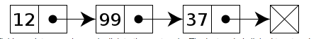
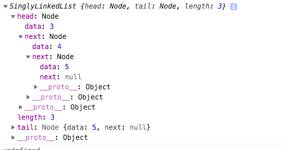

In this tutorial, we are going to learn about what is linked list and implementation of singly linked list in JavaScript.

## What is Linked List?

Linked List is a Linear collection of data where each node has a connection to the next node. it is a data structure with a group of nodes are in the sequence.

Linked lists were developed in 1955–1956 by Allen Newell, Cliff Shaw and Herbert A. Simon at RAND Corporation as the primary data structure for their Information Processing Language.

### Singly Linked List

A singly Linked list is a collection of nodes where each node has a connection to the next node.




### Algorithm implementation

Let's implement the singly linked list in javascript.

We are using javascript classes if you don't know about classes then please check out my previous tutorial [How classes work in javascript ?](/javascript-class/).


```js
class Node{

  constructor(data){
   this.data = data;
   this.next = null;
 }

}
```

Our Node has two properties which are `data` and `next`.


```js
class SinglyLinkedList{

  constructor(){
    this.head = null;
    this.tail = null;
    this.length= 0;
  }

}
```

 SinglyLinkedList class has three properties

- head: It is the first node in the List.
- tail: Last node in the list.
- length: How many nodes present in the list?


we are implementing our first method.


### Push Method

- Push method takes the one argument and pushes it to the end of the list.
- Each time we need to increment the length property by 1.


```js
class SinglyLinkedList{

  constructor(){
    this.head = null;
    this.tail = null;
    this.length= 0;
  }


  push(data){

    let node = new Node(data)

    if(!this.head){
      // this is our first node so we make head and tail pointing
      // to the same node.
      this.head= node;
      this.tail= node ;
    }else{
      // updating the tail
      this.tail.next = node;
      this.tail = node;
    }
    // increment the node length by 1
    this.length++
  }

}


const list = new SinglyLinkedList();


list.push(3);
list.push(4);
list.push(5);

console.log(list);
```

Output



Have you seen in the above image the tail is pointing to `5` because we pushed `5` at the last.

### Pop method

- The pop method helps us to remove the last node from the linked list
- If we remove the node from the list then we need to decrement the node length
 by 1.


__Pseudocode__

1. if there is no `head` then return `null`.
2. Declare two variables node and deleteNode
  - node: initialize with this.head.
  - deleteNode: currently we treated the first node as deleted Node.

3. If there is single node we assign head and tail to null.
    - decrement length by 1
    - return deleteNode.
4. while loop starts if there is more than one node.

5. decrement length by 1.

```js
  pop(){

    if(!this.head) return null

    let node = this.head;
    let deleteNode = node;

    if(!node.next){
    // single node  so we assign head and tail to null
      this.head= null
      this.tail = null
    }
     //more than 1 node
     while(node.next){
       if(!node.next.next){
        // last node found
          deleteNode=node.next;
          node.next = null;
          this.tail=node;
          break
       }
        node = node.next
     }

    this.length--
    return deleteNode
  }

```


### Get method

Get method helps us to get the node at the particular index.

__Pseudocode__

1. if there is no `head` or `index` is less than 0 or `index` is greater than the `length` then return null.
2. Declare a variable currentNode and initialize to this.head.
3. if the index is greater than 0  While loop starts.
  - update the currentNode.
  - decrement the index by 1.
4. return the currentNode.


```js
get(index){

    if(!this.head || index < 0 || index > this.length-1) return null

     // currentNode is pointing to head
    let currentNode = this.head;

    while(index){
     // updating the currentNode with next node
      currentNode = currentNode.next;
      index--;
    }
    return currentNode;
 }
```


### Singly Linked List Tests

<iframe height='265' scrolling='no' title='Singly linked list javascript' src='//codepen.io/saigowthamr/embed/xQRrqN/?height=265&theme-id=dark&default-tab=result' frameborder='no' allowtransparency='true' allowfullscreen='true' style='width: 100%;'>See the Pen <a href='https://codepen.io/saigowthamr/pen/xQRrqN/'>Singly linked list javascript</a> by saigowtham (<a href='https://codepen.io/saigowthamr'>@saigowthamr</a>) on <a href='https://codepen.io'>CodePen</a>.
</iframe>