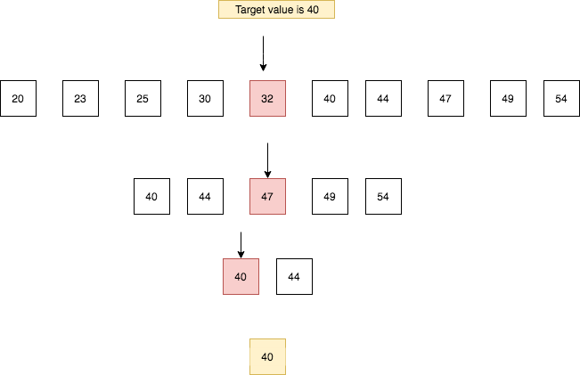
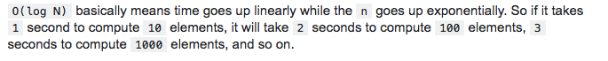

## What is Logarithms?

- Logarithms are the inverse of exponentiation.
- Logarithms were introduced by John Napier to simplify the calculations.

👀 some maths
logbase value = exponent  &nbsp; 👉   &nbsp;  baseexponent = value

log2 8 = 3 &nbsp; 👉  &nbsp; 23 = 8 . (2x2x2 = 8)

The logarithm of base 2 of 8 is 3  it means that we need to raise the exponent of base 2 to produce the value 8.

log2 16 = 4 &nbsp;  👉  &nbsp; 24 = 16

the logarithm of base 2 of 16 is 4.

Logarithms are not always with the base 2 but in computer science, we mostly use base 2.

### Binary search algorithm with logarithmic complexity.

Binary search is used in the sorted data sets it begins with the comparing middle element of the array with the target value if the target value matches then its position is returned. If the target value is less than the middle element, the search continues in the lower half of the array. If the target value is greater than the middle element, the search continues in the upper half of the array. This process continues until it no longer split the array.

In the above example, we chopped the array 3 times to get the target value.

The big O time complexity of binary search is O(log n).

O(log n)

