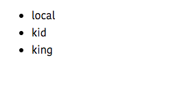
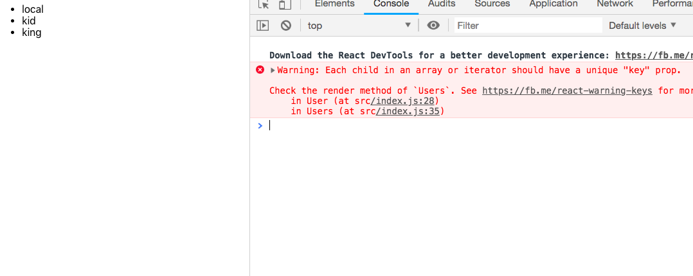
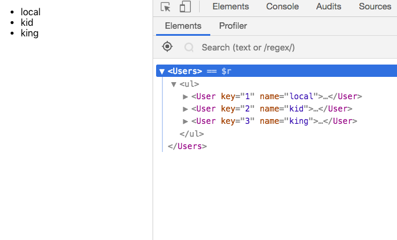

In this tutorial, we are going to learn about how to loop/iterate through the arrays in the react.js.

Let's see some examples.

Suppose we have an array of users we need render in the browser.

```js

function User(props){

   return (
     <li>{props.name}</li>
   )
}


const users = [

    {id:1,name:"local"},
    {id:2,name:"kid"},
    {id:3,name:"king"},

    ]

function Users(){

  return(
      <ul>
       <User name={users[0].name} />
       <User name= {users[1].name}/>
       <User name={users[2].name}/>
      </ul>
  )
}

```




In the above code, we manually passed the each user name by using the index or position.it’s a difficult task to pass each user manually when we have 1000 users or more.


To iterate through the arrays in react we need to use `map` method instead of for loops
mostly use in angular and vue apps.

>If you don't about map method then checkout [how to use map method](https://jshype.com/javascript-map-method/)


Let's refactor our code by using map method.


```js

function User(props){

   return (
       <ul>
       <li>{props.name}</li>
       </ul>
   )
}


const users = [

    {id:1,name:"local"},
    {id:2,name:"kid"},
    {id:3,name:"king"},

    ]

function Users(){

  return(
      <ul>
         {users.map((user)=><User name={user.name}/>)}
      </ul>
  )
}
```

We used curly braces `{ }` because its a JavaScript expression.The `map` method  loop through the users' array and render each user in the browser.

if you open your console you will see an Warning. `Warning: Each child in an array or iterator should have a unique "key" prop`.



This warning is due to the __key__ prop is missed in  `User` component.whenever we are iterating through the arrays in react we need to pass the unique key prop because in the dom react needs to keeps track each user by using a key prop.


Let's add the `key` prop to our code.

```js
function Users(){

  return(
      <ul>
         {users.map((user)=><User key={user.id} name={user.name}/>)}
      </ul>
  )
}
```
In our `users` array, there is an id property which is unique in each user.so that we are passing the `id` to the "key" prop.


If you open  __react dev tools__ you can see a key prop.


