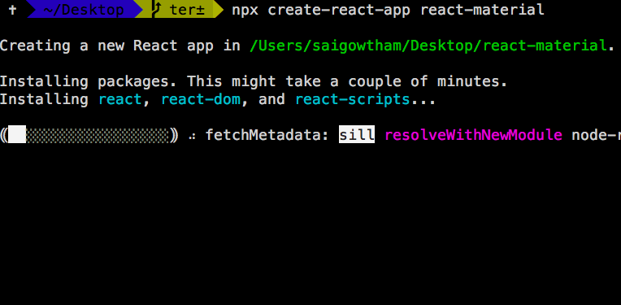
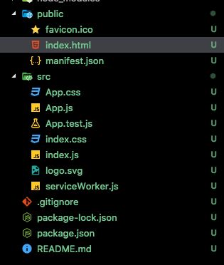
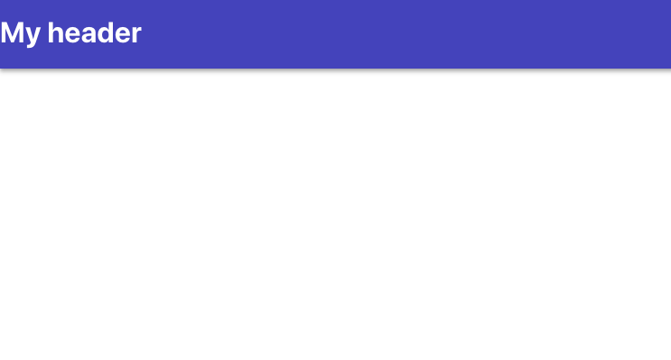
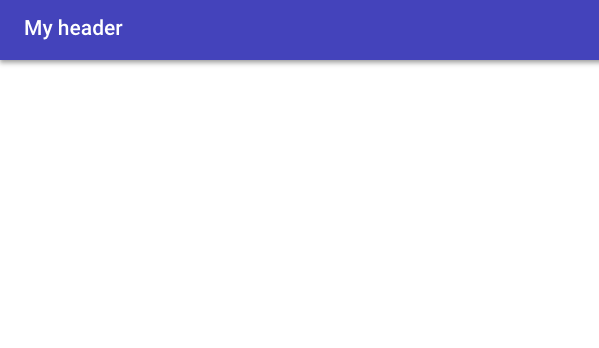
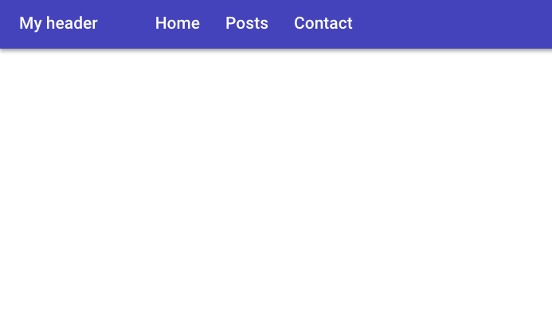
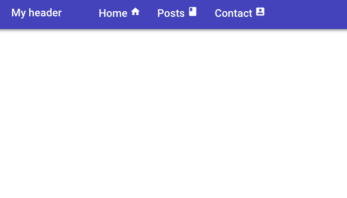
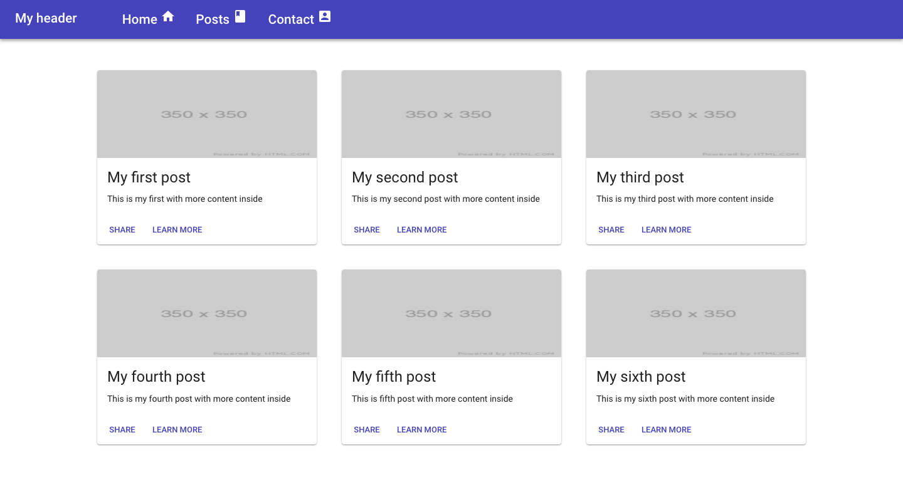
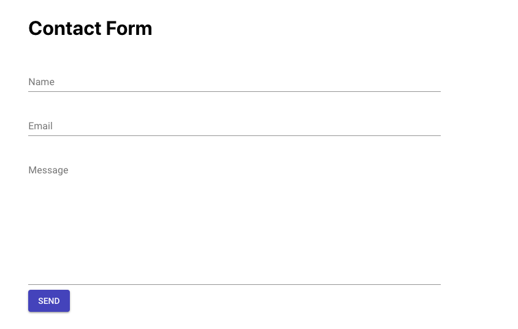

In this tutorial, we are going to learn about how to use the Material UI framework in React apps.


Material design is developed by Google in 2014, it uses the grid-based layouts, responsive animations and transitions, padding, and depth effects such as lighting and shadows.

Material design is inspired by the physical world objects and its textures how they reflect light and
cast shadows.


## What is Material UI?

Material UI is one of the famous React UI frameworks with 6 million monthly npm downloads and 43k GitHub stars.

Material UI provides us React components that implement google material design.


### Getting started

First, we need to set up and install the new react app by using the `create-react-app` command line tool.

Open your terminal and run following commands.

```bash
npx create-react-app react-material
```


Next, we need to change our working directory by using below commands.

```bash
cd react-material
npm start
```
`npm start` is used to run the development server.


It's time to install the Material UI framework by using below commands.

```bash
npm install @material-ui/core
```

Now open your `react-material` app folder by using your favorite code editor or ide.




Navigate to your public folder and open `index.html` and add the below `link` tag.

```html{12}
<!DOCTYPE html>
<html lang="en">

<head>
  <meta charset="utf-8" />
  <link rel="shortcut icon" href="%PUBLIC_URL%/favicon.ico" />
  <meta name="viewport" content="width=device-width, initial-scale=1, shrink-to-fit=no" />
  <meta name="theme-color" content="#000000" />

  <link rel="manifest" href="%PUBLIC_URL%/manifest.json" />

  <link rel="stylesheet" href="https://fonts.googleapis.com/css?family=Roboto:300,400,500" />

  <title>React App</title>
</head>

<body>
  <noscript>You need to enable JavaScript to run this app.</noscript>
  <div id="root"></div>

</body>

</html>
```

Here we updated our HTML file by adding a Google Roboto font because material UI was designed with the Roboto font in mind.


Let's design our App header using Material UI components

Now in `App.js` file we are importing `<AppBar>` component from the '@material-ui/core/AppBar'.

```js
import React, { Component } from 'react';
import AppBar from '@material-ui/core/AppBar';

class App extends Component {
  render() {
    return (
      <div>
        <AppBar color="primary" position="static">
          <h1>My header</h1>
        </AppBar>

      </div>
    );
  }
}
export default App;
```

In `AppBar` component we passed two props `color` and `position`

Now you can see a `Header` with `primary` color is rendered on the screen.




Let's replace our `h1` element with Material UI `TypoGraphy` Component.

*App.js*
```js
import React, { Component } from 'react';
import AppBar from '@material-ui/core/AppBar';
import Toolbar from '@material-ui/core/Toolbar'
import TypoGraphy from '@material-ui/core/Typography'


class App extends Component {
  render() {
    return (
      <div>
        <AppBar color="primary" position="static">
          <Toolbar>
            <TypoGraphy variant="title"
              color="inherit"
            >
              My header
           </TypoGraphy>
          </Toolbar>
        </AppBar>

      </div>
    );
  }
}
export default App;
```
In the above code first we imported two component which are `ToolBar` and `TypoGraphy` from '@material-ui' framework.

In TypoGraphy component we passed two props `variant` and `color`.



Have you seen how we got more spacing over our `heading`?

### Adding Nav bar

Let's add the Navbar to our `Header`.

create a new file called `navbar.js` in your `src` folder.

```js:title=navbar.js
import React from 'react';
import List from '@material-ui/core/List';
import ListItem from '@material-ui/core/ListItem';
import ListItemText from '@material-ui/core/ListItemText';
import TypoGraphy from '@material-ui/core/Typography'


function NavBar(props) {

    return (
        <List component="nav">
            <ListItem component="div">
                <ListItemText inset>
                    <TypoGraphy color="inherit" variant="title">
                        Home
               </TypoGraphy>
                </ListItemText>


                <ListItemText inset>
                    <TypoGraphy color="inherit" variant="title">
                        Posts
               </TypoGraphy>
                </ListItemText>


                <ListItemText inset>
                    <TypoGraphy color="inherit" variant="title">
                        Contact
               </TypoGraphy>
                </ListItemText>
            </ListItem >

        </List>
    )
}


export default NavBar;
```

Inside the `navbar.js` we imported ListItem and ListItemText component.

In __ListItem__ component we added `component` prop value to `nav` so that we can get html `nav` element.





### Material ui svg icons

Material UI  provides us with SVG material icons to use in our react app.

Let's install the icons package in our app so that we can use icons as React components.

```bash
npm install @material-ui/icons
```

Let's Import the icons inside our `navbar.js` file.

```js:title=navbar.js
import React from 'react';
import List from '@material-ui/core/List';
import ListItem from '@material-ui/core/ListItem';
import ListItemText from '@material-ui/core/ListItemText';
import TypoGraphy from '@material-ui/core/Typography'
import ListItemIcon from '@material-ui/core/ListItemIcon'
import { Home, Book, AccountBox } from '@material-ui/icons'

function NavBar(props) {

    return (
        <List component="nav">
            <ListItem component="div" >

                <ListItemText inset>
                    <TypoGraphy color="inherit" variant="title">
                        Home  <Home />
                    </TypoGraphy>
                </ListItemText>


                <ListItemText inset>
                    <TypoGraphy color="inherit" variant="title">
                        Posts <Book />
                    </TypoGraphy>
                </ListItemText>

                <ListItemText inset>
                    <TypoGraphy color="inherit" variant="title">
                        Contact <AccountBox />
                    </TypoGraphy>
                </ListItemText>
            </ListItem >

        </List>
    )
}


export default NavBar;
```




### Grid

The Material UI supports responsive grid layouts which adapt to the device  screen size and
orientation.

Let's use the `Grid` component.

Create a new file called posts.js and add the following code.

```js:title=posts.js
import React from "react";
import { Grid, Paper, Typography } from "@material-ui/core";
import Card from "@material-ui/core/Card";
import CardActionArea from "@material-ui/core/CardActionArea";
import CardActions from "@material-ui/core/CardActions";
import CardContent from "@material-ui/core/CardContent";
import CardMedia from "@material-ui/core/CardMedia";
import Button from "@material-ui/core/Button";
import { posts } from "./dummy-posts";

function Posts(props) {
  return (
    <div style={{ marginTop: 20, padding: 30 }}>
      <Grid container spacing={40} justify="center">
        {posts.map(post => (
          <Grid item key={post.title}>
            <Card>
              <CardActionArea>
                <CardMedia
                  component="img"
                  alt="Contemplative Reptile"
                  height="140"
                  image={post.image}
                  title="Contemplative Reptile"
                />
                <CardContent>
                  <Typography gutterBottom variant="h5" component="h2">
                    {post.title}
                  </Typography>
                  <Typography component="p">{post.excerpt}</Typography>
                </CardContent>
              </CardActionArea>
              <CardActions>
                <Button size="small" color="primary">
                  Share
                </Button>
                <Button size="small" color="primary">
                  Learn More
                </Button>
              </CardActions>
            </Card>
          </Grid>
        ))}
      </Grid>
    </div>
  );
}

export default Posts;

```

In the above code, we imported Grid and Card related components.

In `Grid` Component we passed `container` prop so that it become grid container.

-  `justify` prop helps us to make our grid items center
- `spacing` prop helps us to create the spacing between individual grid items (supporting values are  8, 16, 24, 32 or 40).

Inside the Grid container component, we passed `item` prop to the `Grid` component so that they become grid items.




### Contact form

Let's design a contact form using Material UI `FormControl` and `Input` components.

create a new file called `contact.js` in your `src` folder.


```js:title=contact.js
import React from "react";
import {
  FormControl,
  InputLabel,
  Input,
  Button,
  TextField
} from "@material-ui/core";

class Contact extends React.Component {
  render() {
    return (
      <div
        style={{
          display: "flex",
          justifyContent: "center",
          margin: 20,
          padding: 20
        }}
      >
        <form style={{ width: "50%" }}>
          <h1>Contact Form</h1>

          <FormControl margin="normal" fullWidth>
            <InputLabel htmlFor="name">Name</InputLabel>
            <Input id="name" type="text" />
          </FormControl>

          <FormControl margin="normal" fullWidth>
            <InputLabel htmlFor="email">Email</InputLabel>
            <Input id="email" type="email" />
          </FormControl>

          <FormControl margin="normal" fullWidth>
            <InputLabel htmlFor="email">Message</InputLabel>
            <Input id="email" multiline rows={10} />
          </FormControl>

          <Button variant="contained" color="primary" size="medium">
            Send
          </Button>
        </form>
      </div>
    );
  }
}

export default Contact;

```

Here we first imported the `FormControl`,`InputLabel`,`Input`,`Button` and `TextField` components from the material UI framework.


__FormControlComponent__: In FormControl component we passed margin prop value to `normal` so that it maintains the distance between input fields, we also passed `fullWidth` it means to occupy the available space.

__InputLabel__ :  The InputLabel component helps us to display the label for our input field.

__Input__: The Input component helps us display the HTML `input` field.

 if we pass multiline prop to the `Input` component it will render `textarea` element instead of `input` field.

 rows prop is used to increase the rows in `textarea` element.


Output

