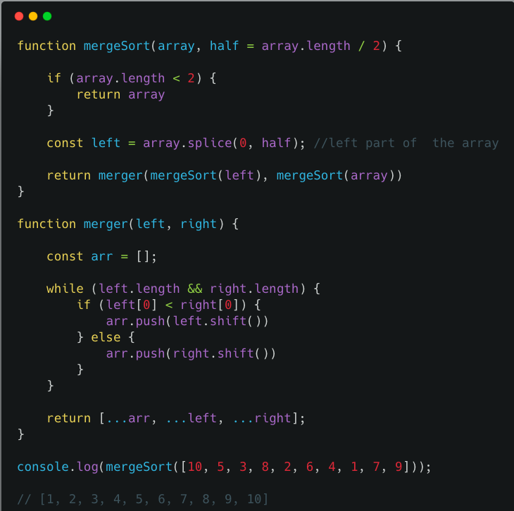

__Merge sort algorithm was invented by John von Neumann__ in 1945.
It is an efficient sorting algorithm using a divide and conquer approach.

1. Merge sort repeatedly divides the array into smaller chunks until we no longer divide the array into chunks.

2. It repeatedly merges the chunks of the array to get the sorted array.

---

### Example : [3,4,2,1]

1).  First, we need to divide the array into smaller chunks.

 ```js
       left  [ 3 , 4 ]     right [ 2, 1 ]

             [ 3 ] [ 4 ]      [ 2 ] [ 1]
```

2). we need to merge the smaller chunks to get the sorted array.


compare 3  and  4  they are already sorted next  2 and 1  put  1 first and second 2.

```
       left   [ 3 , 4 ]     right [ 2, 1 ]

              [ 3]  [ 4 ]      [ 2 ] [ 1]

               [3, 4 ]          [1 ,2 ]

 ```


Now compare left part index of 0 and right part index of 0 which are 3 and 1.

where 1 is smaller than 3 so we remove 1 from the right part and push into the sorted list.

```
       left  [ 3 , 4 ]     right [ 1, 2 ]

              [ 3]  [ 4 ]      [ 2 ] [ 1]

              [3, 4 ]          [ 2 ]


        sorted array  [ 1 ]
```

again we check 3 and 2 and remove 2 from the right part and push into the sorted list

```
       left  [ 3 , 4 ]     right [ 1, 2 ]

              [ 3]  [ 4 ]      [ 2 ] [ 1]

              [3, 4 ]           [  ]


        sorted array  [ 1 ,2 ]
```

Now add the left part and right part with the sorted list.

```
       left  [ 3 , 4 ]     right [ 1, 2 ]

              [ 3]  [ 4 ]      [ 2 ] [ 1]

              [3, 4 ]           [  ]


        sorted array  [ 1 ,2 ,3, 4]
```

### Algorithm implementation

Let's implement a **Merge sort algorithm** in JavaScript.


```js
function mergeSort(array,half = array.length/2){

  if(array.length < 2){
    return array  // it means we no longer divide the array
                  // into smaller chunks
  }

  const left = array.splice( 0,half ); //left part of  the array

  return merger( mergeSort( left ),mergeSort( array ) )
}
```

In the above code we are using a splice method it removes the left part of the array.so that the remaining part of the array is the right part.

Next, we need to implement a merger function which helps us to combine the left  and right part of the array and returns the sorted list.

```js
function merger(left, right) {
    const arr = [  ];
    while (left.length && right.length) {
        if (left[ 0 ] < right[ 0 ]) {
            arr.push( left.shift( ) ) // remove from the left part and push into
                                              //the sorted array
        } else {
            arr.push( right.shift(  ) ) // remove from the right part and push into
                                               //the sorted array
        }
    }
    return [ ...arr, ...left, ...right ];
}
```

full code.




### Code pen demo

   **Tested using mocha and chai**

<iframe height='265' scrolling='no' title='Merge sort algorithm' src='//codepen.io/saigowthamr/embed/KrpXxP/?height=265&theme-id=dark&default-tab=result' frameborder='no' allowtransparency='true' allowfullscreen='true' style='width: 100%;'>See the Pen <a href='https://codepen.io/saigowthamr/pen/KrpXxP/'>Merge sort algorithm</a> by saigowtham (<a href='https://codepen.io/saigowthamr'>@saigowthamr</a>) on <a href='https://codepen.io'>CodePen</a>.
</iframe>