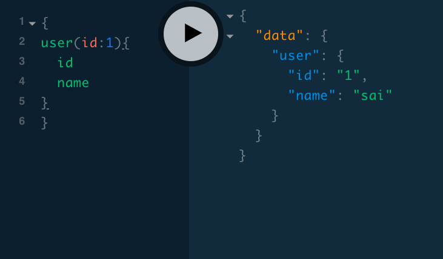
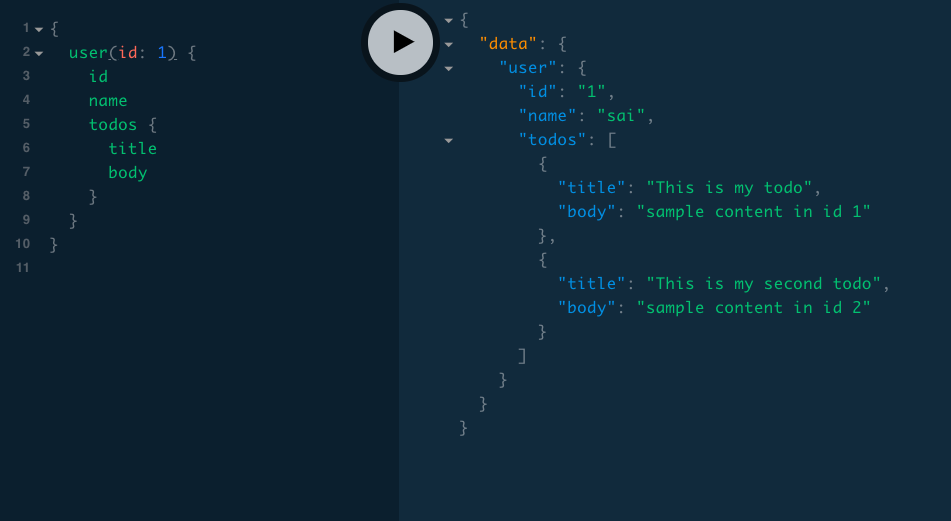
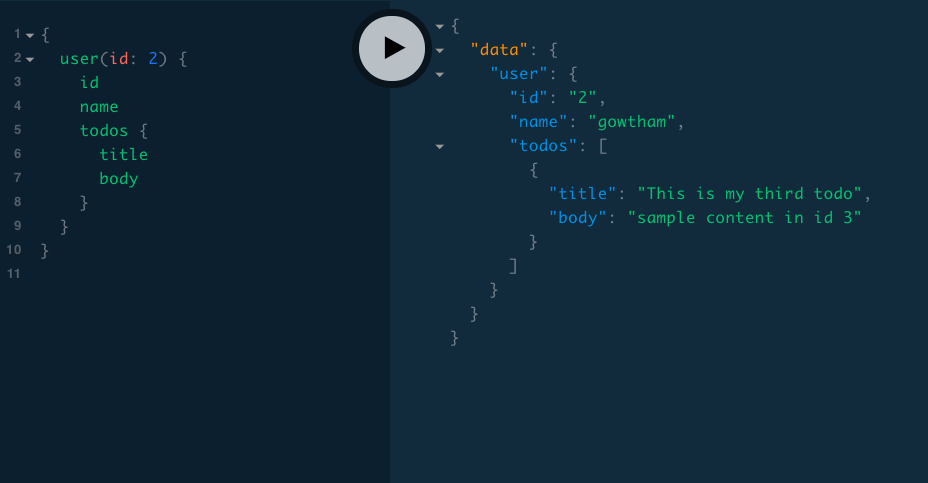
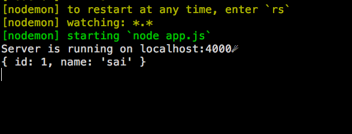
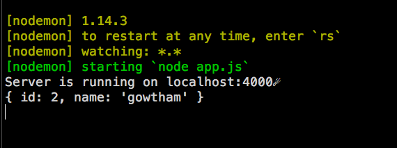

In this tutorial, we are going to learn about how to create relational data and nested resolvers in graphql.


*Note: If you don't about GraphQL then refer to my previous tutorials [GraphQL intro for the beginners](/graphql-intro-beginners/)*


<button class="md-btn">[View code](https://github.com/saigowthamr/graphql-test-api/blob/nested-res/app.js)</button>

Relational data  means consider we have a todos app with users and todos where each todo is
created by the particular user.

```js:title= sample-data
let todos = [
    {
        id: 1,
        title: "This is my todo",
        body: "sample content in id 1",
        userId: 1
    },
    {
        id: 2,
        title: "This is my second todo",
        body: "sample content in id 2",
        userId: 1

    },
    {
        id: 3,
        title: "This is my third todo",
        body: "sample content in id 3",
        userId: 2

    }
]


let users = [

    {
        id: 1,
        name: "sai"
    },
    {
        id: 2,
        name: "gowtham"
    },
]


```


if any user asks for their todos we only show the todos created by them using some type of relationship between the `user` and `todos`.


Let's start writing code.

### Type definitions

```gql


type Todo{
    id: ID!
    title: String!
    body: String!
}

type User{
    id:ID!
    name:String!
}

type Query{
     user(id:ID!): User!
}

```

We created two object types which are `Todo` & `User` and One Query Type.


### Resolvers

Next, we need to tell the graphql how to resolve the `user` field  in the query.

```js

const resolvers = {
    Query: {
        user(parent, args, ctx, info) {

            if (!args.id) {
                throw new Error('id is required')
            }
            return users.find(user => user.id === +args.id)
        }
    }

}
```


Let's test it now by using the graphql play-ground.




### Nested resolvers

In this step, we are creating a relationship between the user and todos for this we need to add
a new field called `todos` to the `User` type.

```js

type User{
    id:ID!
    name:String!
    todos:[Todo!]!
}

```

if you ask for a `todos` you will get an array of todos where it's shape should look like `Todo`
type but we don't have any resolver for the `todos` field.


Let's create a nested resolver to handle the `todos` field.


```js
const resolvers = {
    Query: {
        user(parent, args, ctx, info) {

            if (!args.id) {
                throw new Error('id is required')
            }

            return users.find(user => user.id === +args.id)

        }

    },
    User: {
        todos(parent, args, ctx, info) {

              //parent is the root object (User is the parent here)

            return todos.filter(todo => todo.userId === parent.id)
        }
    }

}
```

In the above code, we have added Nested `todos` resolver on the User object so that if any user asks for there `todos` we need to take the `id` from it's  parent and return their todos.






Let's log the parent argument in the console.

if we ask for the user with the `id: 1`

```js:title=user query id-1
{
  user(id: 1) {
    id
    name
    todos {
      title
      body
    }
  }
}

```
the parent argument for the userid 1.




if we ask for the user with  `id: 2`


```js:title=user query id-2
{
  user(id: 2) {
    id
    name
    todos {
      title
      body
    }
  }
}

```
Now, the parent argument is different




>Note: Nested resolvers only run when we query for that nested field otherwise it doesn't run.


[Code repository](https://github.com/saigowthamr/graphql-test-api/tree/nested-res)