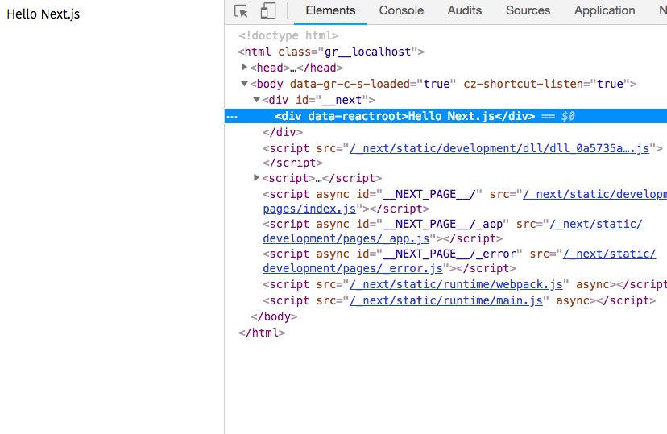
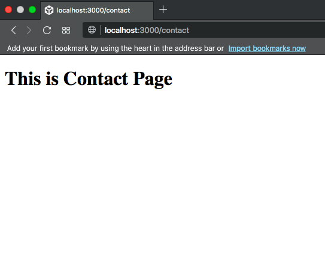
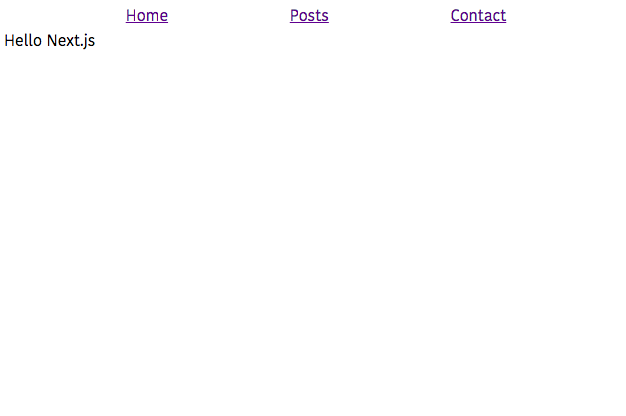
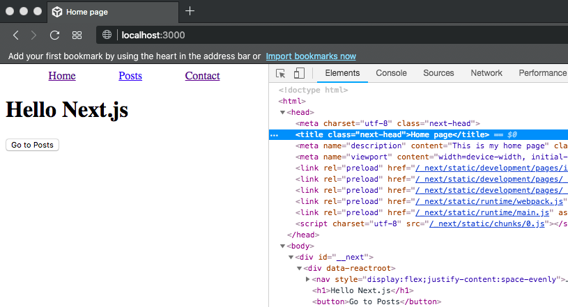

In this tutorial, we are going to learn about what is server-side rendering and how to build server-side rendered react apps by using next.js.


## What is Server Side Rendering?

In Single page apps like react or angular or vue we send a single HTML with no content and generate full HTML markup in the client browser by downloading the JavaScript files and executed in the browser.

Server-Side Rendering means the (HTML)markup we are sending to the client is generated in the server instead of in the client browser.

### Uses of server-side rendering

- Server-side apps are better for the SEO.

- Faster page load timing.

- Good for social media sharing.

### What is Nextjs?

Next.js is a react framework which is used to build server-side rendered react apps.


### Getting started with Nextjs

Let's install the following packages by running the below commands.

```bash
# create  a new directory
mkdir nextjs-app

# changing the directory
cd nextjs-app

# Initializing the new package.json file
npm init -y

# installing the packages

npm i next react react-dom
```
once you successfully installed the packages now open your `package.json` file present inside your
`nextjs-app` folder and add the below scripts.

```json
  "scripts": {
    "dev": "next",
    "build": "next build",
    "start": "next start"
  }
```

### Creating pages in nextjs

In nextjs, we need to create a pages folder and add the required pages to our app in that folder so that
nextjs will automatically create the routing for our react app.

create a new folder called `pages` in your `nextjs-app`.

Inside the pages, folder create a new file called `index.js` and add the below code.

```js
import React from 'react'

function IndexPage() {
    return (
        <div>
            Hello Next.js
        </div>
    )
}

export default IndexPage;
```

Now open your terminal and run `npm run dev` to turn on the nextjs development server.



Let's create two more pages.

create a `contact.js` file in your pages folder and add the following code.

```js
import React from 'react';

function ContactPage() {
    return (
        <div>
            <h1>This is Contact Page</h1>
        </div>
    )
}
export default ContactPage;
```

create a `posts.js` file in your pages folder and add the following code.

```js
import React from 'react';

function Posts() {
    return (
        <div>
            <ul>
                <li>My first post</li>
                <li>My second post</li>
            </ul>
        </div>
    )
}
export default Posts;
```

Now open your browser and manually type `localhost:3000/contact` you will see a contact page is rendered on the screen.




### Routing in nextjs

Let's add the navigation to our app so that we can navigate to different pages easily instead of manually
typing the page paths.

create a new folder called `components` in your app folder and create and a new file called `navbar.js` and
add the following code.

```js
import React from 'react';
import Link from 'next/link'

function NavBar() {

    return (
        <nav style={{ display: "flex",
        justifyContent: "space-evenly"}}>
            <Link href="/"><a>Home</a></Link>
            <Link href="/posts"><a>Posts</a></Link>
            <Link href="/contact"><a>Contact</a></Link>
        </nav>
    )

}
export default NavBar;
```

In `NavBar` component we imported `Link` component from the `nextjs/link`.

`Link` component accepts the `href` prop to specify the which path we need to navigate.

Open your index.js file and add the NavBar component.

```js:title=index.js
import React from 'react'
import NavBar from '../components/navbar';


function IndexPage() {
    return (
        <div>
            <NavBar />
            Hello Next.js
        </div>
    )
}
export default IndexPage;
```

Now we can see our app with a navigation bar.




### Programmatically navigate

We can also [programmatically navigate](/reactrouter/programaticallynavigation/) in nextjs by importing  the `Router` object from 'next/router'.

```js{10-11}:title=index.js
import React from 'react';
import Router from 'next/router'
import NavBar from '../components/navbar';

function IndexPage() {
    return (
        <div>
            <NavBar />
            <h1>Hello Next.js</h1>
            <button onClick={() => Router.push('/posts')}>
            Go to Posts</button>
        </div>
    )
}

export default IndexPage;
```

### Adding Seo component

So far we didn't add any SEO related tags to our app let's create our Seo component so that we can use everywhere in our app.

create a new file called `seo.js` in your `components` folder.

```js:title=seo.js
import React from 'react';
import Head from 'next/head'

function Seo(props) {
    return (
        <Head>
            <title>{props.title}</title>
            <meta name="description" content={props.description} />
            <meta name="viewport" content="width=device-width,
            initial-scale=1,shrink-to-fit=no" />
        </Head>
    )
}

export default Seo;
```
Here we imported the `Head` component from the 'next/head' and we passed our meta tags as a children
to the Head component.

Let's use our `Seo` component inside the `index.js` file.

```js:title=index.js
import React from 'react';
import Router from 'next/router'
import NavBar from '../components/navbar';
import Seo from '../components/seo'

function IndexPage() {
    return (
        <div>
            <Seo title="Home page" description="This is my home page"/>
            <NavBar />
            <h1>Hello Next.js</h1>
            <button onClick={() => Router.push('/posts')}>Go to Posts</button>
        </div>
    )
}

export default IndexPage;
```

Now if you navigate to `localhost:3000` you can see our `title` is changed to `Home page`.


