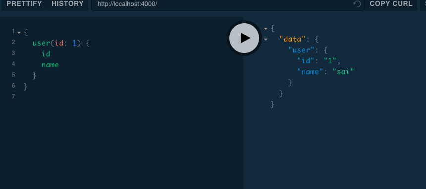
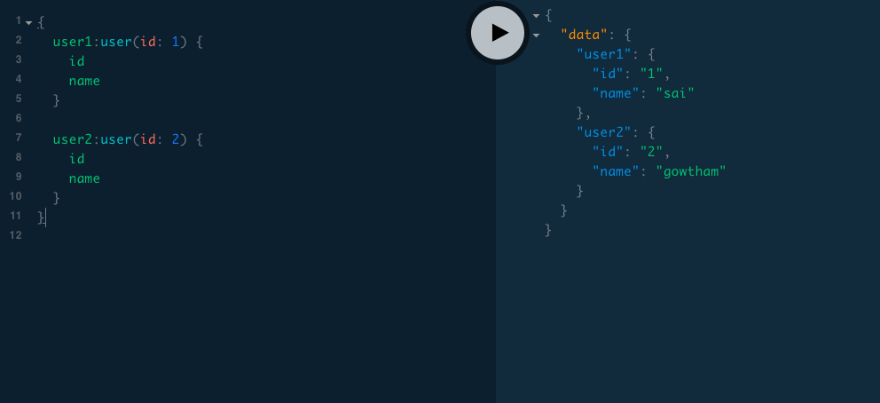
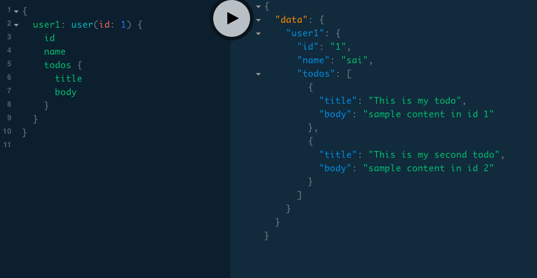

In this tutorial, we are going to learn about how to create queries and mutations in the graphql server.


**Queries**  are used to get the data from the graphql endpoint like `get` method in the
`Rest API`


**Mutations** are used to create or update or delete the data in graphql.


Let's learn how to create a query in graphql if you don't know about Graphql then please check out my
previous tutorial [GraphQL intro](/graphql-intro-beginners/).


Everything in graphql starts with creating a Schema.In graphql type system, there are two special types which are `Query` type and `Mutation` type.


### Schema

```js

type User{
  id:ID!
  name:String!
}

type Query{
   user(id:ID!):User!
}

```

First, we created a `User` Object type with two fields `id,name` and also
`Query` type with one field called `user`.

>Note: ( ! ) means that field is not accepted null values.

In graphql, we need to create a resolver function for every field present in the Query type so that
graphql knows how to respond to those queries.


```js

const resolver = {

     Query:{
         user:function(parent,args,ctx,info){
             return users.find((user)=>user.id === ctx.id)
         }
     }

}
```

>Note: The resolver function and Query field should have the same name otherwise graphql gives you an error.
> [Learn more about resolvers](/howt-create-resolvers-graphql-tutorial/)


### How to run a query in graphql?

To run a query we need to write a field name inside the curly braces and you need to specify what data you need to get back from these query like in below we asked `id` and `name` for the user `id:1`.

```js
{
   user(id:1){
       id
       name
   }

}
```

The output from the graphql server will give you json data back.




### Aliases in graphql

Sometimes we need to run the same query twice in that situations we can use aliases in graphql.

```js
{
  user1: user(id: 1) {
    id
    name
  }

  user2: user(id: 2) {
    id
    name
  }
}

```




### Nested Queries

Nested queries are something like a query inside a query.

```js
{
  user1: user(id: 1) {
    id
    name
    todos {
      title
      body
    }
  }
}

```


>You can learn here [how to create nested queries in graphql](http://localhost:8000/nested-resolvers-relationaldata-graphql/)


### Mutations in graphql

For mutations, we need to define a Mutation type with the fields like how we defined Query fields in the Schema.

```js

type Mutation{

    createUser(name:String!):User!
    udpateUser(id:ID!,name:String):User!
    deleteUser(id:ID!):User!
}

```

we defined three fields in the Mutation type which are `createUser, updateUser, deleteUser` which is used to create a new user or update a user or delete the user.

Examples of how to run mutations:

```js
mutation{

   createUser(name:"king"){
       name
   }

}

```

```js
mutation{

  deleteUser(id:1){
      id
      name
  }

}

```


I have created a test API you can download it from github and play with it so that you can
more clarity about queries and mutations.

<button class="md-btn">[Code repository](https://github.com/saigowthamr/graphql-test-api)</button>

happy coding...

>Learn more about [how to create graphql  api ](/graphql-server-javascript/)

