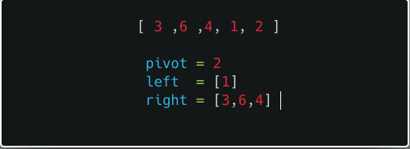
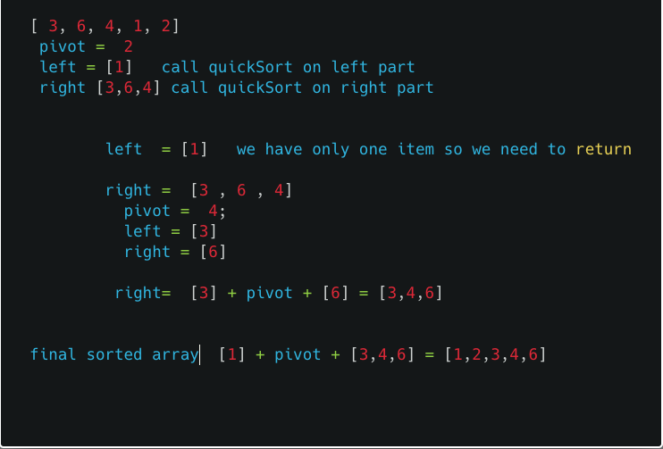

## Quicksort

- it is an efficient sorting algorithm for the larger datasets where it
performs faster than the merge sort and heap sort.

- It was Developed by a British computer scientist Tony Hoare in 1959 and published in 1961.


### How does quicksort works?

   Array has  5 items  [ 3 ,6 , 4, 1, 2 ]

 1). first we need to choose the pivot value from the array we can choose any thing as a pivot value but we are choosing last item 2 as a pivot.

 2). Next, we need to loop through the array and compare with pivot if any item which is less than pivot place on left-hand side else if any item is greater than the pivot place on the right-hand side.

 

3)  We need to run the quickSort recursively on right part and left part.

 


### Quicksort algorithm implementation

Let's implement the quicksort algorithm in JavaScript.


First, we are creating a function with three parameters which are `arr`, `length` and `start`.

**arr** : unsorted array.

**length**: how many times we need to loop, our pivot value is the last item in the array so that our loop ends before the pivot value.

**start** :  loop starts from 0.

```js
function quickSort(arr,length = arr.length-1,start=0){

  if(arr.length < 2) return arr

 const pivot = arr[arr.length-1];
 const left  = [ ];
 const right = [ ];
}
```

Next, we are using a while loop it helps us to loop over the items in the unsorted array and if any item which is less than pivot value push into the left array else push into the right array.

```js
function quickSort(arr,length = arr.length-1,start=0){

  if(arr.length < 2) return arr

 const pivot = arr[arr.length-1];
 const left  = [ ];
 const right = [ ];

 while (start < length) {
        if (arr[start] < pivot) left.push(arr[start])
        else right.push(arr[start])
        start++
    }
}
```

the final step we need to run the quickSort recursively on both left-hand side
and right-hand side.


```js
function quickSort(arr, length = arr.length - 1, start = 0) {

    if (arr.length < 2) return arr // base case

    const pivot = arr[arr.length - 1]; //pivot value
    const left = [ ];
    const right = [ ];

    while (start < length) {
        if (arr[start] < pivot) left.push(arr[start])
        else right.push(arr[start])
        start++
    }

    return [...quickSort(left), pivot, ...quickSort(right)];
}

console.log(quickSort([4, 9, 2, 6, 8, 10, 3, 1, 7, 5]))

//output => [1, 2, 3, 4, 5, 6, 7, 8, 9, 10]
```

In the above code we used spread operator to combine the left and right part of the arrays.


### Quicksort Time complexity

- Average case  - O(nlogn)

- Best case     - O(nlogn)


### Tested using Mocha and chai


<iframe height='265' scrolling='no' title='Quicksort algorithm javascript' src='//codepen.io/saigowthamr/embed/bQVMqB/?height=265&theme-id=dark&default-tab=result' frameborder='no' allowtransparency='true' allowfullscreen='true' style='width: 100%;'>See the Pen <a href='https://codepen.io/saigowthamr/pen/bQVMqB/'>Quicksort algorithm javascript</a> by saigowtham (<a href='https://codepen.io/saigowthamr'>@saigowthamr</a>) on <a href='https://codepen.io'>CodePen</a>.
</iframe>


