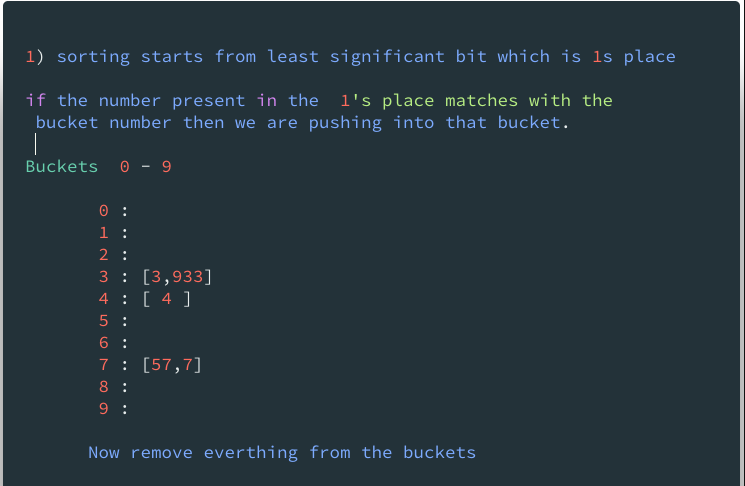
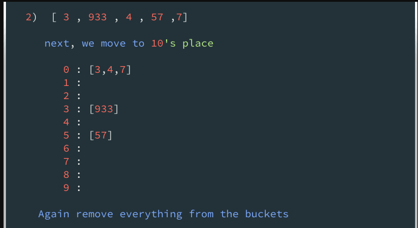
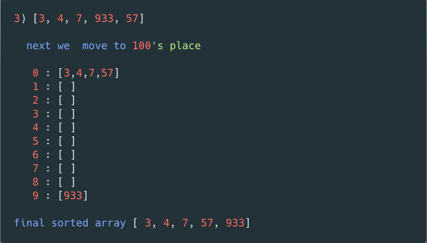
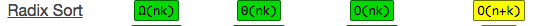

In this tutorial, we are going to learn about Radix sort algorithm and its implementation in JavaScript.

## What is Radix sort ?

Radix sort is a non-comparison based sorting algorithm where it grouping by the number place and position.


Example : [4, 57, 7, 3, 933]








### Radix sort algorithm implementation


First, we are implementing some helper functions

1. If we pass an array of numbers `getMax` function returns back max number length.

 suppose  `getMax([3, 44, 533])  // output  3`

```js
function getMax(arr) {

    let max = 0;
    for (let num of arr) {
        if (max < num.toString().length) {
            max = num.toString().length
        }
    }
    return max
}
```

### Second helper function

if we pass a number and place `getPosition` function returns back number in that place.

```js
 function getPosition(num, place){
 return  Math.floor(Math.abs(num)/Math.pow(10,place))% 10
}
 ```
suppose
```js
         getPosition(243 , 1 )  // 4
         getPosition(123,  0)   // 3
         getPosition(943, 2)   // 9
```


**Main algorithm starts.**


```js
 function radixSort(arr){

   const max = getMax(arr); // returns length  of max digit

   return arr
}
```

If our max length is 4 we only loop 4 times


next, we need to write two for loops


first for loop helps us to get the number of places like 1's, 10's, 100's
and resetting the buckets.

```js
 function radixSort(arr){

   const max = getMax(arr);

   for(let i=0;i<max;i++){
     let buckets = Array.from({length:10},()=>[ ]) // creating 10 empty arrays
      arr = [].concat(...buckets);
   }
   return arr
}
```

second for loop is used to loop over  every number in the unsorted array and
push into it's desired buckets.

```js
function radixSort(arr) {

    const max = getMax(arr); // length of the max digit in the array

    for (let i = 0; i < max; i++) {
        let buckets = Array.from({ length: 10 }, () => [ ])
        for (let j = 0; j < arr.length; j++) {
          buckets[getPosition(arr[ j ], i)].push(arr[ j ]); // pushing into buckets
        }
        arr = [ ].concat(...buckets);
    }
    return arr
}

console.log(radixSort([4, 57, 7, 3, 933])) // [3,4,7,57,933]
```

we successfully implemented radix sort


**Algorithm is Tested using Mocha and chai**

<iframe height='265' scrolling='no' title='Radix algorithm javascript' src='//codepen.io/saigowthamr/embed/aQNzJY/?height=265&theme-id=dark&default-tab=result' frameborder='no' allowtransparency='true' allowfullscreen='true' style='width: 100%;'>See the Pen <a href='https://codepen.io/saigowthamr/pen/aQNzJY/'>Radix algorithm javascript</a> by saigowtham (<a href='https://codepen.io/saigowthamr'>@saigowthamr</a>) on <a href='https://codepen.io'>CodePen</a>.
</iframe>

###  Radix sort Time and space complexity

 

 -  n -  number of the elements in the array
 -  k -  Max number length or word size


