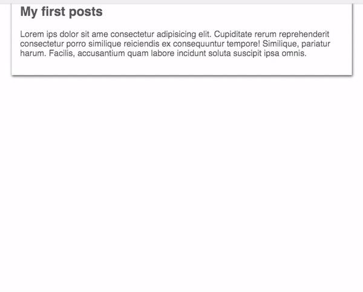
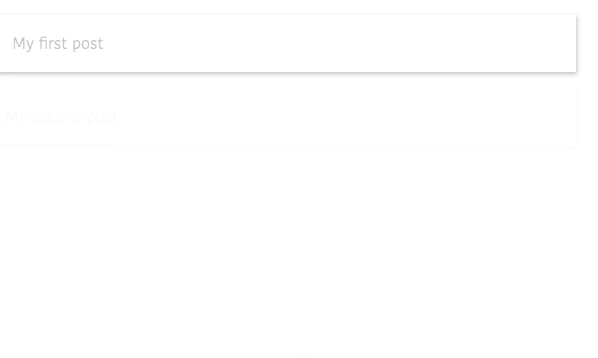
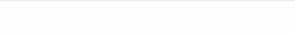

In this tutorial, we are going to learn about how to animate the react elements by using react spring animation library.


## Getting started

First, we are creating our react-app using `create-react-app` command line tool.

Open your terminal and run below commands to install react-app.

```bash
npx create-react-app react-animations
```
This above command will install react app related files in `react-animations` folder.

```bash
cd react-animations
```
change your working directory to `react-animations`.

```bash
npm start # to run the react development server
```

### Installing React spring library

Let's install the react-spring animation library to our react app.

Run the following command to install `react-spring` library.

```bash
npm i react-spring
```

### Simple Animation Example

Once you successfully installed above packages let's create our first simple animation.

Clear everything present inside your `App.js` and add the below code.


```js{7-10}
import React from "react";
import { Spring } from "react-spring";
import "./styles.css";

function App() {
  return (
    <Spring
      from={{ opacity: 0.6, marginTop: -50 }}
      to={{ opacity: 1, marginTop: 50 }}
    >
      {props => (
        <div style={props} className="App">
          <article className="post">
            <h1>My first posts</h1>
            <p>
              Lorem ipsum dolor sit amet consectetur adipisicing elit.
              Cupiditate rerum reprehenderit consectetur porro similique
              reiciendis ex consequuntur tempore! Similique, pariatur
              harum.Facilis, accusantium quam labore incidunt soluta
              suscipit ipsa omnis.
            </p>
          </article>
        </div>
      )}
    </Spring>
  );
}

export default App;
```

In the above we first imported `Spring` component from the 'react-spring' Inside the Spring component we passed function as a children  and that function provides us `props` parameter.

We passed the `props` parameter to `div` element style attribute.

The Spring component is used to move the elements from one place to another place, it
accepts two props `from` and `to`.

__from__: where animation starts from.

__to__: Where animation needs to end.

Ouput:



### Animating Array of items Example

Sometimes we need to animate array of items for that we need to import `Trail` component from the 'react-spring' library.

>The Trail component animates the first item in the list of elements, the rest of elements form a natural trail and follow their previous sibling.

```js{14-19}
import React from "react";
import { Trail } from "react-spring";
import "./styles.css";

const posts = [
  { title: "My first post", id: 1 },
  { title: "My second post", id: 2 },
  { title: "My Third post", id: 3 },
  { title: "My Fourth post", id: 4 }
];

function AllPosts() {
  return (
    <Trail
      items={posts}
      keys={post => post.id}
      from={{ marginLeft: -20, opacity: 0 }}
      to={{ marginLeft: 20, opacity: 1 }}
    >
      {post => props => (
        <div style={props} className="post">
             {post.title}
        </div>
      )}
    </Trail>
  );
}

export default AllPosts;
```

__Trail__ component accepts four props `items` ,`keys`,`from` and `to`.


**items**: It takes the array of  items we need to animate.

**keys**: We need to pass the unique key prop for each item in the array.

Output:




### Animating Navigation bar example

Let's animate the navigation bar by using `Spring` component.


```js{8,10}
import React from "react";
import ReactDOM from "react-dom";
import {Spring,config} from "react-spring";
import "./styles.css";

function NavBar() {
  return (
    <Spring from={{ number: 0 }} to={{ number: 100 }} config={config.slow}>
      {props => (
        <div style={{ width: props.number + "%" }}>
          <nav className="nav-bar">
            <a href="#">Home</a>
            <a href="#"> Posts</a>
            <a href="#">Contact</a>
          </nav>
        </div>
      )}
    </Spring>
  );
}

export default NavBar;
```

In the above code we passed `number` property `from={{ number: 0 }}` and `to={{ number: 100 }}` props so that the **Spring**  component starts counter from 0 to 100.

We accesed the `number` property in the `div` element by using  `props.number`.


Output:

