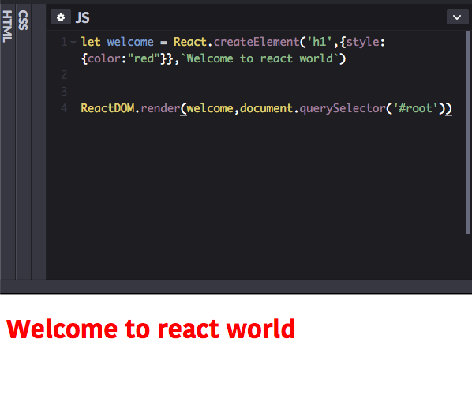
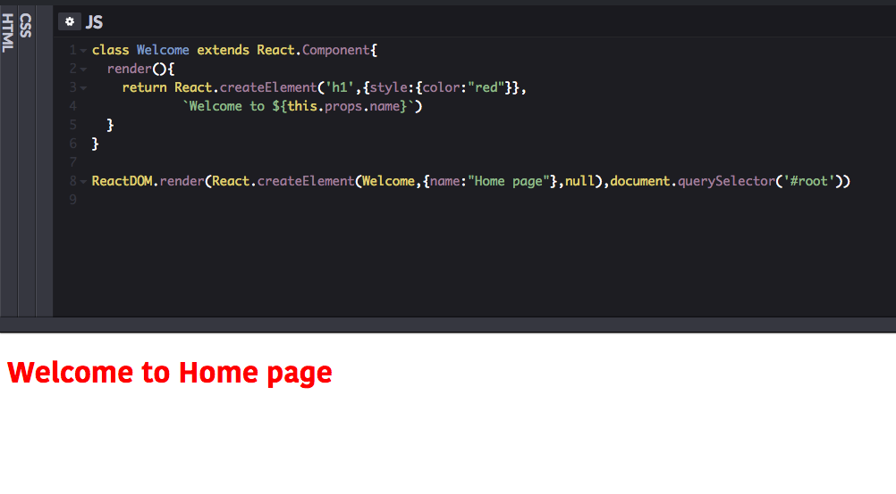

In this tutorial, we are going to learn how to write react without jsx. The JSX we write inside the react is often transpiled to a React.createElement method with the help of babel compiler.

React.createElement(type,props,children) method accepts three arguments `type` , `props` ,`children`.


**type:** Type of the html element or component. (example : `h1,h2,p,button`..etc ).

**props:** The properties object.
(example: `{style :{ color:"red"}}, className,event handlers etc` ).

**children:** anything you need to pass between the dom elements.


```js

let welcome = React.createElement('h1',{style:{color:"red"}},`Welcome to react world`)


ReactDOM.render(welcome,document.querySelector('#root'))

```

**ReactDom.render  method accepts two arguments.**

- The first argument is which component or element needs to render in the dom.

- The second argument is where to render in the dom.



This is a pure JavaScript with out using jsx.


Now we are building `Welcome` component instead of the variable.


```js

class Welcome extends React.Component{
  render(){
    return React.createElement('h1',{style:{color:"red"}},
            `Welcome to ${this.props.name}`)
  }
}

ReactDOM.render(React.createElement(Welcome,
                {name:"Home page"},null),document.querySelector('#root'))

```
In the  `Welcome` Component we have added `props` also so that we can have more control over the component.



So far we are building components with no user interaction let's build an interactive component with state and event Handling.


### Counter component example

```jsx{1,25-30}

const  el =  React.createElement

function Button(props){
  return el('button',{onClick:props.handleClick},props.name)
}

class Counter extends React.Component{

  state= {
       num: 0
  }

  handleIncrement = () =>{
    this.setState({
      num: this.state.num + 1
    })
  }

   handleDecrement = () =>{
    this.setState({
      num: this.state.num - 1
    })
  }


  render(){
    return el('div',null,el(Button,{handleClick:this.handleIncrement,name:'Increment'},null),
                          el(Button,{handleClick:this.handleDecrement,name:'Decrement'},null),
                             el('p',null,this.state.num),
  }

}


ReactDOM.render(el(Counter,null,null),document.querySelector('#root'))
```

**Code pen demo**

<iframe height='265' scrolling='no' title='React.createelement method example' src='//codepen.io/saigowthamr/embed/jXVMZy/?height=265&theme-id=dark&default-tab=result' frameborder='no' allowtransparency='true' allowfullscreen='true' style='width: 100%;'>See the Pen <a href='https://codepen.io/saigowthamr/pen/jXVMZy/'>React.createelement method example</a> by saigowtham (<a href='https://codepen.io/saigowthamr'>@saigowthamr</a>) on <a href='https://codepen.io'>CodePen</a>.
</iframe>