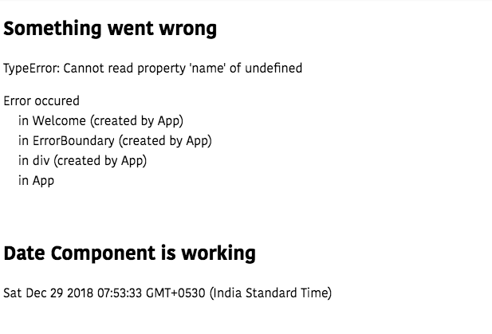

In this tutorial, we are going to learn about error boundaries in react.


### What is an Error boundary?

In the past, we don't have a way to catch the errors in React components and we are seeing
some cryptic errors in case our app breaks.

React 16 introduces a new way to catch errors by using the error boundaries component
which helps us to catch the errors anywhere in our app and renders the fallback UI.

Error boundaries don't break the whole App component tree instead of it only renders the fallback UI
on an error occurred component.

Error boundaries are only defined in the class-based components.


Let's see an example

We are using the `componentDidCatch` lifecycle method to update the `error` state and logging the `errorInfo` in the console.

```js
class ErrorBoundary extends Component {
  state = {
    error: false,
    errorInfo: null
  };
  componentDidCatch(error, errorInfo) {
    this.setState({
      error: error,
      errorInfo: errorInfo
    });
  }

  render() {
    if (this.state.error) {
      return (
        <div style={{ whiteSpace: "pre" }}>
          <h2>Something went wrong</h2>
          {this.state.error && this.state.error.toString()}
          <br />
          <p>Error occured {this.state.errorInfo.componentStack}</p>
        </div>
      );
    }

    return this.props.children;
  }
}

```

The ErrorBoundary component only renders the fallback UI if an error has occurred otherwise we are rendering the `children`.


Let's use the ErrorBoundary component to catch the errors.


```js
function User(props) {
  return <h1>{props.user.name}</h1>;
}

function App(props) {
  return (
    <div>
      <ErrorBoundary>
        <Welcome />
      </ErrorBoundary>
      <br />
      <h2>Date Component is working</h2>
      <Date />
    </div>
  );
}
```
In the above code, we wrapped the `Welcome` component with an `ErrorBoundary` component.

Output



Our `Date` component is still working fine only __User__ component is rendering the
fallback UI(message something went wrong) because we failed to pass the `user.name` prop.


### Where to place ErrorBoundary components?

You can use it on top level of your app components or individual components to stop the breaking the whole app.