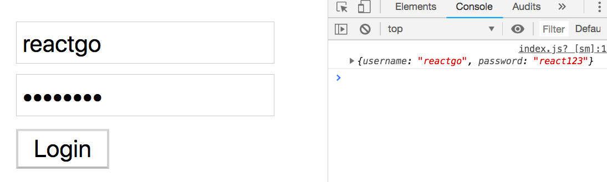
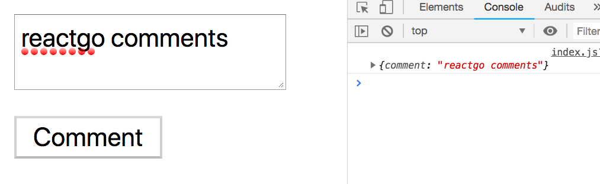
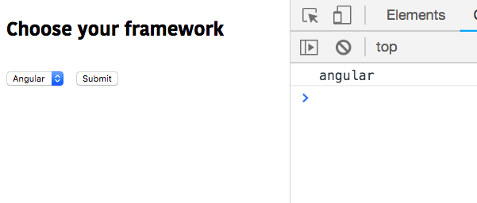

In this tutorial, we are going to learn about how to handle the forms in react.


In HTML form elements like `input` , `textarea` and `select` they maintain there
own internal state in the dom but in react we are handling the state inside the components
and updating the state using `setState()` method.


If the form elements state is controlled by react components,they are called controlled components.


Let's look into the examples.

## Input element

```js
class Login extends React.Component {
  state = {
    username: "",
    password: ""
  };

  handleSubmit = e => {
    e.preventDefault();
    console.log(this.state);
  };
  handleUsername = e => {
    this.setState({
      username: e.target.value
    });
  };
  handlePassword = e => {
    this.setState({
      password: e.target.value
    });
  };

  render() {
    return (
      <form onSubmit={this.handleSubmit}>
        <input
          type="text"
          value={this.state.username}
          placeholder="Username"
          onChange={this.handleUsername}
        />
        <input
          type="password"
          value={this.state.password}
          placeholder="Password"
          onChange={this.handlePassword}
        />
        <button type="submit">Login</button>
      </form>
    );
  }
}
```

There is a `Login` Component with two `input` fields username and password where we added an `onChange`
handler to update the react state on every keystroke.

When a User clicks on a login button we are logging the data in the console or you can send a data to your backend.




### Textarea element

In react we are assigning a state to the value attribute present inside the `textarea` element by using the `onChange` handler we are updating the state it is are similar to the `input` element.

example:

```js
class Comments extends React.Component {
  state = {
    comment:""
  };

  handleSubmit = e => {
    e.preventDefault();
    console.log(this.state);
  };

  handleComment = e => {
    this.setState({
      comment: e.target.value
    });
  };


  render() {
    return (
      <form onSubmit={this.handleSubmit}>
       <textarea value={this.state.comment}
         onChange={this.handleComment}/>
        <button type="submit">Comment</button>
      </form>
    );
  }
}
```
In the above code we have added a `onChange` event handler, to the textarea element to update the `comment` property defined inside the `state` object.




### Select element

The select element in the HTML is used to create a dropdown list.

Let's see an example.

```js
class ChooseFramework extends React.Component {
  state = {
    framework: "vue"
  };

  handleSubmit = e => {
    e.preventDefault();
    console.log(this.state.framework);
  };

  handleChange = e => {
    this.setState({
      framework: e.target.value
    });
  };

  render() {
    return (
      <form onSubmit={this.handleSubmit}>
        <h2>Choose your framework</h2>
        <select onChange={this.handleChange} value={this.state.framework}>
          <option value="react">React</option>
          <option value="angular">Angular</option>
          <option value="vue">Vue</option>
        </select>
        <button type="submit">Submit</button>
      </form>
    );
  }
}
```

Here we added an `onChange` handler and `value` attribute to the `select` element.

The `option` elements are nested inside the `select` element, there is a `value` attribute in each `option` element which is holding the data.

When we select a particular `option` the `this.state.framework` property value is updated with the option attribute value. Like in the below image we selected `angular` framework so that `angular` is logged inside the console.




