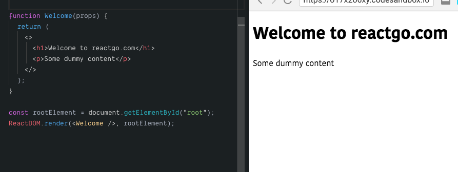

In this tutorial, we are going to learn about the usage of fragments in react apps.

## What is a React Fragment?

 React Fragment is a react component which helps us to return the multiple child elements without using the extra dom nodes.

React fragments are introduced in version 16.


Let's see some examples

### Without React fragments

```js
import React from 'react';

function Welcome(props){

    return (
       <div>
        <h1>Welcome to reactgo.com</h1>
        <p>Some dummy content</p>
       </div>
    )
}


```

Now we are replacing the Welcome Component code by using the fragments.


### With React Fragments


```js
import React,{Fragment} from 'react';

function Welcome(props){

    return (
       <Fragment>
         <h1>Welcome to reactgo.com</h1>
         <p>Some dummy content</p>
       </Fragment>
    )
}
```

By using fragments we stopped to create an extra `div` element in the `Welcome` Component.

### Short syntax

There is also a new and short syntax for the fragments.

```js
import React from 'react';

function Welcome(props){

    return (
       <>
         <h1>Welcome to reactgo.com</h1>
         <p>Some dummy content</p>
       </>
    )
}
```

The new syntax is using the empty tags to declare react fragments.




### Some more examples

Fragments usage in returning the group of child components.


```js

function Button(){
    return <button>Click</button>
}

function Name(){
    return <h1>Hi react</h1>
}

function Post(){

    return (
        <div>
          <h1>Heading...</h1>
          <p>post content</p>
        </div>
    )
}


function App(){

    return (
        <>
         <Post/>
         <Name/>
         <Button/>
        </>
    )
}

```


