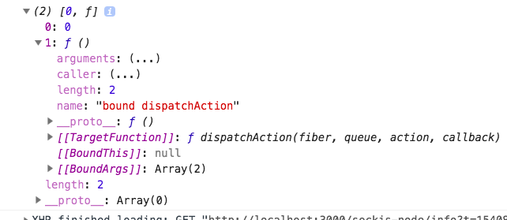
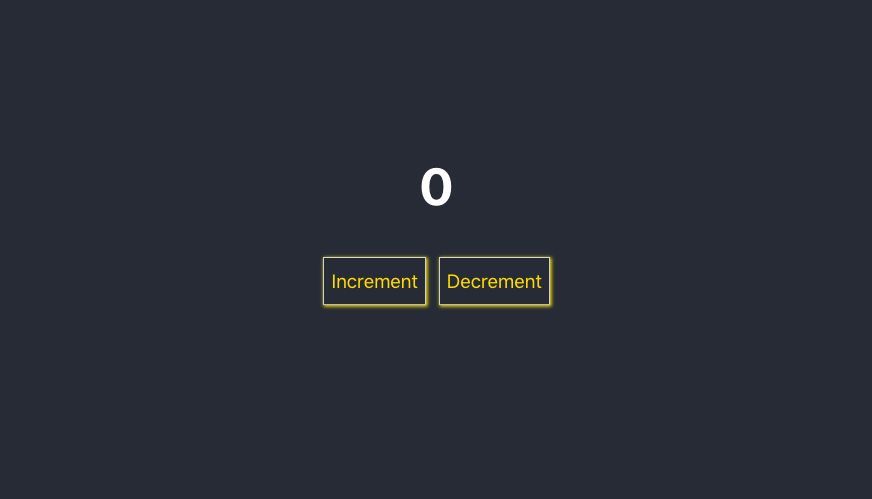
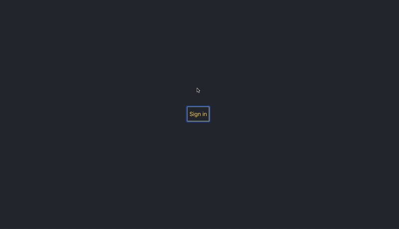

In this tutorial, we are going to learn about how to use the hooks in react apps by using examples.

React hooks helps us to implement the stateful functional components. They’re currently in React v16.7.0-alpha.By using react hooks you can write stateful components without classes.

 [View demo ⚛️](https://saigowthamr.github.io/Reacthooks-example)


Let's play with react hooks.


```sh
npx create-react-app react-hooks
cd react-hooks
npm i react@next react-dom@next
npm start
```

Let's create a two new components called *signin.js* and *counter.js*.

```js:title=signin.js
import React from 'react';

function Signin(props) {
    return <button
        onClick={props.isSignin ? props.Signout : props.Signin} >
        {props.isSignin ? "Signout" : "Sign in"}</button>
}


export default Signin;
```

```js:title=counter.js
import React from 'react';

export default (props) => {

    return (
        <div>
        <h1> {props.value}</h1>
        <button onClick={props.Increment} >Increment</button>
        <button onClick={props.Decrement} >Decrement</button>
        </div>
    )

}
```

Let's write some hooks.

## What is a hook?

A hook is a function which helps us to use the react features

For example in the below code `useState` hook is used to add the state  in functional components.


### useState hook

```js:title=App.js
import React, { useState } from 'react';
import './App.css';
import Signin from './signin';
import Counter from './counter';

function App(props) {

   console.log(useState(0));

  return (
    <div className="App">
      <header className="App-header">
      </header>
    </div>
  );

}

export default App;
```
In the above code,first we imported the two components which we created above and we invoked the useState hook method by passing an intial state 0.

useState hook returns the array with two elements which are the current state and the function which is used to update the state.



Let's use that two elements by using array destructuring.

```js
import React, { useState } from 'react';
import './App.css';
import Signin from './signin';
import Counter from './counter';

function App(props) {

  const [value, Setvalue] = useState(0);

  function Incvalue() {
    return Setvalue(value + 1)
  }

  function Decvalue() {
    return Setvalue(value - 1)
  }

  return (
    <div className="App">
      <header className="App-header">
        <Counter value={value} Increment={Incvalue} Decrement={Decvalue} />
      </header>
    </div>
  );

}

export default App;
```




that's it we successfully created our first stateful functional component by using hooks.


### Custom React hooks.

custom react hooks are just javascript functions which start with word "use".

Let's create our own react custom hook.


```js:title=status.js
import { useState } from 'react';

function useSigninStatus(status) {

    const [isSignin, setSignin] = useState(status);

    function Signin() {
        setSignin(true)
    }

    function Signout() {
        setSignin(false)
    }
    return {
        isSignin,
        Signin,
        Signout,
    }
}

export default useSigninStatus;
```

### How to use custom react hooks?

We are importing the custom hook from the `./status.js` file.

```js
import React, { useState, useEffect } from 'react';
import './App.css';
import Signin from './signin';
import Counter from './counter';
import useSigninStatus from './status';

function App(props) {

  const [value, Setvalue] = useState(0);

  let status = useSigninStatus(false);

  function Incvalue() {
    return Setvalue(value + 1)
  }

  function Decvalue() {
    return Setvalue(value - 1)
  }

  return (
    <div className="App">
      <header className="App-header">
        <Signin {...status} />
        <Counter isSignin={status.isSignin} value={value} Increment={Incvalue}
         Decrement={Decvalue} />
      </header>
    </div>
  );

}

export default App;
```



### useReducer hook

By using reducer hook we can create and dispatch the actions it means we can use the redux by using useReducer hook.

Let's rewrite our code by using **useReducer** hook.

**reducer.js**

```js
function reducer(state, action) {

    switch (action.type) {
        case "Increment":
            return {
                ...state,
                value: state.value + 1
            };
        case "Decrement":
            return {
                ...state,
                value: state.value - 1
            }
        case "Resetcounter":
            return {
                ...state,
                value: 0,
            }
        case "Signin":
            return {
                ...state,
                isSignin: true
            };
        case "Signout":
            return {
                ...state,
                isSignin: false
            }

        default:
            return state
    }
}


export { reducer };
```

**App.js**

```js
import React, { useReducer, useEffect } from 'react';
import './App.css';
import { reducer } from './reducer';
import Auth from './signin';
import Counter from './counter';

function App(props) {

    let [state, dispatch] = useReducer(reducer, { value: 0, isSignin: false })

    return (
        <div className="App">
            <header className="App-header">
                <Auth isSignin={state.isSignin}
                    Signin={() => { dispatch({ type: "Signin" }) }}
                    Signout={() => { dispatch({ type: "Signout" }) }}
                />
                <Counter
                    isSignin={state.isSignin}
                    value={state.value}
                    Increment={() => { dispatch({ type: "Increment" }) }}
                    Decrement={() => { dispatch({ type: "Decrement" }) }} />
            </header>
        </div>
    );

}

export default App;

```

 __useReducer__: The useReducer method takes the two arguments the first argument is reducer function the second argument is initial state.

### useEffect hook

useEffect hook helps to use the lifecycle methods such as componentDidMount, componentDidUpdate and componentWillUnmount.

useEffect hook runs on the first render and also run every time when a component updates.


```js
 useEffect(() => {
        if (!state.isSignin) {
            dispatch({ type: "Resetcounter" })
        }
    })
```

We are using the useEffect hook to reset the counter value to 0.

Hope you enjoyed...

 [Code repository](https://github.com/saigowthamr/Reacthooks-example)

 [View demo ⚛️](https://saigowthamr.github.io/Reacthooks-example)


