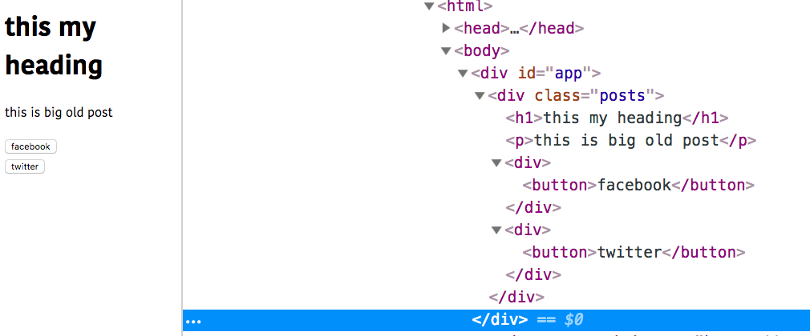

In this tutorial, we are going to learn about how to use props.children in React.


>Note: If you don't know about props then checkout [A beginners guide to react props](/beginners-guide-to-react-props/)


### Props.children

 In reactjs `props.children` is used to add the data between the __opening__ and __closing__ JSX tags.

Let's see an example:

```js{5,12-16}

function Sidebar(props) {

    return (
        <div className="sidebar">
            {props.children}
        </div>
    )
}


<Sidebar>
    <nav>
        <a href="#">Home</a>
        <a href="#">Posts</a>
        <a href="#">Contact</a>
    </nav>
</Sidebar>
```

In `Sidebar` component we defined `props.children` inside the div tag, if we pass anything between the   `Sidebar` opening and closing jsx tags that data will be passed to props.children property and renders inside the `<div>`.


In __class based components__ we need to use `this.props.children` instead of `props.children`.


Let's refactor our code by using __classes__.


```js{6,14-18}

class Sidebar extends React.Component {

    render() {
        return (
            <div className="sidebar">
                {this.props.children}
            </div>
        )
    }
}


<Sidebar>
    <nav>
        <a href="#">Home</a>
        <a href="#">Posts</a>
        <a href="#">Contact</a>
    </nav>
</Sidebar>
```


### More examples

```js

function Posts(props){

   return (
       <div className="posts">
         {props.children}
       </div>
   )

}

function Share(props){

    return (
        <div>
          <button>{props.name}</button>
        </div>
    )
}


<Posts>
    <h1>this my heading</h1>
    <p>this is big old post</p>
    <Share name="facebook"/>
    <Share name="twitter"/>
</Posts>

```

