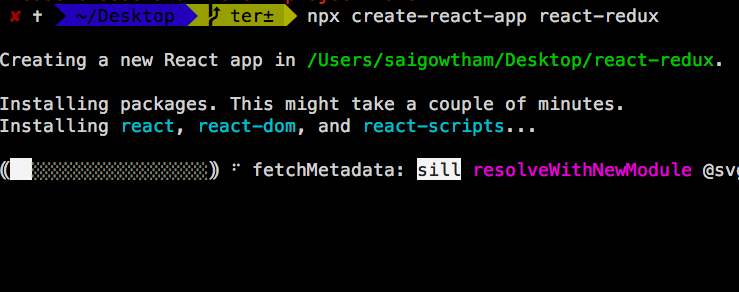
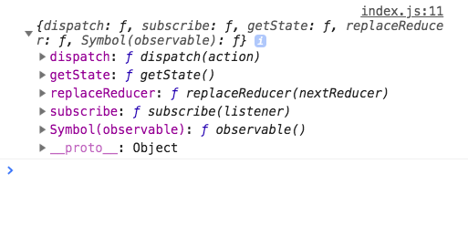
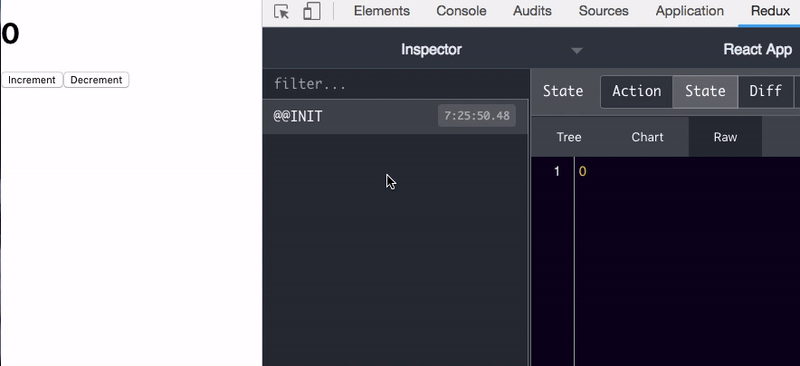
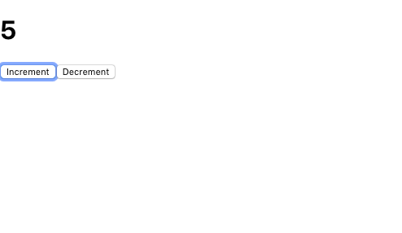

In this tutorial, we are going to learn about how to use the redux library for the state management in react apps.


## What is Redux?

Redux is a state management library for the JavaScript apps, redux stores the whole app state in the
a single JavaScript object.

Redux dev tools help us to check how your application state is changed.

## Why we need to use redux in react?

In the React apps, we have a state which is related to the components and we are passing data down to the child components by using `props`.If we are creating large apps it's often hard to share the state with the other components by using `props`.

So that we need to use the `redux` to store our whole app state is a single JavaScript object then we can access it anywhere from our app component tree.


## Getting started with React Redux

First, we need to set up and install a new react app by using the `create-react-app` command line tool.

Open your terminal and run following commands.

```bash
npx create-react-app react-redux
```
This above command will download the react related files in the "react-redux" folder.




Now, we need to change our directory to "react-redux" folder.

```bash
cd react-redux

npm start
```
`npm start` is used run the development server.


### Installing redux library

Let's install the redux library from the node package manager(npm).

```js
npm install --save redux
```

Now, open 'react-redux' folder in your favorite code editor.

### Reducer function

The Reducer function in the redux helps us to return the new app state by taking the previous app state and type of action.

Reducer functions are pure functions it means they are not mutating the state given to it, instead of returning the new app state.

create a `reducer.js` file in your `src` folder.

```js:title=reducer.js

const counterReducer = (state = 0, action) => {

    switch (action.type) {
        case "INCREMENT":
            return  state + 1
        case "DECREMENT":
            return state - 1
        default:
            return state
    }

}

export default counterReducer
```

In the above code, we created a `counterReducer` function with two parameter `state` and `action`
Inside the `counterReducer` function we defined `switch` statement by passing a `action.type` property.

We added default parameter `state`  to `0`.


### How to update the state in redux?

In the redux we can't  update the state directly, the only way to change the state is by calling an
`dispatch` method with `action` object.

The `dispatch` method is provided by the redux.

### Creating store

Navigate to `index.js` file present inside your app folder.

Inside the `index.js` we need to import the `counterReducer` function from the `reducer.js` file we just created above and `createStore` function from the 'redux' library.

```js:title=index.js
import React from 'react';
import ReactDOM from 'react-dom';
import './index.css';
import App from './App';
import { createStore } from 'redux'
import counterReducer from './reducer';

const store = createStore(counterReducer)

console.log(store)

ReactDOM.render(<App />, document.getElementById('root'));

```

In the above code, we passed our `counterReducer` function as an argument to the `createStore`
function and we logged the `store` property.

If you open your browser console you will see an object which is returned by the `createStore` function.



In the above image, we have seen three important methods are logged in the console.

__dispatch__ : The `dispatch` method is used to update the state by taking the `action` object as an
argument.

__getState__ : The `getState` method is used to get the current app state.

__subcribe__: The subscribe method is used to re-render our app whenever the state is updated.


```js
console.log(store.getState())  // 0
```

If we invoke the `store.getState()` we can see a current app state which is `0`


### Redux dev tools setup

Redux dev tools extension help us to see which type of action is dispatched by the user, current and previous state.

You can download it from your [chrome web store](https://chrome.google.com/webstore/detail/redux-devtools/lmhkpmbekcpmknklioeibfkpmmfibljd?hl=en).

Once you successfully downloaded now restart your browser.

Navigate to your `index.js` and pass this( `window.__REDUX_DEVTOOLS_EXTENSION__ && window.__REDUX_DEVTOOLS_EXTENSION__()`) line as an second argument to the `createStore` function.

```js{8-10}
import React from 'react';
import ReactDOM from 'react-dom';
import './index.css';
import App from './App';
import { createStore } from 'redux'
import counterReducer from './reducer';

const store = createStore(counterReducer,
    window.__REDUX_DEVTOOLS_EXTENSION__ && window.__REDUX_DEVTOOLS_EXTENSION__())

ReactDOM.render(<App />, document.getElementById('root'));

```

Let's create a `Counter` component by using the `redux` state.

```js:title=index.js
import React from 'react';
import ReactDOM from 'react-dom';
import './index.css';
import { createStore } from 'redux'
import counterReducer from './reducer';


const store = createStore(counterReducer,
    window.__REDUX_DEVTOOLS_EXTENSION__ && window.__REDUX_DEVTOOLS_EXTENSION__())

function increment() {
    store.dispatch({ type: "INCREMENT" })
}

function decrement() {
    store.dispatch({ type: "DECREMENT" })
}

const Counter = () => {
    return (
        <div>
            <h1>{store.getState()}</h1>
            <button onClick={increment}>Increment</button>
            <button onClick={decrement}>Decrement</button>

        </div>
    )
}

ReactDOM.render(<Counter />, document.getElementById('root'));
```

In the above code, we created two functions which are  `increment` and `decrement`.

__increment function__ :  it used to dispatch the action type `INCREMENT`.

__decrement function__ :  it used to dispatch the action type `DECREMENT`.

Now open your browser and navigate to `localhost:3000`.


If we click on `increment` or `decrement` button you will see the state is updated in the redux dev tools but our Counter component is still not re-rendering with the updated state because
we are not invoking the `subscribe` method.




### Subscribe method

The subscribe method in redux helps us to re-render our app whenever the state is updated.

```js{30-34}:title=index.js
import React from 'react';
import ReactDOM from 'react-dom';
import './index.css';
import { createStore } from 'redux'
import counterReducer from './reducer';


const store = createStore(counterReducer,
    window.__REDUX_DEVTOOLS_EXTENSION__ && window.__REDUX_DEVTOOLS_EXTENSION__())

function increment() {
    store.dispatch({ type: "INCREMENT" })
}

function decrement() {
    store.dispatch({ type: "DECREMENT" })
}

const Counter = () => {
    return (
        <div>
            <h1>{store.getState()}</h1>
            <button onClick={increment}>Increment</button>
            <button onClick={decrement}>Decrement</button>

        </div>
    )
}

const render = () => ReactDOM.render(<Counter />,
                      document.getElementById('root'))

render()

store.subscribe(render);
```

Here we created a `render` function and passed it to the `subscribe` method as a first argument.

