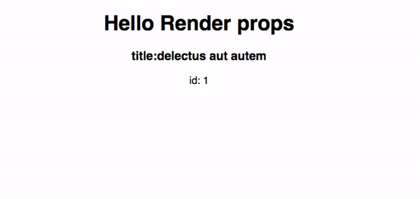
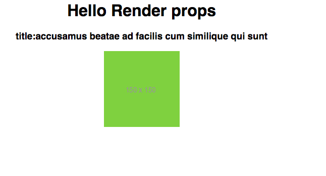

In react, if we pass functions as [props](/beginners-guide-to-react-props/) to the component are called render props.

Render props is a pattern in react which helps us to pass the functions as a prop to the
components so that we can decide the component rendering logic instead of let component render
it's own logic.

Let's learn it by using an example.

```js
class FetchData extends React.Component {
  state = {
    data: null,
    loading: true,
    error: ""
  };
  componentDidMount() {
    axios
      .get(this.props.url)
      .then(res => {
        this.setState({
          data: res.data,
          loading: false
        });
      })
      .catch(err => {
        this.setState({
          error: err
        });
      });
  }
  render() {
    const {data,loading,error} = this.state
    return (
       <div>
       {loading && <p>Loading ...</p>}
       {error && <p>{error}</p>}
        {data && <div>
          <h3>title:{data.title}</h3>
          <p>id: {data.id}</p>
        </div>}
       </div>
    )
  }
}

function App() {
  return (
    <div className="App">
      <h1>Hello React</h1>
      <FetchData url="https://jsonplaceholder.typicode.com/todos/1"/>
    </div>
  );
}

```

In the above code, we created two components where `FetchData` component is used to fetch the data from the backend.

If we try to fetch the data from the other `API` endpoint we need to re-define the `FetchData` component logic because currently `FetchData` component only renders the data from the `todos` API.

Because we have no control over the `FetchComponent` rendering logic because we are just rendering the component inside the App component by passing the `url` as a prop .

Let's use the __renderprops__ pattern to solve our problem.

### FetchData Component

```js{35-44}
class FetchData extends React.Component {
  state = {
    data: null,
    loading: true,
    error: ""
  };

  componentDidMount() {
    axios
      .get(this.props.url)
      .then(res => {
        this.setState({
          data: res.data,
          loading: false
        });
      })
      .catch(err => {
        this.setState({
          error: err
        });
      });
  }

  render() {
    return this.props.children(this.state);
  }
}

function App() {
  return (
    <div className="App">
      <h1>Hello Render props</h1>

      <FetchData url="https://jsonplaceholder.typicode.com/todos/1">
        {({ data, loading, error }) => {
          if (loading) return <p>loading...</p>;
          if (error) return <p>{error}</p>;
          return (
            <div>
              <h3>title:{data.title}</h3>
              <p>id: {data.id}</p>
            </div>
          );
        }}
      </FetchData>
    </div>
  );
}
```

Instead of hard-coding the `FetchData` component rendering logic we are just invoking the function by passing a `state` which is defined inside the `<FetchData>` opening and closing (`</FetchData>`) jsx tags.

Inside the `FetchData` component, we are extracting the state by destructuring and added our own rendering logic.

output:




Let's fetch data from the different API endpoint.

```js
function App() {
  return (
    <div className="App">
      <h1>Hello Render props</h1>
      <FetchData url="https://jsonplaceholder.typicode.com/photos/1">
        {({ data, loading, error }) => {
          if (loading) return <p>loading...</p>;
          if (error) return <p>{error}</p>;
          return (
            <div>
              <h3>title:{data.title}</h3>
              
            </div>
          );
        }}
      </FetchData>
    </div>
  );
}
```
output




If you know about `React Apollo` library  `Query` or `Mutation` components they are also using the render props pattern.


**React Apollo Query component example.**

```js
import React, { Component } from "react";
import { Query } from "react-apollo";

function App() {
    return (
      <div className="App">
        <Query query={query}>
          {result => {
            if (result.loading) return <p>loading...</p>;
            if (result.error) return <p>{result.error.message}</p>;
            return (
              <div>
                <h1>Name: {result.data.viewer.name}</h1>
                <p>Email: {result.data.viewer.email}</p>
              </div>
            );
          }}
        </Query>
      </div>
    );
}
```