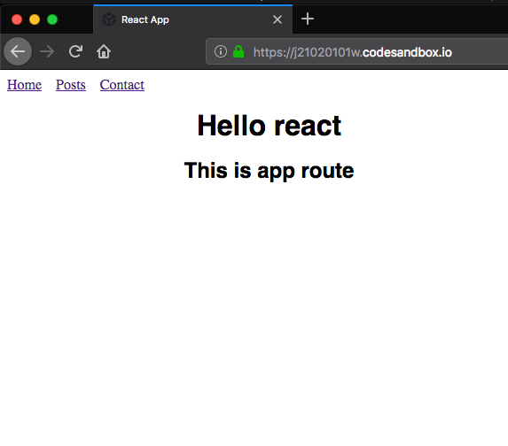
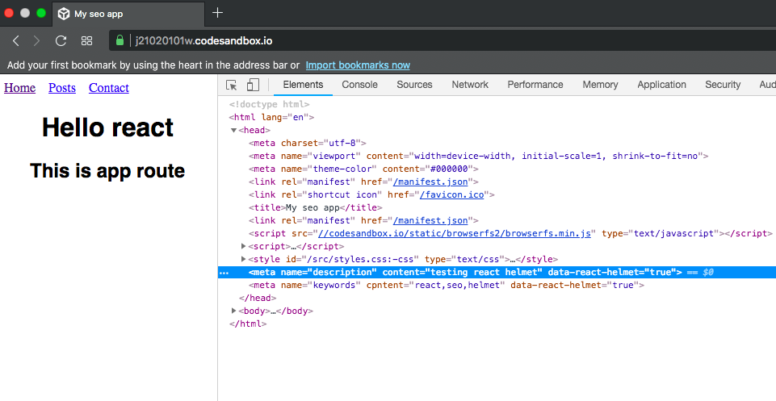

In this tutorial, we will learn about seo in react apps by using the react helmet package.


In the single page apps, the SEO is the hard part to add because we are reusing single html page throughout the site.

There is a package called React helmet which helps us to control our head tags. React helmet provides us a `Helmet` component which takes the plain html meta tags and adds it inside the head tag to our pages.

Let's see an example.

First, we need to install a react-helmet package from the npm package manager.

Run the below command in your terminal to install the `react-helmet` package.

```js
npm i react-helmet
```
Consider our app has three routes like in the below image.



If we try to navigate to posts route or contact route we are seeing the same title and description tags for all routes.

Let's use the Helmet component to control the head tags in our app.

```js
import React from "react";
import { Helmet } from "react-helmet";

function App() {
  return (
    <div className="App">
      <Helmet>
        <title>My seo app</title>
        <meta name="description" content="testing react helmet" />
        <meta name="keywords" cpntent="react,seo,helmet" />
      </Helmet>
      <h1>Hello react</h1>
      <h2>This is app route</h2>
    </div>
  );
}

export default App;

```

In the above code, we first imported the Helmet component from the 'react-helmet' package then we passed the seo tags as children to the Helmet component.

output:



We successfully added the seo tags to our app.

### Server-side rendering usage

React helmet package are also used in Server side rendering react apps.

Example for the server-side rendering.

```js
import React from 'react';
import { renderToString } from 'react-dom/server';
import express from 'express';
import App from './src/App';
const app = express();

app.get('/*', (req, res) => {
  const app = renderToString(<App />);
  const helmet = Helmet.renderStatic();

const html = `
    <!doctype html>
    <html ${helmet.htmlAttributes.toString()}>
        <head>
            ${helmet.title.toString()}
            ${helmet.meta.toString()}
            ${helmet.link.toString()}
        </head>
        <body ${helmet.bodyAttributes.toString()}>
            <div id="app">
                ${app}
            </div>
        </body>
    </html>
`;

  res.send(html);
});

app.listen(3000);
```

In the server side code, we first invoked the `renderToString` method by passing an `App` component, next we invoked the `Helmet.renderStatic()` to get the head data.

Each helmet property contains a `toString()` method which is used inside the html string.